# 모듈 1 과제 보고서 - 배달 로봇 온보딩

## 실행 환경

- 작성자: 최성진
- 호스트: Windows 11
- 실습 환경: Ubuntu 22.04.5 LTS (WSL2), Linux 6.18.33.2
- SSH 대상: `chsjh@localhost` (`127.0.0.1`)
- 확인일: 2026-09-07

## 문제 1 연산 분담과 실시간성 설계

### 1-1 연산 분담 배치표 - 작업 / 위치 / 지연 예산 / 데이터량 / 근거 (6행)

배달 로봇에는 2D 라이다(15 Hz), RGB 카메라(60 fps / 720p), IMU(400 Hz), 바퀴 엔코더(2 kHz), 모터 드라이버, LTE 모듈이 실려 있다고 가정함, LTE 조건은 `ping 1~5 ms`, 처리량 `95~100 Mbps`임

아래 지연 예산은 설계 목표이며 실제 로봇에서 측정한 처리 시간은 아님, 센서 입력 주기를 기준으로 모터 제어는 0.5 ms 이내, 장애물 감지는 66.67 ms 이내, 보행자 인식은 16.67 ms 이내에 처리되도록 예산을 잡고 표에서는 반올림해 표시함

| 작업 | 위치 | 지연 예산 | 데이터량 | 근거 |
|---|---|---:|---|---|
| 모터 속도 제어 | 임베디드 | 약 0.5 ms | 약 30 kB/s | 즉각 반응해야 하는 모터 제어라 임베디드에서 처리함 |
| 장애물 감지 | Edge AI | 약 67 ms | 약 40 kB/s | 통신 상태와 상관없이 빠르게 정지하고 회피해야 하므로 Edge AI에서 처리함 |
| 보행자 인식 | Edge AI | 약 17 ms | 약 170 MB/s | 원본 영상이 LTE 용량보다 커서 로봇 안의 Edge AI에서 바로 인식함 |
| 지도 기반 경로 계획 | 클라우드 | 약 1 s | 약 10 kB/요청 | 넓은 지도와 교통 정보를 함께 활용해야 하므로 클라우드에서 처리함 |
| 배달 완료 사진 업로드 | 클라우드 | 약 5 s | 약 2 MB/건 | 실시간 안전 제어가 아니므로 완료 후 클라우드에 업로드함 |
| 운행 로그 집계 | 클라우드 | 약 1분 | 약 100 kB/분 | 즉시 반응할 필요가 없어 로컬에 모은 뒤 클라우드에서 일괄 처리함 |

표의 지연 예산과 데이터량은 배치 판단에 필요한 규모를 근삿값으로 표시함, 카메라 규격 외의 메시지 크기는 아래와 같이 별도 가정함

- 제어 입력은 엔코더 2개 각각 4 B, IMU 메시지 32 B로 가정해 `2 x 4 x 2,000 + 32 x 400 = 28,800 B/s`, 약 30 kB/s로 잡음
- 라이다는 스캔당 360개 점, 점당 8 B로 가정해 `360 x 8 x 15 = 43,200 B/s`, 약 40 kB/s로 잡음
- 경로 요청 10 kB, 압축 완료 사진 2 MB, 운행 로그 100 kB/분은 이 설계의 대표 메시지 크기이며 원문 고정 사양이나 실측값이 아님
- MB와 kB는 각각 1,000,000 B와 1,000 B 기준이며 센서 메시지 헤더, 전송 오버헤드는 별도임

LTE ping만으로 최악 지연이나 항상 연결됨을 보장할 수 없으므로 제어와 안전 정지는 로봇 안에서 처리함, 클라우드는 전역 경로만 제공하고 통신이 끊기거나 오래된 경로만 남으면 로컬 판단이 감속과 정지를 수행함

### 1-2 카메라 원시 영상 전송량과 LTE 대비 판단

구현 내용에 제시된 RGB 카메라(60 fps / 720p)를 기준으로 계산했으며 채널당 8 bit의 비압축 RGB를 가정해 한 픽셀은 R, G, B 채널을 합쳐 3 B로 잡음

```text
한 프레임 = 1280 x 720 x 3 B
          = 2,764,800 B
          = 2.7648 MB

초당 데이터 = 2,764,800 B x 60 fps
            = 165,888,000 B/s
            = 165.888 MB/s
            = 1,327.104 Mbps
```

카메라 원시 영상 전송량: `165.888 MB/s`

LTE 대비 판단: `95~100 Mbps`는 `11.875~12.5 MB/s`이며 카메라 입력이 약 13.27~13.97배 커서 지속 전송 불가

프로토콜 오버헤드를 제외해도 LTE 용량을 크게 넘으므로 Edge AI에서 보행자를 인식하고 좌표, 분류, 신뢰도 같은 작은 결과만 전송하며 사진은 필요한 시점에 압축해서 보냄

#### 계산 실행과 검증

실행 명령

```bash
python3 scripts/verify_design.py
```

실행 결과

```text
frame_bytes=2764800
camera_MB_per_second=165.888
camera_Mbps=1327.104
LTE_95_Mbps: capacity_MB_per_second=11.875, camera_ratio=13.969516
LTE_100_Mbps: capacity_MB_per_second=12.5, camera_ratio=13.271040
encoder: 2000 Hz, period_ms=0.500000
IMU: 400 Hz, period_ms=2.500000
lidar: 15 Hz, period_ms=66.666667
camera: 60 Hz, period_ms=16.666667
assumed_encoder_and_IMU_bytes_per_second=28800
assumed_lidar_bytes_per_second=43200
[PASS] camera bandwidth, sensor periods and explicit payload assumptions
```

결과: 수식과 실행 결과가 일치함, 데이터량 계산을 검증한 것이며 실제 카메라 전송이나 로봇 제어 성능을 측정한 것은 아님

### 1-3 인지, 판단, 제어 계층 매핑과 주기표

| 작업 | 계층 | 갱신 주기 | 입력 > 출력 | 멀티레이트 연결 |
|---|---|---:|---|---|
| 모터 속도 제어 | 제어 | 제어 2 kHz(0.5 ms), IMU 400 Hz(2.5 ms) | 속도 목표, 엔코더, IMU > 모터 드라이버 명령 | 판단 계층이 15 Hz로 보낸 속도 목표를 유지하면서 엔코더 기준 2 kHz로 제어하며 IMU 최신값은 5번의 제어 주기 동안 재사용함 |
| 장애물 감지 | 인지 | 라이다 15 Hz(약 67 ms) | 라이다 스캔 > 장애물 거리, 방향 | 새 결과를 판단 계층에 전달함 |
| 보행자 인식 | 인지 | 카메라 60 Hz(약 17 ms) | RGB 프레임 > 보행자 위치, 추적 상태 | 판단 계층에서 가장 최신 결과를 사용함 |
| 지도 기반 경로 계획 | 판단 | 클라우드 약 1 Hz(약 1 s) | 지도, 교통 정보, 위치, 목적지 > 전역 경유점 | 전역 경로 사이를 Edge AI의 15 Hz 로컬 추종과 회피가 메움 |
| 배달 완료 사진 업로드 | 인지 | 배달 완료 시 1회, 약 5 s 이내 | 완료 이벤트, RGB 정지 화면 > 압축 JPEG, 클라우드 저장 | 사진을 압축한 뒤 작업 큐를 통해 클라우드에 전달함 |
| 운행 로그 집계 | 판단 | 로컬 약 10 s 수집, 클라우드 약 1분 배치 | 인지, 판단, 제어 로그 > 클라우드 집계 로그 | 로컬 버퍼에 모은 뒤 클라우드에서 운영 분석용으로 집계함 |

#### 인지, 판단, 제어 계층 블록 다이어그램

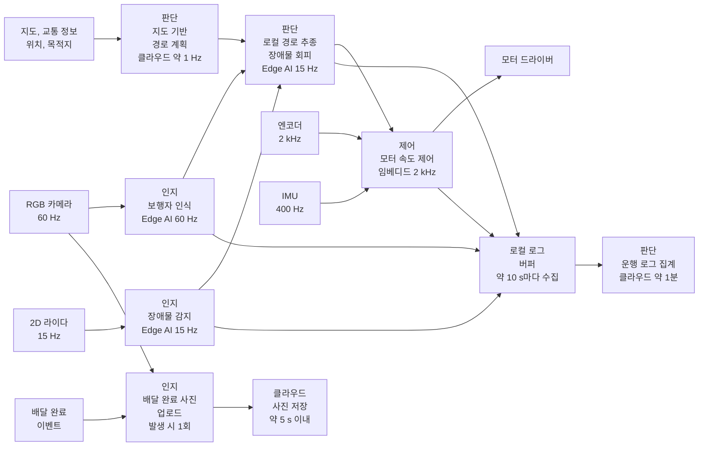

서로 다른 주기는 최신 상태를 공유하는 버퍼와 타임스탬프로 연결하며 사진과 로그 I/O는 낮은 우선순위 작업 큐에서 처리해 2 kHz 제어 루프를 막지 않게 함

센서 주기와 전체 반응 지연은 다름, 장애물의 샘플 대기 시간, 인지 처리, 판단, 제동기 반응을 모두 합쳐 정지거리 안에 멈추는지는 실제 속도와 제동 성능으로 별도 확인해야 함, 사진과 로그는 안전 제어 외의 부가 작업이며 표에는 정보를 생산하거나 사용하는 대표 계층으로 표시함

### 1-4 Hard / Firm / Soft 분류표 - Hard 항목의 마감 초과 결과

| 작업 | 분류 | 마감 초과의 물리적 결과 |
|---|---|---|
| 모터 속도 제어 | Hard | 약 0.5 ms 제어 마감을 놓치면 속도 오버슈트와 자세 불안정이 누적되어 충돌 위험 발생 |
| 장애물 감지 | Hard | 안전 정지 판단의 입력 마감을 놓치면 제동 시작이 늦어져 정지거리 확보 실패와 충돌 위험이 생김 |
| 보행자 인식 | Firm | 늦게 나온 과거 프레임은 현재 판단 가치가 거의 없어 폐기해야 하며 안전 정지는 라이다 계층이 보완 |
| 지도 기반 경로 계획 | Firm | 늦은 새 경로는 가치가 낮아지므로 결과를 버리고 재계획하며 그동안 Edge AI가 감속하거나 정지 |
| 배달 완료 사진 업로드 | Soft | 늦어져도 사진의 증빙 가치는 유지되고 고객 확인 시점만 지연 |
| 운행 로그 집계 | Soft | 지연돼도 로컬 버퍼에 보존되며 모니터링과 분석 결과만 지연 |

Hard 분류는 해당 마감이 안전에 필요하다는 설계 가정이며 실물에서 최악 실행 시간과 정지거리를 입증했다는 뜻은 아님, 보행자 인식을 Firm으로 둔 것은 별도의 라이다 안전 정지 경로가 있다는 가정에 의존함

### 1-5 주기, 지연, 지터 구분 - 각 한 문장

- 주기: 같은 작업을 다시 시작하기까지의 간격이며, 모터 제어 2 kHz는 1초에 2,000번, 즉 0.5 ms마다 실행한다는 뜻
- 지연: 입력을 받은 뒤 결과가 나오기까지 걸린 시간이며, 라이다가 장애물을 본 순간부터 모터에 정지 명령을 보내기까지의 시간
- 지터: 일정해야 할 실행 간격이 흔들리는 정도이며, 예를 들어 0.5 ms마다 돌아야 하는 모터 제어가 0.4 ms 뒤에 실행됐다가 다음에는 0.6 ms 뒤에 실행되는 현상

## 문제 2 SSH 원격 접속과 udev 장치 경로 고정

### 문제 2 실행 환경

Windows 11 > WSL2 Ubuntu 22.04 > 기존 ROS2 실습용 Python 가상환경 순서로 진행함, 이 문제의 SSH와 udev 명령은 Linux 시스템 기능이므로 ROS2 노드를 실행하거나 Python 패키지를 추가 설치할 필요는 없음

Windows PowerShell에서 WSL에 들어가는 명령

```powershell
wsl.exe -d Ubuntu-22.04
```

WSL 안에서 실행한 명령

```bash
cd /mnt/c/Desktop/coding/lv1_module1_student
set -o pipefail
source /home/chsjh/.venvs/ros2-humble/bin/activate
bash scripts/verify_runtime.sh env | tee evidence/capture_env.txt
```

실행 결과

```text
stage=env time=2026-09-07T11:18:33+09:00
chsjh
PA12
PRETTY_NAME="Ubuntu 22.04.5 LTS"
6.18.33.2-microsoft-standard-WSL2
/mnt/c/Desktop/coding/lv1_module1_student
/home/chsjh/.venvs/ros2-humble/bin/python
Python 3.10.12
venv_active=True
[PASS] Ubuntu and existing Python venv verified
```

결과: 배포판이 Ubuntu 22.04.5이며 Python 경로가 기존 가상환경을 가리킴, `venv_active=True`와 통과 출력을 확인함, SSH로 들어간 새 셸에서는 가상환경 활성화를 다시 수행함

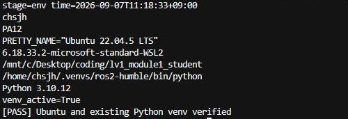

터미널에서 배포판, 작업 경로, 가상환경 활성화와 Python 버전을 확인함

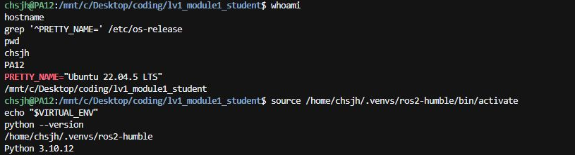

단계별 실행 화면은 [실행 화면 목록](images/README.md)에 정리함

환경, SSH, scp, udev 확인에는 `scripts/verify_runtime.sh`를 사용하고 출력은 `evidence/`에 저장함, 시각과 클라이언트 포트, PID, pts 번호는 실행마다 달라짐

로그를 tee로 저장할 때 `set -o pipefail`을 적용해 앞선 명령의 실패도 종료 코드에 반영되게 함

가상환경의 패키지 목록은 `pip freeze`로 저장한 [requirements.txt](requirements.txt)에 기록함, openssh-server와 udev 설정은 시스템 환경이므로 아래 설치·실행 기록으로 별도 정리함

### 2-1 고른 접속 대상과 무비밀번호 접속 증명

접속 대상은 `chsjh@localhost`로 선택함, 하나의 WSL Ubuntu 안에서 클라이언트가 SSH 서버에 TCP 연결을 맺는 방식으로 수행함

#### SSH 서버 설치 상태와 22번 포트

이미 설치된 openssh-server를 사용함, 설치 여부를 `dpkg-query`로 확인한 뒤 서비스를 시작하고 `systemctl status ssh`, `ss -tlnp | grep ':22'`를 실제 실행함

실행 명령 - Windows PowerShell에서 WSL의 root 사용자로 시스템 단계 실행

```powershell
wsl.exe -d Ubuntu-22.04 -u root -- bash /mnt/c/Desktop/coding/lv1_module1_student/scripts/verify_runtime.sh services
```

실행 결과

```text
stage=services time=2026-09-07T11:04:00+09:00
openssh-server 1:8.9p1-3ubuntu0.16 install ok installed
● ssh.service - OpenBSD Secure Shell server
     Loaded: loaded (/lib/systemd/system/ssh.service; enabled; vendor preset: enabled)
     Active: active (running) since Mon 2026-09-07 09:37:55 KST; 1h 26min ago
       Docs: man:sshd(8)
             man:sshd_config(5)
   Main PID: 252 (sshd)
      Tasks: 1 (limit: 23986)
     Memory: 3.5M
        CPU: 554ms
     CGroup: /system.slice/ssh.service
             └─252 "sshd: /usr/sbin/sshd -D [listener] 0 of 10-100 startups"

Sep 07 11:01:59 PA12 sshd[5476]: Accepted publickey for chsjh from 127.0.0.1 port 48012 ssh2: ED25519 SHA256:mEpMQgfHCJ/24zh0+4L631+sQwzUvEP0YbuDMUsAFvc
Sep 07 11:01:59 PA12 sshd[5476]: pam_unix(sshd:session): session opened for user chsjh(uid=1000) by (uid=0)
Sep 07 11:01:59 PA12 sshd[5476]: pam_unix(sshd:session): session closed for user chsjh
active
active
LISTEN 0      128           0.0.0.0:22        0.0.0.0:*    users:(("sshd",pid=252,fd=3))            
LISTEN 0      128              [::]:22           [::]:*    users:(("sshd",pid=252,fd=4))            
[PASS] SSH service active and TCP port 22 listening
```

결과: 패키지는 `install ok installed`, 서버는 `active (running)`이며 IPv4와 IPv6의 TCP 22번 포트가 LISTEN 상태임, 서버 로그에서도 공개키 인증 기록을 확인함

`apt install` 결과 패키지가 이미 최신 버전이며 서비스는 `active (running)` 상태임, 22번 포트의 LISTEN 상태는 위 `ss` 출력에서 확인함

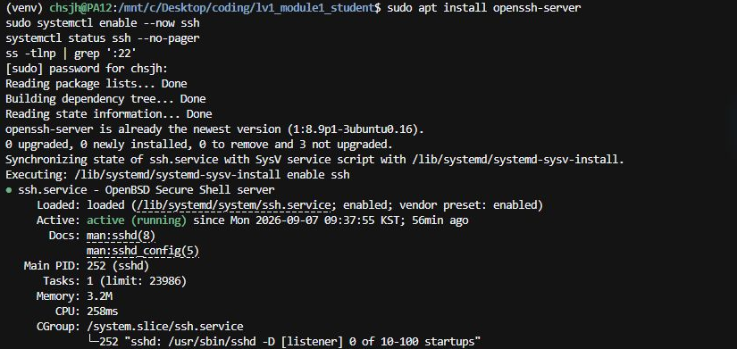

#### 키 생성과 공개키 등록

`physicalai_lv1_module1_ed25519` 키를 재생성하고 공개키를 등록함, 생성 화면의 `Overwrite (y/n)? y`는 기존 키 파일을 덮어쓴 기록임

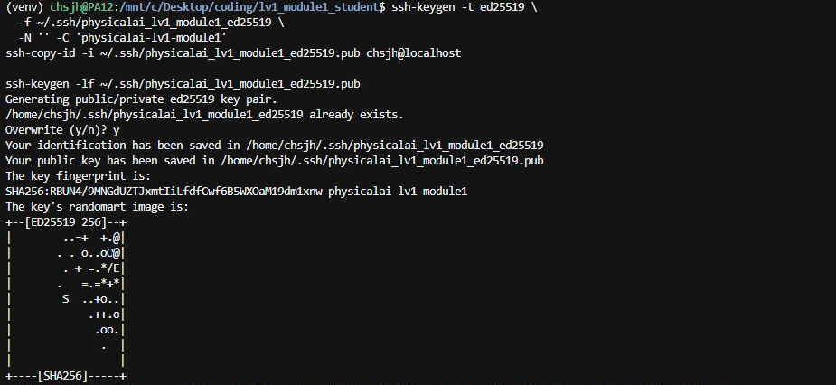

공개키 등록 결과는 `Number of key(s) added: 1`이며 지문은 `SHA256:RBU…`로 시작함, 아래 접속 실험에 사용한 `physicalai_lv1_module1_completion_ed25519`는 지문이 `SHA256:mEp…`로 시작하는 별도 키임

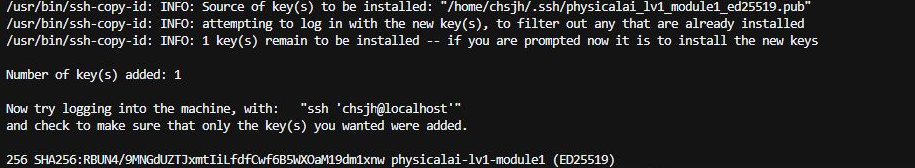

기존 키와 별도로 접속 실험용 키를 생성함, 개인키는 `/home/chsjh/.ssh/physicalai_lv1_module1_completion_ed25519`, 공개키는 같은 경로의 `.pub` 파일임

실행 명령

```bash
bash scripts/verify_runtime.sh keysetup
```

위 단계 안에서 최초 생성 시 실행한 명령

```bash
ssh-keygen -t ed25519   -f /home/chsjh/.ssh/physicalai_lv1_module1_completion_ed25519   -N '' -C physicalai-lv1-module1-completion
```

최초 키 생성 결과

```text
stage=keysetup time=2026-09-07T11:01:33+09:00
Generating public/private ed25519 key pair.
Your identification has been saved in /home/chsjh/.ssh/physicalai_lv1_module1_completion_ed25519
Your public key has been saved in /home/chsjh/.ssh/physicalai_lv1_module1_completion_ed25519.pub
The key fingerprint is:
SHA256:mEpMQgfHCJ/24zh0+4L631+sQwzUvEP0YbuDMUsAFvc physicalai-lv1-module1-completion
The key's randomart image is:
+--[ED25519 256]--+
|..o+*oo+. o      |
| o.=...o+o o     |
|  = .. .E.o      |
| . =  .+o= .     |
|  . * ooS.o      |
| . = +  o. .     |
|  o.+  .  o      |
|  ...o  .o       |
|.o....o.o.       |
+----[SHA256]-----+
```

등록 과정에서는 기존에 접속 가능한 키를 사용해 새 공개키를 서버에 추가함, 처음에는 ssh-copy-id가 기존 인증 키로 접속한 것을 새 키 등록으로 오인해 건너뛰었으며 새 키 단독 로그인은 실제로 실패했음, 새 공개키가 authorized_keys에 없는 것을 확인한 뒤 `ssh-copy-id -f`로 한 번 등록하고 다시 검증함

수정 후 등록 단계를 실행하는 명령 - 같은 WSL 작업 폴더에서 실행함

```bash
bash scripts/verify_runtime.sh keysetup
```

이 명령 하나가 키가 없으면 생성, 기존 키가 있으면 재사용, 공개키가 등록되지 않았으면 등록, 마지막으로 공개키 지문 확인까지 수행함

아래는 공개키를 실제로 추가했을 때 저장한 결과임, 이미 등록된 현재 상태에서 재실행하면 `Existing completion key reused; no key overwritten`과 `Public key already registered; duplicate append skipped`가 나오는 것이 정상임

수정 후 등록 단계의 실행 결과

```text
stage=keysetup time=2026-09-07T11:01:57+09:00
Existing completion key reused; no key overwritten
/usr/bin/ssh-copy-id: INFO: Source of key(s) to be installed: "/home/chsjh/.ssh/physicalai_lv1_module1_completion_ed25519.pub"

Number of key(s) added: 1

Now try logging into the machine, with:   "ssh -o 'IdentityFile=/home/chsjh/.ssh/physicalai_lv1_module1_ed25519' -o 'IdentitiesOnly=yes' -o 'BatchMode=yes' -o 'StrictHostKeyChecking=yes' 'chsjh@localhost'"
and check to make sure that only the key(s) you wanted were added.

256 SHA256:mEpMQgfHCJ/24zh0+4L631+sQwzUvEP0YbuDMUsAFvc physicalai-lv1-module1-completion (ED25519)
```

스크립트는 공개키가 이미 등록돼 있으면 중복 추가하지 않음, 개인키 내용은 보고서와 제출 폴더에 포함하지 않음

키 생성과 등록 로그 조회

```bash
cat evidence/02b_keysetup.txt
cat evidence/02c_key_registration.txt
```

첫 파일에는 등록 건너뛰기 기록이 남아 있음, 두 번째 파일에서 공개키 추가 성공을 확인하고 SSH 접속으로 인증 여부를 확인함

#### 실제 SSH 세션과 원격 단일 명령

실행 명령

```bash
bash scripts/verify_runtime.sh ssh 2>&1 | tee evidence/capture_ssh.txt
```

단계 내부에서는 검증 키만 사용하도록 `IdentitiesOnly=yes`, 비밀번호로 대체하지 않도록 `BatchMode=yes`를 지정하고 `ssh -tt`로 접속함, 접속한 셸에서 가상환경 활성화, `tty`, `who`, `SSH_CONNECTION` 출력 후 별도 SSH 단일 명령으로 `uname -a`를 실행함

실행 결과

```text
stage=ssh time=2026-09-07T11:11:45+09:00
256 SHA256:mEpMQgfHCJ/24zh0+4L631+sQwzUvEP0YbuDMUsAFvc physicalai-lv1-module1-completion (ED25519)
/home/chsjh/.venvs/ros2-humble/bin/python
/dev/pts/10
chsjh    pts/1        2026-09-07 09:37
root     pts/6        2026-09-07 10:57
chsjh    pts/10       2026-09-07 11:11 (127.0.0.1)
SSH_CONNECTION=127.0.0.1 45460 127.0.0.1 22
[PASS] key-only SSH session verified
Connection to localhost closed.
Linux PA12 6.18.33.2-microsoft-standard-WSL2 #1 SMP PREEMPT_DYNAMIC Thu Jun 18 21:54:43 UTC 2026 x86_64 x86_64 x86_64 GNU/Linux
```

결과: 원격 pts 번호가 `who`에 표시되고 `SSH_CONNECTION`의 마지막 값이 서버 포트 22임, 지정한 키로 비밀번호 입력 없이 성공했으므로 키 기반 SSH 접속을 확인함, localhost는 같은 컴퓨터를 가리키지만 실제 sshd 인증과 네트워크 세션을 거친 결과임

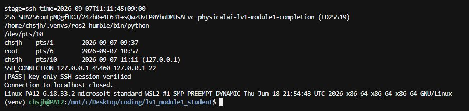

2026-09-07 11:28:18에 같은 키로 다시 접속함, `SHA256:mEp…` 지문과 `/dev/pts/5`, `SSH_CONNECTION=127.0.0.1 47430 127.0.0.1 22`를 확인함, 11:11:45의 접속과는 별도 세션임

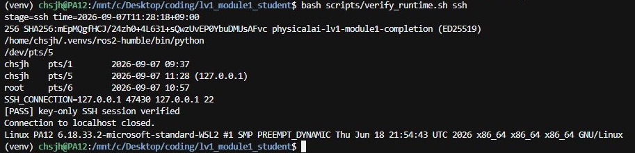

### 2-2 개인키와 공개키 중 서버에 등록하는 것

서버의 `~/.ssh/authorized_keys`에 등록하는 것은 공개키의 내용임, 개인키는 클라이언트에 보관하고 인증 데이터에 서명하며 서버는 공개키로 그 서명을 검증하므로 공개키만으로 유효한 서명을 만들어 접속할 수 없음

### 2-3 원격 단일 명령과 scp 전송 검증

원격 단일 명령인 `uname -a`의 실제 출력은 2-1 마지막 줄에 기록함

실행 명령

```bash
bash scripts/verify_runtime.sh scp
```

단계 내부에서 원격 임시 폴더를 만든 뒤 제출 규칙 파일을 `scp`로 전송하고 양쪽의 `sha256sum`을 비교함

실행 결과

```text
stage=scp time=2026-09-07T11:01:58+09:00
c5038d2a59fd6d994b9861645fc4de171b93323cfdd092c91b4c1187ced6e3b2  /mnt/c/Desktop/coding/lv1_module1_student/rules/99-robot-sensor.rules
c5038d2a59fd6d994b9861645fc4de171b93323cfdd092c91b4c1187ced6e3b2  /tmp/physicalai_module1_20260907/99-robot-sensor.rules
[PASS] scp source and destination SHA256 match
```

결과: 전송 전 파일과 원격 파일의 SHA256이 같음, 단순히 파일 이름이 생긴 것에 그치지 않고 내용까지 동일하게 전송됐음을 확인함

2026-09-07 12:13:15에 scp 전송을 반복한 결과도 양쪽 SHA256이 같음, 실행 출력은 [capture_scp.txt](evidence/capture_scp.txt)에 저장함

```text
stage=scp time=2026-09-07T12:13:15+09:00
c5038d2a59fd6d994b9861645fc4de171b93323cfdd092c91b4c1187ced6e3b2  /mnt/c/Desktop/coding/lv1_module1_student/rules/99-robot-sensor.rules
c5038d2a59fd6d994b9861645fc4de171b93323cfdd092c91b4c1187ced6e3b2  /tmp/physicalai_module1_20260907/99-robot-sensor.rules
[PASS] scp source and destination SHA256 match
```

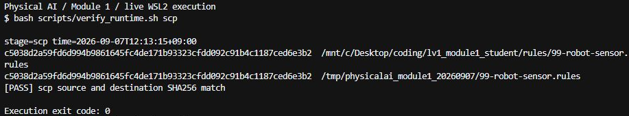

### 2-4 두 장치를 구분한 속성

#### 접속한 환경의 시리얼 장치 종류와 소유 그룹

실행 명령

```bash
bash scripts/verify_runtime.sh tty
```

단계 내부에서 SSH로 접속한 환경에 `ls -l /dev/tty*`를 실행함, 전체 출력은 [05_tty.txt](evidence/05_tty.txt)에 보관하고 대표 두 줄을 발췌함

```text
crw-rw-rw- 1 root tty     5,  0 Sep  7 10:52 /dev/tty
crw-rw---- 1 root dialout 4, 64 Sep  7 10:52 /dev/ttyS0
```

결과: 첫 글자 `c`는 문자 장치임, `/dev/tty` 그룹은 tty이고 `/dev/ttyS0` 그룹은 dialout임, 이 목록만으로 실제 USB 센서가 연결됐다고 판단하지 않음

`ls -l /dev/tty /dev/ttyS0` 결과에서 문자 장치 표시와 tty/dialout 소유 그룹을 확인함

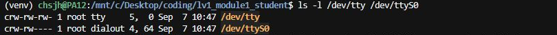

#### loop 장치와 구분 속성 조사

라이다는 16 MiB의 `lidar.img`, IMU는 24 MiB의 `imu.img`를 사용함, 기존 실습과 구별하기 위해 `~/fake_sensors_physicalai_lv1/` 경로를 사용했으며 규칙 파일에도 같은 절대 경로를 사용함

두 이미지의 연결과 고정 링크 설정은 문제 2의 '순서를 바꿔 재연결한 결과' 절에서 수행함. 연결된 장치의 속성을 다시 조회할 때는 같은 WSL 터미널에서 아래 명령 전체를 실행함.

`bash scripts/verify_runtime.sh tty`는 장치 목록만 조회함. 별도로 실행한 스크립트 안의 변수는 현재 터미널에 남지 않으므로, `readlink -e`로 고정 링크의 실제 장치 경로를 읽어 `lidar_device`와 `imu_device`를 먼저 설정함. 고정 링크가 없으면 같은 작업 폴더에서 `sudo bash scripts/verify_runtime.sh udev`로 장치 연결과 규칙 적용을 수행한 뒤 조회함.

```bash
lidar_device=$(readlink -e /dev/robot_lidar)
imu_device=$(readlink -e /dev/robot_imu)

if [ -b "$lidar_device" ] && [ -b "$imu_device" ]; then
    printf 'lidar_device=%s\nimu_device=%s\n' "$lidar_device" "$imu_device"
    udevadm info --attribute-walk --name="$lidar_device"
    udevadm info --attribute-walk --name="$imu_device"
    cat "/sys/class/block/${lidar_device#/dev/}/loop/backing_file"
    cat "/sys/class/block/${imu_device#/dev/}/loop/backing_file"
else
    printf '장치가 연결되지 않음: sudo bash scripts/verify_runtime.sh udev 실행 후 다시 조회\n' >&2
fi
```

실행 결과 - 최초 연결 당시 속성 출력 발췌. loop 번호는 연결 순서에 따라 달라지므로 현재 조회 결과가 loop1이어도 같은 이미지 파일을 가리키면 정상임.

```text
looking at device '/devices/virtual/block/loop0':
    KERNEL=="loop0"
    SUBSYSTEM=="block"
```

이 환경의 attribute-walk에는 `loop/backing_file` 값이 표시되지 않아 같은 장치의 sysfs 파일을 직접 읽음. 연결 순서에 관계없이 라이다와 IMU의 backing file은 각각 아래 경로여야 함.

| 센서 역할 | 구분한 속성 | 실제 값 |
|---|---|---|
| 라이다 | `loop/backing_file` | `/home/chsjh/fake_sensors_physicalai_lv1/lidar.img` |
| IMU | `loop/backing_file` | `/home/chsjh/fake_sensors_physicalai_lv1/imu.img` |

장치 번호인 loop0, loop1은 연결 순서에 따라 변하지만 backing file은 센서 역할을 식별하므로 규칙 조건으로 사용함, 전체 조사 결과는 [라이다 속성](evidence/udev_lidar_attributes.txt)과 [IMU 속성](evidence/udev_imu_attributes.txt)에 보관함

이미지 파일을 loop 장치로 연결하고 `udevadm`으로 속성을 조사함. 아래 화면은 최초 연결 당시의 `KERNEL=="loop0"`, `SUBSYSTEM=="block"` 출력이며, 고정 링크의 역순 재연결 결과는 문제 2의 '순서를 바꿔 재연결한 결과' 절에 정리함.

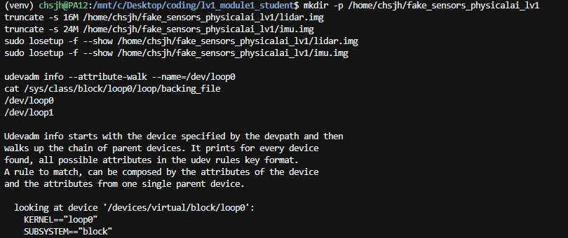

### 2-5 작성한 udev 규칙과 키 설명표

아래는 터미널 명령이 아니라 [rules/99-robot-sensor.rules](rules/99-robot-sensor.rules)에 저장한 파일 내용임

```udev
# `udevadm info`에서 block/loop 계층을 확인하고 sysfs의 backing_file로 구분한다.
SUBSYSTEM=="block", KERNEL=="loop*", ATTR{loop/backing_file}=="/home/chsjh/fake_sensors_physicalai_lv1/lidar.img", SYMLINK+="robot_lidar", MODE="0660", GROUP="disk"
SUBSYSTEM=="block", KERNEL=="loop*", ATTR{loop/backing_file}=="/home/chsjh/fake_sensors_physicalai_lv1/imu.img", SYMLINK+="robot_imu", MODE="0660", GROUP="disk"
```

| 키/연산자 | 역할 |
|---|---|
| `SUBSYSTEM=="block"` | 이벤트가 block 장치 계층인지 비교함 |
| `KERNEL=="loop*"` | 커널 장치 이름이 loop로 시작하는지 비교함 |
| `ATTR{loop/backing_file}` | 현재 장치의 sysfs 속성을 읽어 실제 연결된 이미지 파일을 비교함 |
| `SYMLINK+=` | 장치의 기존 별칭 목록을 유지하면서 고정 이름을 추가함 |
| `MODE="0660"` | 실제 장치 노드의 소유자와 그룹에 읽기/쓰기를 허용함 |
| `GROUP="disk"` | loop 장치 노드의 소유 그룹을 disk로 지정함 |
| `==` | 조건이 같은지 비교함 |
| `=` | 지정 값을 대입함 |
| `+=` | 목록형 값에 항목을 추가함 |

`MODE`와 `GROUP`은 심볼릭 링크의 `lrwxrwxrwx` 표시가 아니라 실제 `/dev/loopN` 장치 노드에 적용됨, 검증 스크립트에서 `stat -c '%a:%G'` 결과가 `660:disk`인지 확인함

### 2-6 순서를 바꿔 재연결한 결과

실행 명령 - Windows PowerShell에서 관리자용 WSL 사용자로 실행

```powershell
wsl.exe -d Ubuntu-22.04 -u root -- bash /mnt/c/Desktop/coding/lv1_module1_student/scripts/verify_runtime.sh udev
```

실행 순서는 규칙 파일 설치 > 규칙 다시 읽기 > 라이다 먼저 연결 > 속성과 링크 검증 > 두 실습 장치 해제 > IMU 먼저 연결 > 링크와 실제 파일, 권한 재검증임

스크립트는 이 과제의 두 backing file과 일치하고 마운트되지 않은 장치만 해제함, 기존 이미지의 크기가 예상과 다르면 중단하며 이미 존재하는 이미지를 truncate로 다시 쓰지 않음, 고정된 loop 번호를 가정해 다른 장치를 해제하지 않음

실행 결과

```text
stage=udev time=2026-09-07T11:15:23+09:00
FIRST: lidar=/dev/loop0 imu=/dev/loop1
/home/chsjh/fake_sensors_physicalai_lv1/lidar.img
/home/chsjh/fake_sensors_physicalai_lv1/imu.img
lrwxrwxrwx 1 root root 5 Sep  7 11:15 /dev/robot_imu -> loop1
lrwxrwxrwx 1 root root 5 Sep  7 11:15 /dev/robot_lidar -> loop0
robot_lidar -> /dev/loop0 backing=/home/chsjh/fake_sensors_physicalai_lv1/lidar.img
robot_imu -> /dev/loop1 backing=/home/chsjh/fake_sensors_physicalai_lv1/imu.img
[PASS] first attachment links and mode/group verified
REVERSED: imu=/dev/loop0 lidar=/dev/loop1
lrwxrwxrwx 1 root root 5 Sep  7 11:15 /dev/robot_imu -> loop0
lrwxrwxrwx 1 root root 5 Sep  7 11:15 /dev/robot_lidar -> loop1
robot_lidar -> /dev/loop1 backing=/home/chsjh/fake_sensors_physicalai_lv1/lidar.img
robot_imu -> /dev/loop0 backing=/home/chsjh/fake_sensors_physicalai_lv1/imu.img
[PASS] loop numbers exchanged; fixed links still identify correct sensors
[PASS] only this assignment images detached; no mounted device touched
```

결과: 첫 연결의 라이다/IMU 번호가 역순 연결에서 서로 바뀌었음, 그 상태에서도 robot_lidar는 lidar.img, robot_imu는 imu.img를 가리키며 두 장치의 권한과 그룹도 검증을 통과함, 재연결 중 서비스가 읽지 않도록 중지하거나 재연결 후 장치를 다시 여는 처리는 실제 로봇 프로그램에서 별도로 구현해야 함

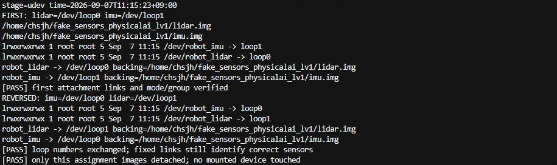

### 2-7 실제 USB 센서용 규칙 초안과 구분 근거

아래는 과제에서 준 USB 제품 ID를 이용한 초안이며 실제 USB 센서를 연결해 실행한 결과는 아님, loop 규칙 파일과 구분해 문서에만 기록함

```udev
SUBSYSTEM=="tty", KERNEL=="ttyUSB*", ATTRS{idVendor}=="10c4", ATTRS{idProduct}=="ea60", SYMLINK+="robot_lidar", MODE="0660", GROUP="dialout"
SUBSYSTEM=="tty", KERNEL=="ttyUSB*", ATTRS{idVendor}=="10c4", ATTRS{idProduct}=="ea70", SYMLINK+="robot_imu", MODE="0660", GROUP="dialout"
```

loop용 block/loop 조건을 tty/ttyUSB 조건으로 바꾸고 부모 USB 장치의 속성을 찾는 `ATTRS{idVendor}`, `ATTRS{idProduct}`를 사용함, vendor는 둘 다 10c4이므로 product가 ea60인지 ea70인지 함께 비교해야 두 역할을 구별할 수 있음, vendor와 product까지 같은 제품 두 개라면 serial 등 추가 식별 속성이 필요함

## 문제 3 Git 저장소 협업

### 3-1 별도 연습 저장소 URL과 브랜치

2026-09-07에 로컬 연습 저장소에서 브랜치, 충돌 해결, merge와 rebase를 실습함, 별도 GitHub 연습 저장소 생성·clone·push와 PR 실습은 미수행 상태임

| 항목 | 현재 상태 |
|---|---|
| 별도 비공개 연습 저장소 URL | GitHub 연습 저장소 미생성, 실제 URL 기록 대기 |
| PR URL | PR 미생성, 실제 URL 기록 대기 |
| 최초 README | 라이다 15 Hz, RGB 60 fps 720p, IMU 400 Hz, 엔코더 2 kHz, LTE 사양 작성 완료 |
| `feature/compute-layout` | 문제 1의 연산 분담과 실시간성 설계 문서 커밋 완료 |
| `feature/udev-rules` | 문제 2의 규칙 파일과 설명 표 커밋 완료 |

아래 실습은 로컬 저장소를 clone한 연습 저장소에서 수행함

로컬 실행 당시 커밋

| 역할 | 커밋 |
|---|---|
| 최초 README | `d04d328` |
| compute-layout 최초 구현 | `17fd513` |
| udev-rules 최초 구현 | `a2957ed` |

### 3-2 PR 셀프 리뷰와 반영 커밋

PR 생성, 셀프 리뷰, 수정 커밋과 병합은 미수행 상태임, 검토할 항목은 README에 설계 문서 링크가 빠져 있다는 점임

> 설계 문서가 추가됐지만 README에서 바로 찾아가는 링크가 없음
> README에 `docs/compute-layout.md` 링크를 추가하고 대상 파일이 실제로 존재하는지 확인할 필요가 있음

위 의견은 리뷰 초안임, 리뷰 URL과 수정 커밋, 병합 결과는 아직 없음

### 3-3 의도적 충돌 재현과 해결

`branch-a`와 `branch-b`를 같은 main 커밋에서 만들고 README의 동일한 `로봇 상태` 행을 다르게 수정함
branch-a에는 라이다 검증 완료, branch-b에는 IMU 검증 완료를 기록함
main에 branch-a를 먼저 병합한 뒤 branch-b를 병합해 실제 충돌을 발생시킴

아래 실행은 로컬 연습 저장소에서 수행했으며 `exit`는 각 명령 직후 확인한 종료 코드임
기대했던 충돌은 종료 코드 1, 성공한 명령은 종료 코드 0임

실행 명령 - 로컬 연습 저장소의 `main` 브랜치에서 시작함

```powershell
git merge --no-ff branch-a -m 'merge: integrate lidar verification'
```

실행 결과

```text
Merge made by the 'ort' strategy.
 README.md | 2 +-
 1 file changed, 1 insertion(+), 1 deletion(-)
exit=0
```

실행 명령 - 로컬 연습 저장소의 `main` 브랜치에서 시작함

```powershell
git merge --no-ff branch-b -m 'merge: integrate imu verification'
```

실행 결과

```text
Auto-merging README.md
CONFLICT (content): Merge conflict in README.md
Automatic merge failed; fix conflicts and then commit the result.
exit=1
```

실행 명령 - 로컬 연습 저장소의 `main` 브랜치에서 시작함

```powershell
git status --short
```

실행 결과

```text
UU README.md
exit=0
```

실행 명령 - 로컬 연습 저장소의 `main` 브랜치에서 시작함

```powershell
git diff -- README.md
```

실행 결과

```text
diff --cc README.md
index 37cb481,25f5122..0000000
--- a/README.md
+++ b/README.md
@@@ -16,7 -16,7 +16,11 @@@
  
  | 항목 | 값 |
  |---|---|
++<<<<<<< HEAD
 +| 로봇 상태 | 라이다 규칙 검증 완료 |
++=======
+ | 로봇 상태 | IMU 규칙 검증 완료 |
++>>>>>>> branch-b
  
  ## 브랜치 역할
  
exit=0
```

- `<<<<<<< HEAD`: 현재 main에 반영된 라이다 쪽 내용이 시작됨
- `=======`: 현재 내용과 병합하려는 내용의 경계임
- `>>>>>>> branch-b`: branch-b의 IMU 쪽 내용이 끝남

두 변경은 서로 다른 센서의 검증 결과이므로 어느 하나를 버리지 않고 아래 한 행으로 해결함

```text
| 로봇 상태 | 라이다와 IMU 규칙 검증 완료 |
```

실행 명령

```powershell
$ReadmePath = Join-Path (Get-Location) 'README.md'
$Text = [IO.File]::ReadAllText($ReadmePath)
$Pattern = '(?ms)^<<<<<<< HEAD\r?\n.*?^>>>>>>> branch-b\r?\n'
$Text = [regex]::Replace($Text, $Pattern, "| 로봇 상태 | 라이다와 IMU 규칙 검증 완료 |`n")
[IO.File]::WriteAllText($ReadmePath, $Text, [Text.UTF8Encoding]::new($false))
```

실제 실행 스크립트는 위와 같이 표식을 치환해 UTF-8로 저장함
이어 수행한 add, 검사, commit의 실제 결과는 아래와 같음

실행 명령 - 로컬 연습 저장소의 `main` 브랜치에서 시작함

```powershell
git add README.md
```

실행 결과

```text
(표준 출력 없음)
exit=0
```

실행 명령 - 로컬 연습 저장소의 `main` 브랜치에서 시작함

```powershell
git diff --cached --check
```

실행 결과

```text
(표준 출력 없음)
exit=0
```

실행 명령 - 로컬 연습 저장소의 `main` 브랜치에서 시작함

```powershell
git commit -m 'merge: resolve lidar and imu status conflict'
```

실행 결과

```text
[main 459e802] merge: resolve lidar and imu status conflict
exit=0
```

검증 결과

```text
PASS conflict resolution leaves a clean working tree
PASS resolution preserves both verification claims
PASS no conflict markers remain
PASS conflict resolution commit has two parents
```

### 3-4 merge와 rebase 이력 비교

#### 지정 feature 브랜치에서 main 기준 rebase

로컬 main에 compute-layout을 병합한 다음 udev-rules 브랜치를 main 위로 다시 적용함

실행 명령 - 로컬 연습 저장소의 `main` 브랜치에서 시작함

```powershell
git switch feature/udev-rules
```

실행 결과

```text
Switched to branch 'feature/udev-rules'
Your branch is up to date with 'origin/feature/udev-rules'.
exit=0
```

실행 명령 - 로컬 연습 저장소의 `feature/udev-rules` 브랜치에서 시작함

```powershell
git rebase main
```

실행 결과

```text
Rebasing (1/1)
Successfully rebased and updated refs/heads/feature/udev-rules.
exit=0
```

기능 커밋은 `a2957ed`에서 `0078451`로 바뀜
규칙 내용은 원본 파일과 SHA-256 해시가 같은지 별도로 검사해 통과함

실행 명령 - 로컬 연습 저장소의 `feature/udev-rules` 브랜치에서 시작함

```powershell
git merge-base --is-ancestor main feature/udev-rules
```

실행 결과

```text
(표준 출력 없음)
exit=0
```

실행 명령 - 로컬 연습 저장소의 `main` 브랜치에서 시작함

```powershell
git merge --ff-only feature/udev-rules
```

실행 결과

```text
Updating bc0b373..0078451
Fast-forward
 docs/udev-rules.md          | 17 +++++++++++++++++
 rules/99-robot-sensor.rules |  3 +++
 2 files changed, 20 insertions(+)
 create mode 100644 docs/udev-rules.md
 create mode 100644 rules/99-robot-sensor.rules
exit=0
```

#### 같은 변경을 merge와 rebase로 비교

같은 출발 커밋에서 기준 파일 변경 1개와 기능 파일 변경 1개를 만들고, 동일한 두 커밋을 각 비교 브랜치에 사용함
merge 방식은 분기 모양을 보존하고, rebase 방식은 기능 커밋을 기준 커밋 뒤에 다시 만듦

실행 명령 - 로컬 연습 저장소의 `compare/merge-main` 브랜치에서 시작함

```powershell
git merge --no-ff compare/merge-feature -m 'merge: preserve comparison branch topology'
```

실행 결과

```text
Merge made by the 'ort' strategy.
 docs/comparison-feature.md | 3 +++
 1 file changed, 3 insertions(+)
 create mode 100644 docs/comparison-feature.md
exit=0
```

실행 명령 - 로컬 연습 저장소의 `compare/merge-main` 브랜치에서 시작함

```powershell
git log --oneline --graph --decorate -5
```

실행 결과

```text
*   808bb80 (HEAD -> compare/merge-main) merge: preserve comparison branch topology
|\  
| * b45cdd5 (compare/rebase-feature, compare/merge-feature) docs: add comparison feature
* | 68db888 (compare/rebase-main) docs: advance comparison base
|/  
*   459e802 (main) merge: resolve lidar and imu status conflict
|\  
| * db68ad7 (branch-b) docs: record imu verification on shared row
exit=0
```

실행 명령 - 로컬 연습 저장소의 `compare/rebase-feature` 브랜치에서 시작함

```powershell
git rebase compare/rebase-main
```

실행 결과

```text
Rebasing (1/1)
Successfully rebased and updated refs/heads/compare/rebase-feature.
exit=0
```

실행 명령 - 로컬 연습 저장소의 `compare/rebase-main` 브랜치에서 시작함

```powershell
git merge --ff-only compare/rebase-feature
```

실행 결과

```text
Updating 68db888..60e977a
Fast-forward
 docs/comparison-feature.md | 3 +++
 1 file changed, 3 insertions(+)
 create mode 100644 docs/comparison-feature.md
exit=0
```

실행 명령 - 로컬 연습 저장소의 `compare/rebase-main` 브랜치에서 시작함

```powershell
git log --oneline --graph --decorate -4
```

실행 결과

```text
* 60e977a (HEAD -> compare/rebase-main, compare/rebase-feature) docs: add comparison feature
* 68db888 docs: advance comparison base
*   459e802 (main) merge: resolve lidar and imu status conflict
|\  
| * db68ad7 (branch-b) docs: record imu verification on shared row
exit=0
```

기능 변경의 커밋 ID는 merge에서 `b45cdd5`로 보존됐고, rebase에서는 `60e977a`로 바뀜
비교 구간 아래에 보이는 분기는 이전 충돌 해결 이력이며 이번 rebase로 생긴 분기가 아님

실행 명령 - 로컬 연습 저장소의 `compare/rebase-main` 브랜치에서 시작함

```powershell
git diff --exit-code 808bb806e1c7154a9c5750ebb026f5ab5bf11285 60e977aaa21e055b4c02fd74928298297c79d5f6
```

실행 결과

```text
(표준 출력 없음)
exit=0
```

실행 명령 - 로컬 연습 저장소의 `compare/rebase-main` 브랜치에서 시작함

```powershell
git show -s --format=%P 808bb806e1c7154a9c5750ebb026f5ab5bf11285
```

실행 결과

```text
68db888819425db6e82ecae4320c7a6a48342642 b45cdd5a1f5c7390f99c5bb5a95f474140509493
exit=0
```

실행 명령 - 로컬 연습 저장소의 `compare/rebase-main` 브랜치에서 시작함

```powershell
git show -s --format=%P 60e977aaa21e055b4c02fd74928298297c79d5f6
```

실행 결과

```text
68db888819425db6e82ecae4320c7a6a48342642
exit=0
```

두 결과의 파일 내용은 같지만 merge 결과에는 부모가 2개, rebase 결과에는 부모가 1개임
이력 모양만 다르고 최종 내용이 같은 비교인지 `git diff --exit-code`의 종료 코드 0으로 검증함

### 3-5 팀 규칙에서 merge와 rebase 선택

1. 여러 사람이 공유한 브랜치와 분기 이력을 보존해야 하는 작업은 merge를 선택함
2. 아직 공유하지 않은 개인 feature 브랜치를 최신 main 위에 정리할 때는 rebase를 선택함
3. 이미 공유한 커밋을 rebase해야 한다면 팀원과 먼저 합의하고, 임의의 강제 push는 하지 않음

#### 이력과 결과 파일 확인

2026-09-07 12:17:23에 로컬 연습 저장소의 merge와 rebase 이력을 조회하고 결과 파일을 비교함

```powershell
git log --graph --oneline --no-decorate -6 compare/merge-main
git log --graph --oneline --no-decorate -5 compare/rebase-main
git diff --exit-code compare/merge-main compare/rebase-main
```

`git diff` 종료 코드가 0이며 두 브랜치의 최종 파일 트리가 같음, 실행 출력은 [capture_git_graph.txt](evidence/capture_git_graph.txt)에 저장함

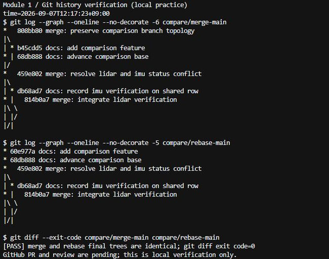
