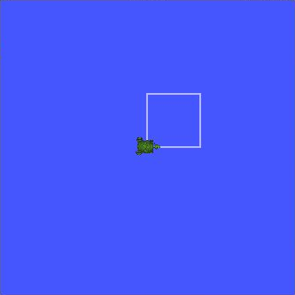
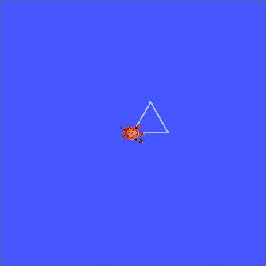
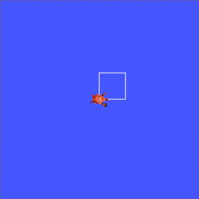
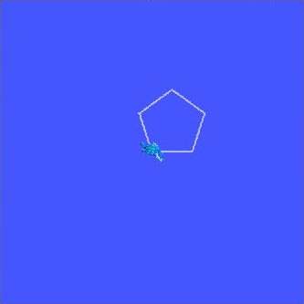
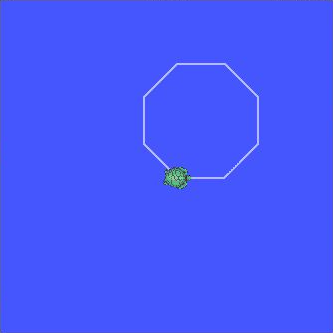
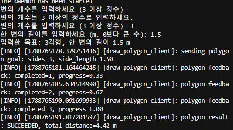
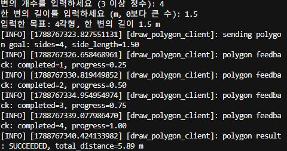
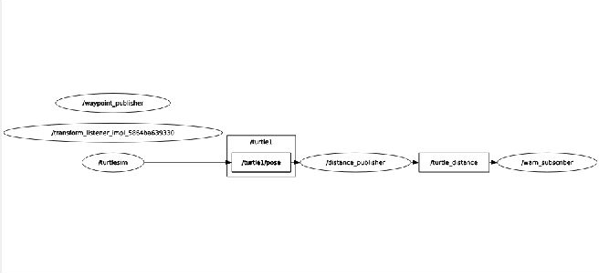
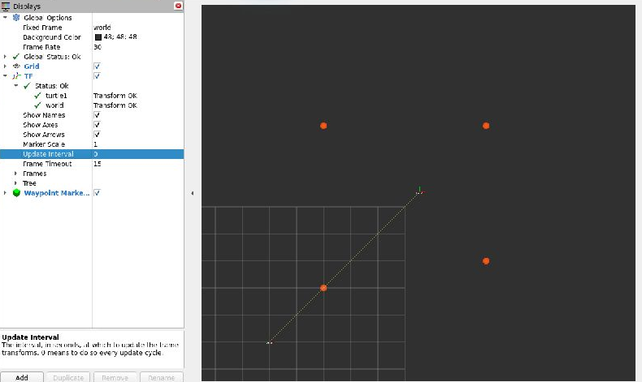

# 모듈 2 과제 — turtlesim 기반 C++·Python ROS 2 패키지 개발

작성자: 최성진

## 실행 환경과 재현 방법

2026-09-07에 아래 제출 폴더의 소스를 빌드하고 문제별로 실행함. 코드와 출력은 문제 번호 순서로 기록함.

| 항목 | 사용 환경 |
| --- | --- |
| 작업 폴더 | `C:\Desktop\coding\physicalai-lv1-최성진\lv1_module2` |
| Linux 경로 | `/mnt/c/Desktop/coding/physicalai-lv1-최성진/lv1_module2` |
| 운영체제·미들웨어 | WSL2 Ubuntu 22.04 · ROS 2 Humble |
| Python | 3.10.12 · `/home/chsjh/.venvs/ros2-humble/bin/python` |
| 패키지 | `turtle_interfaces`, `turtle_py`, `turtle_cpp` |
| 통신 | Fast DDS의 로컬 UDP 전송, 인터페이스 `127.0.0.1` |

새 터미널마다 다음 환경을 적용함. 아래 문제별 명령은 이 설정을 마친 터미널에서 실행함.

```bash
cd '/mnt/c/Desktop/coding/physicalai-lv1-최성진/lv1_module2'
source scripts/use_env.sh
MODULE_ROOT="$PWD"
WORKSPACE="$MODULE_ROOT/ros2_ws"
python -c 'import sys; print(sys.executable)'
```

실제 Python 경로:

```text
/home/chsjh/.venvs/ros2-humble/bin/python
```

설치된 Python 노드 12개의 첫 줄도 같은 가상환경 Python을 가리킴. `colcon` 실행 파일의 시스템 Python 대신 가상환경의 `python /usr/bin/colcon`으로 빌드함.

```bash
cd "$WORKSPACE"
python /usr/bin/colcon build \
  --build-base "$HOME/physicalai_lv1_build/module2_20260907/build" \
  --symlink-install --event-handlers console_direct+ \
  --cmake-args -DPython3_EXECUTABLE=/home/chsjh/.venvs/ros2-humble/bin/python
cd "$MODULE_ROOT"
source scripts/use_env.sh
```

Humble 인터페이스 생성 단계에서 한글이 포함된 중간 파일 경로가 분리되어 첫 빌드가 실패했음. 빌드 중간 파일만 홈 폴더의 영문 경로로 옮긴 후 세 패키지를 빌드함. 소스와 `install/`은 지정한 과제 폴더에 유지함. [최종 가상환경 빌드와 실행 파일 확인](evidence/20260907/00_environment_build_venv.txt)

[use_env.sh](scripts/use_env.sh)는 가상환경·ROS 2·현재 워크스페이스를 순서대로 설정한 뒤 [통신 설정](config/fastdds_loopback.xml)을 적용함. 터미널 실험은 ROS domain 62, 독립된 화면 캡처 실행은 63을 사용함. 같은 실험에 참여하는 터미널은 같은 domain을 사용해야 함. 기본 실행은 62이며, 화면 실험 환경은 `export MODULE2_DOMAIN_ID=63` 후 스크립트를 source하면 적용됨.

`build/`, `install/`, `log/`, 가상환경과 캐시는 재생성하는 파일임. 구현 소스·설정, 이 보고서, 실행 기록, 화면과 rosbag을 함께 보관함. 빠른 시작과 다각형 입력 방법은 [README](README.md)에 정리함.

---

## 문제 1. C++ 빌드 체계 — 수동 빌드·링크 오류·증분 빌드

### 1. 구현 파일과 실행 기준

2026-09-07에 제출 폴더의 C++ 소스를 사용하여 수동 빌드, 의도한 링크 오류, CMake(씨메이크) 빌드와 증분 빌드를 확인함. 전체 명령과 출력은 [문제 1·2 실행 기록](evidence/20260907/problem1_2/session.log)에 보관함.

| 파일 | 역할 |
| --- | --- |
| `cpp_basics/stop_distance.cpp` | 속도와 마찰계수를 입력받아 제동 거리를 계산함. |
| `cpp_basics/motor.hpp` | Motor 클래스의 생성자와 함수 선언을 둠. |
| `cpp_basics/motor.cpp` | Motor 함수의 실제 동작을 정의함. |
| `cpp_basics/main.cpp` | 왼쪽·오른쪽 모터 객체를 생성하고 속도를 설정·출력함. |
| `cpp_basics/CMakeLists.txt` | C++17, 소스와 실행 파일의 관계, `-Wall` 경고 옵션을 선언함. |

다음 명령은 같은 소스로 실험을 다시 수행하는 순서임. Ubuntu 터미널에서 실행하며, 컴파일 결과와 수정 실험용 복사본은 새 임시 폴더에 생성함. 아래 블록은 같은 터미널에서 순서대로 실행함. 당시의 실제 빌드 경로와 명령 전문은 위 실행 기록에 남아 있음.

```bash
MODULE_ROOT='/mnt/c/Desktop/coding/physicalai-lv1-최성진/lv1_module2'
CPP_ROOT="$MODULE_ROOT/cpp_basics"
CPP_RUN="$(mktemp -d /tmp/lv1_module2_cpp.XXXXXX)"
mkdir -p "$CPP_RUN/problem1"
```

### 2. 제동 거리 계산

평지에서 마찰에 의한 일정한 감속을 가정하여 `d = v² / (2μg)`를 사용함. 속도 `v=10 m/s`, 마찰계수 `μ=0.8`, 중력가속도 `g=9.81 m/s²`이면 `100 / 15.696 ≈ 6.371 m`임. 운전자나 제어기의 반응 시간 동안 이동한 거리는 포함하지 않은 제동 거리임. 코드에서 속도는 0 이상, 마찰계수는 0보다 큰 입력만 허용함.

```bash
g++ -Wall -std=c++17 "$CPP_ROOT/stop_distance.cpp" \
  -o "$CPP_RUN/problem1/stop_distance"
printf '10\n0.8\n' | "$CPP_RUN/problem1/stop_distance"
```

실제 출력:

```text
Speed (m/s): Friction coefficient: Stopping distance: 6.371 m
```

입력을 파이프로 전달했으므로 출력 파일에는 입력한 `10`, `0.8`이 다시 표시되지 않으며, 안내문이 같은 줄에 이어짐. 계산 결과는 소수 셋째 자리까지 `6.371 m`로 확인함. [계산 출력 원문](evidence/20260907/problem1_2/problem1/stop_distance.log)

### 3. 컴파일과 링크를 분리한 수동 빌드

Compile(컴파일)은 각 `.cpp`를 목적 파일 `.o`로 바꾸는 단계이고, Link(링크)는 목적 파일에 나뉜 함수 정의를 모아 실행 파일로 연결하는 단계임. 헤더는 각 `.cpp`에서 포함하므로 별도의 `.o`로 빌드하지 않음.

```bash
g++ -Wall -std=c++17 -c "$CPP_ROOT/motor.cpp" \
  -o "$CPP_RUN/problem1/motor.o"
g++ -Wall -std=c++17 -c "$CPP_ROOT/main.cpp" \
  -o "$CPP_RUN/problem1/main.o"
g++ -Wall -std=c++17 "$CPP_RUN/problem1/main.o" \
  "$CPP_RUN/problem1/motor.o" -o "$CPP_RUN/problem1/motor_app"
"$CPP_RUN/problem1/motor_app"
```

실제 출력:

```text
left motor speed: 120 rpm
right motor speed: 115 rpm
```

`main.cpp`에서 설정한 왼쪽 120 rpm, 오른쪽 115 rpm이 각각 출력됨. rpm은 모터가 1분 동안 회전하는 횟수임. [정상 실행 출력](evidence/20260907/problem1_2/problem1/motor_app.log)

### 4. motor.o를 제외한 링크 오류

다음 링크 명령에서 함수 정의가 들어 있는 `motor.o`를 의도적으로 제외함.

```bash
g++ -Wall -std=c++17 "$CPP_RUN/problem1/main.o" \
  -o "$CPP_RUN/problem1/motor_app_missing"
```

실제 오류 출력 발췌:

```text
/usr/bin/ld: main.cpp:(.text+0xf0): undefined reference to `Motor::set_rpm(double)'
/usr/bin/ld: main.cpp:(.text+0x108): undefined reference to `Motor::set_rpm(double)'
/usr/bin/ld: main.cpp:(.text+0x114): undefined reference to `Motor::print_status() const'
/usr/bin/ld: main.cpp:(.text+0x120): undefined reference to `Motor::print_status() const'
collect2: error: ld returned 1 exit status
```

종료 코드 **1**과 `undefined reference`를 확인함. 생성자 정의도 찾지 못한 오류가 함께 발생했으며 전문은 [링크 오류 로그](evidence/20260907/problem1_2/problem1/link_error.log)에 있음.

| 구분 | 발생 단계와 원인 | 이번 관찰 |
| --- | --- | --- |
| 컴파일 오류 | 소스 하나를 번역할 때 문법·타입·선언 등이 잘못되면 발생함. | 두 소스의 `.o` 생성은 성공함. |
| 링크 오류 | 이미 생성한 목적 파일들을 합칠 때 필요한 함수 정의를 찾지 못하면 발생함. | `motor.hpp`로 함수 선언은 알지만 `motor.o`를 빼서 실제 정의가 없음. |

수정은 소스 문법을 바꾸는 것이 아니라 앞 절의 정상 링크 명령처럼 `main.o`와 `motor.o`를 함께 전달하는 것임. 정상 조합에서는 모터 출력이 확인됨.

### 5. CMake 빌드

제출 소스 다섯 개를 별도 폴더로 복사하여 빌드함. 이 복사본을 다음 증분 빌드 실험에도 사용했으며, 실험을 위해 제출 원본의 `motor.cpp`를 변경하지 않았음.

```bash
mkdir -p "$CPP_RUN/problem1/cmake_source"
cp "$CPP_ROOT/CMakeLists.txt" "$CPP_ROOT/stop_distance.cpp" \
  "$CPP_ROOT/motor.hpp" "$CPP_ROOT/motor.cpp" "$CPP_ROOT/main.cpp" \
  "$CPP_RUN/problem1/cmake_source/"
cmake -S "$CPP_RUN/problem1/cmake_source" \
  -B "$CPP_RUN/problem1/cmake_build"
cmake --build "$CPP_RUN/problem1/cmake_build" --verbose
```

실제 구성 출력에서 `GNU 11.4.0`, `Configuring done`, `Generating done`을 확인함. `cmake --build`가 `/usr/bin/gmake`를 호출했으므로 과제의 CMake 구성 후 Make(메이크) 빌드와 같은 빌드 도구를 사용함.

실제 최초 빌드 출력 발췌:

```text
[ 20%] Building CXX object CMakeFiles/stop_distance.dir/stop_distance.cpp.o
[ 40%] Linking CXX executable stop_distance
[ 40%] Built target stop_distance
[ 60%] Building CXX object CMakeFiles/motor_app.dir/main.cpp.o
[ 80%] Building CXX object CMakeFiles/motor_app.dir/motor.cpp.o
[100%] Linking CXX executable motor_app
[100%] Built target motor_app
```

`stop_distance.cpp`, `main.cpp`, `motor.cpp`를 각각 컴파일하고 실행 파일 두 개를 링크함. [CMake 구성 로그](evidence/20260907/problem1_2/problem1/cmake_configure.log), [최초 빌드 원문](evidence/20260907/problem1_2/problem1/cmake_first_build.log)

### 6. 복사본 motor.cpp 수정과 증분 빌드

복사본 `motor.cpp`의 출력 문자열만 ` motor speed: `에서 ` motor speed after edit: `로 바꿈. 파일의 시간을 건드리기만 한 것이 아니라 실제 소스 한 줄을 변경함. 변경 내용은 [원본과 복사본 비교](evidence/20260907/problem1_2/problem1/source_edit.diff)에 남김.

```bash
sleep 1
python3 - "$CPP_RUN/problem1/cmake_source/motor.cpp" <<'PY'
import pathlib
import sys

path = pathlib.Path(sys.argv[1])
text = path.read_text()
assert ' motor speed: ' in text
path.write_text(text.replace(' motor speed: ', ' motor speed after edit: ', 1))
PY
cmake --build "$CPP_RUN/problem1/cmake_build" --verbose
"$CPP_RUN/problem1/cmake_build/motor_app"
```

실제 증분 빌드 출력 발췌:

```text
gmake[2]: Nothing to be done for 'CMakeFiles/stop_distance.dir/build'.
[ 40%] Built target stop_distance
[ 60%] Building CXX object CMakeFiles/motor_app.dir/motor.cpp.o
[ 80%] Linking CXX executable motor_app
[100%] Built target motor_app
```

변경 후 실행 출력:

```text
left motor speed after edit: 120 rpm
right motor speed after edit: 115 rpm
```

재컴파일 대상은 **motor.cpp 하나**였음. `main.cpp.o`는 다시 만들지 않았고 기존 목적 파일을 재사용함. 변경된 목적 파일이 들어가는 `motor_app`은 다시 링크했으며, 관계없는 `stop_distance`는 그대로 사용함. 새 출력 문자열이 실행 결과에 나타나 수정한 소스가 실행 파일에 반영된 것도 확인함. [증분 빌드 원문](evidence/20260907/problem1_2/problem1/cmake_incremental.log), [수정 후 실행 출력](evidence/20260907/problem1_2/problem1/motor_after_edit.log)

Incremental build(인크리멘털 빌드)는 변경된 부분의 영향 범위만 다시 만드는 방식임. 이번 Make 빌드는 CMake가 만든 의존 관계와 소스·헤더·목적 파일의 수정 시각을 이용해 대상을 판단함. `motor.cpp`가 해당 `.o`보다 새로워졌으므로 그 파일을 재컴파일하고, 이를 포함하는 실행 파일을 다시 링크함.

## 문제 2. 현대 C++ 센서 계층 — 다형성·소멸자·메모리 관리

### 1. 구현과 빌드

`cpp_basics/sensors/`에 공통 규칙인 Sensor, 파생 클래스 Lidar와 Imu, 다형성·STL·메모리 실험을 실행하는 main.cpp를 구현함. Sensor의 `virtual double read() const = 0`으로 센서별 읽기 동작을 요구하고, 정상 빌드에서는 `virtual ~Sensor()`로 파생 객체가 올바르게 정리되도록 함.

재현 명령은 문제 1에서 설정한 `MODULE_ROOT`, `CPP_RUN`을 이어서 사용함. 새 터미널이면 문제 1의 변수 설정 블록을 먼저 실행함.

```bash
cmake -S "$MODULE_ROOT/cpp_basics/sensors" \
  -B "$CPP_RUN/problem2/build" -DCMAKE_BUILD_TYPE=Debug
cmake --build "$CPP_RUN/problem2/build" --verbose
```

실제 빌드 출력 발췌:

```text
[ 33%] Built target sensors_app
[ 66%] Built target sensors_asan
[100%] Built target sensors_no_virtual
```

| 실행 파일 | 목적 |
| --- | --- |
| `sensors_app` | 가상 소멸자가 있는 정상 센서 계층, 다형성, STL, 객체 수명을 확인함. |
| `sensors_asan` | `-fsanitize=address`로 누수 발생 코드와 수정 코드를 비교함. |
| `sensors_no_virtual` | 컴파일 정의 `SENSOR_DEMO_NON_VIRTUAL_DESTRUCTOR`로 비가상 소멸자 분기를 선택하여 위험한 삭제를 관찰함. |

비가상 소멸자 버전은 별도 실행 파일로 빌드했으며, 정상 버전에서 가상 소멸자를 제거한 것이 아님. 이 비교 버전에서는 `-Wnon-virtual-dtor` 경고가 발생함. 세 대상은 모두 빌드되었고, 상세 명령은 [구성 로그](evidence/20260907/problem1_2/problem2/cmake_configure.log)와 [빌드 로그](evidence/20260907/problem1_2/problem2/cmake_build.log)에 기록함.

### 2. 다형성·최근 측정값·거리 기록

```bash
"$CPP_RUN/problem2/build/sensors_app"
```

실제 출력 발췌:

```text
[create] Sensor base: front_lidar
[create] Lidar: front_lidar
[create] Sensor base: body_imu
[create] Imu: body_imu
[read] front_lidar (Lidar) = 1.20 m
[read] body_imu (Imu yaw rate) = 0.35 rad/s

Latest measurements (unordered_map)
  body_imu -> 0.35
  front_lidar -> 1.20
Records within 0.35 m: 1
```

`std::vector<std::unique_ptr<Sensor>>`에는 Sensor를 가리키는 포인터를 넣었지만, `read()` 호출은 실제 객체에 맞게 Lidar와 Imu의 구현으로 연결됨. 이를 Polymorphism(폴리모피즘), 즉 같은 호출 형태로 센서별 동작을 실행하는 다형성이라고 함.

`std::unordered_map<std::string, double>`은 센서 이름을 키로 하여 최근 측정값을 저장함. 출력 순서는 보장하지 않으므로 이름과 값의 대응을 확인함.

거리 기록 `1.20, 0.49, 0.50, 0.51, 0.10, 0.90`에 `std::count_if`의 `distance <= 0.35` 조건을 적용함. 조건을 만족하는 값은 `0.10` 하나이므로 결과는 **1개**임. Imu의 `0.35 rad/s`는 각속도이며 별도 거리 기록과 혼동하지 않음. [정상 실행 전체 로그](evidence/20260907/problem1_2/problem2/normal.log)

### 3. clamp 함수 템플릿

`clamp<T>`는 최솟값과 최댓값을 받아 값을 범위 안으로 제한함. 동일한 함수 템플릿을 double 속도와 int 픽셀값에 적용함.

실제 출력:

```text
=== 2. clamp template ===
double speed: 3.70 -> 2.00
int pixel: 300 -> 255
```

속도 3.70은 범위 `0.0~2.0`의 상한 2.00으로, 픽셀 300은 범위 `0~255`의 상한 255로 제한됨. 자료형마다 같은 코드를 따로 작성하지 않아도 각 자료형으로 함수를 사용할 수 있음을 확인함.

### 4. 스택 객체와 힙 객체의 소멸 시점

정상 실행에서 출력한 소멸 순서:

```text
=== 3. Stack lifetime ===
[create] Sensor base: stack_lidar
[create] Lidar: stack_lidar
[read] stack_lidar (Lidar) = 2.40 m
End of stack scope -> destructor runs now.
[destroy] Lidar: stack_lidar
[destroy] Sensor base: stack_lidar

=== 4. Heap lifetime managed by unique_ptr ===
[create] Sensor base: heap_imu
[create] Imu: heap_imu
[read] heap_imu (Imu yaw rate) = 0.75 rad/s
End of unique_ptr scope -> destructor runs now.
[destroy] Imu: heap_imu
[destroy] Sensor base: heap_imu
```

지역 변수 `Lidar stack_sensor`는 해당 중괄호 범위를 벗어날 때 소멸함. `std::make_unique<Imu>`로 생성한 객체는 힙에 존재하지만, 이를 소유한 unique_ptr(유니크 포인터)이 범위를 벗어나면서 객체를 자동 삭제함. 이 실험에서는 두 방식 모두 범위 종료가 정리 시점이었으며, 힙 객체가 무조건 프로그램 종료 때까지 살아 있는 것은 아님.

두 경우 모두 **자식 소멸자 → 부모 Sensor 소멸자** 순서가 출력됨. 다형성 벡터의 `front_lidar`에서도 Lidar 소멸자가 먼저, Sensor 소멸자가 다음으로 출력됨.

### 5. 가상 소멸자를 제외한 비교 실험

```bash
"$CPP_RUN/problem2/build/sensors_no_virtual" --destructor-demo
```

Lidar를 생성한 뒤 `unique_ptr<Sensor>`를 통해 삭제하는 순간 AddressSanitizer(어드레스 새니타이저)가 타입 불일치를 검출함. 실행 종료 코드는 **1**이었음.

실제 오류 출력 발췌:

```text
==11181==ERROR: AddressSanitizer: new-delete-type-mismatch on 0x506000000020 in thread T0:
  object passed to delete has wrong type:
  size of the allocated type:   64 bytes;
  size of the deallocated type: 40 bytes.
```

이번 실행에서는 64바이트 Lidar 객체를 생성했지만, 비가상 소멸자를 가진 Sensor를 통해 40바이트 타입으로 삭제하려 하여 오류가 발생함. 부모 포인터로 파생 객체를 삭제하는 구조에서는 부모 소멸자가 가상이어야 함. 가상 소멸자가 없는 삭제는 Undefined behavior(언디파인드 비헤이비어), 즉 C++에서 결과를 보장하지 않는 동작이므로 단순히 “부모만 항상 소멸함”이라고 일반화하지 않음. [비가상 소멸자 오류 전문](evidence/20260907/problem1_2/problem2/no_virtual.log)

### 6. 메모리 누수 재현과 검출

`--leak` 분기에서는 반복문으로 Lidar 세 개를 `new`로 생성하고 `delete`를 생략함. 각 Lidar는 double 세 개를 저장하는 vector도 소유하므로 객체 자체와 내부 저장 공간이 함께 남음.

```bash
ASAN_OPTIONS=detect_leaks=1 \
  "$CPP_RUN/problem2/build/sensors_asan" --leak
```

실제 검출 결과 발췌:

```text
==11182==ERROR: LeakSanitizer: detected memory leaks
Direct leak of 192 byte(s) in 3 object(s) allocated from:
Indirect leak of 72 byte(s) in 3 object(s) allocated from:
SUMMARY: AddressSanitizer: 264 byte(s) leaked in 6 allocation(s).
```

직접 누수는 Lidar 세 개의 `64 × 3 = 192바이트`, 간접 누수는 내부 vector 데이터의 `3 × 8 × 3 = 72바이트`로 확인함. 합계는 **264바이트, 6회 할당**이며 종료 코드는 **1**임. 이는 이번 g++ 11.4.0 환경에서 관찰한 수치이며, 핵심은 삭제되지 않은 메모리를 검사 도구가 검출했다는 점임. [누수 오류 전문](evidence/20260907/problem1_2/problem2/leak.log)

### 7. make_unique를 사용한 수정 방식

`--fixed` 분기에서는 같은 수의 센서를 `std::make_unique<Lidar>`로 만들고 `vector<unique_ptr<Sensor>>`가 소유하도록 함. 반복문에서 생성한 객체가 함수 종료 시 자동으로 삭제되도록 수정한 코드 경로를 실행함.

```bash
ASAN_OPTIONS=detect_leaks=1 \
  "$CPP_RUN/problem2/build/sensors_asan" --fixed
```

실제 출력 발췌:

```text
Program exit: unique_ptr releases every sensor automatically.
[destroy] Lidar: managed_lidar_0
[destroy] Sensor base: managed_lidar_0
[destroy] Lidar: managed_lidar_1
[destroy] Sensor base: managed_lidar_1
[destroy] Lidar: managed_lidar_2
[destroy] Sensor base: managed_lidar_2
```

수정 버전은 종료 코드 **0**으로 끝났고, `AddressSanitizer`와 `LeakSanitizer` 오류가 없음을 로그로 확인함. 센서 세 개 모두 자식·부모 소멸자가 출력됨. RAII(알에이아이아이)는 자원 정리를 객체 수명에 연결하는 방식이며, 이 코드에서는 unique_ptr가 범위를 벗어날 때 메모리를 자동 해제하는 역할을 함. [수정 버전 출력](evidence/20260907/problem1_2/problem2/fixed.log)

| 확인 항목 | 이번 결과 |
| --- | --- |
| 다형성 루프 | Lidar 1.20 m, Imu 0.35 rad/s를 각 구현으로 읽음. |
| 0.35 이하 거리 기록 | 1개임. |
| clamp 템플릿 | double 3.70 → 2.00, int 300 → 255임. |
| 지역·make_unique 객체 소멸 | 각 범위 종료 때 자식 → 부모 순서로 소멸함. |
| 가상 소멸자 제외 | new-delete-type-mismatch, 종료 코드 1을 확인함. |
| delete 생략 | 264바이트/6회 할당 누수, 종료 코드 1을 확인함. |
| make_unique 수정 코드 | 세 객체를 정리하고 누수 오류 없이 종료 코드 0으로 끝남. |

---

## 문제 3. rclpy 노드 — 거리 발행·구독·정사각형 주행

### 1. 패키지와 노드 구성

`turtle_py`를 `ament_python` 패키지로 구성하고, 상태 발행·경고 구독·사각형 주행을 각각의 노드로 구현함. 2026-09-07 16:06~16:07의 실제 실행에서 기본 10 Hz, 실행 중 20 Hz 변경, 두 구독자의 동시 수신, 네 변 주행과 종료를 확인함. [실제 실행 명령·출력 전체](evidence/20260907/problem3_4/session.log)

| 실행 파일 | 소스 | 역할 |
| --- | --- | --- |
| `distance_publisher` | `turtle_py/distance_publisher.py` | `/turtle1/pose`를 저장하고, 타이머에서 원점 거리 `hypot(x, y)`를 `/turtle_distance`에 `std_msgs/msg/Float32`로 발행함. |
| `warn_subscriber` | `turtle_py/warn_subscriber.py` | 거리 토픽을 구독하고 `warn_distance`보다 크면 경고를 출력함. 기본 임계값은 2.5임. |
| `square_driver` | `turtle_py/square_driver.py` | `geometry_msgs/msg/Twist`를 `/turtle1/cmd_vel`에 보내 네 변 이동과 제자리 회전을 수행함. |

Pose(포즈)는 위치와 방향을 함께 나타내는 상태임. 구독 Callback(콜백)은 데이터가 도착했을 때 실행되는 함수이며, 상태 발행자는 이 콜백에서 최신 Pose와 수신 시각을 저장함. 거리 계산과 발행은 Timer(타이머) 콜백에서 수행하므로 pose의 수신 주기와 거리 발행 주기를 구분함.

`setup.py`의 `console_scripts`에는 `distance_publisher = turtle_py.distance_publisher:main`, `warn_subscriber = turtle_py.warn_subscriber:main`, `square_driver = turtle_py.square_driver:main`을 등록함. 노드 실행 파일이 올바른 Python을 사용하도록 가상환경의 Python으로 colcon을 실행하여 빌드함.

설치한 square_driver의 첫 줄을 확인한 실제 결과:

```text
#!/home/chsjh/.venvs/ros2-humble/bin/python
```

Shebang(셔뱅)은 실행 파일 첫 줄에서 사용할 해석기를 지정하는 표시임. 이 결과로 설치한 노드가 `/home/chsjh/.venvs/ros2-humble/bin/python`을 사용하도록 생성됐음을 확인함. [빌드·패키지 발견·셔뱅 확인 기록](evidence/20260907/00_environment_build_venv.txt)

### 2. 실행 명령과 pose 필드

재현할 때는 공통 환경 절의 가상환경·ROS 2·현재 워크스페이스 및 통신 설정을 **새 터미널마다** 적용함. 다음 소스·설치 경로를 사용함.

```bash
MODULE_ROOT='/mnt/c/Desktop/coding/physicalai-lv1-최성진/lv1_module2'
WORKSPACE="$MODULE_ROOT/ros2_ws"
source /home/chsjh/.venvs/ros2-humble/bin/activate
source /opt/ros/humble/setup.bash
source "$WORKSPACE/install/setup.bash"
```

각 실행 명령은 별도의 터미널에서 실행함.

| 터미널 | 실행 명령 |
| --- | --- |
| 1 | `ros2 run turtlesim turtlesim_node` |
| 2 | `ros2 run turtle_py distance_publisher` |
| 3 | `ros2 run turtle_py warn_subscriber --ros-args -r __node:=warn_subscriber_1` |
| 4 | `ros2 run turtle_py warn_subscriber --ros-args -r __node:=warn_subscriber_2` |

자동 실행 기록에서는 Python 노드를 `$WORKSPACE/install/turtle_py/lib/turtle_py/`의 설치 실행 파일로 직접 기동함. 이는 `ros2 run turtle_py <실행 파일>`이 찾는 같은 실행 파일이며, 프로세스별 종료 신호와 종료 코드를 직접 확인하기 위해 사용함.

별도 조회 터미널에서 pose를 읽음.

```bash
ros2 topic echo /turtle1/pose turtlesim/msg/Pose --once
```

실제 출력:

```text
x: 5.544444561004639
y: 5.544444561004639
theta: 0.0
linear_velocity: 0.0
angular_velocity: 0.0
---
```

`x`, `y`는 위치, `theta`는 라디안 방향, `linear_velocity`와 `angular_velocity`는 선속도와 각속도임. 초기 원점 거리는 `hypot(5.544444561, 5.544444561) ≈ 7.841`로 계산됨. [pose 출력 원문](evidence/20260907/problem3_4/pose_once.log)

### 3. 기본 10 Hz와 두 구독자의 동시 수신

```bash
ros2 param get /distance_publisher publish_rate
ros2 param get /warn_subscriber_1 warn_distance
ros2 topic hz /turtle_distance
```

파라미터 조회 실제 결과는 순서대로 다음과 같음.

```text
Double value is: 10.0
Double value is: 2.5
```

주기 측정 출력 발췌:

```text
average rate: 9.998
average rate: 10.000
average rate: 10.000
average rate: 10.000
```

최종 측정 평균은 **10.000 Hz**, 메시지 간 간격은 약 **0.100초**였음. Hz(헤르츠)는 1초에 몇 번 발생하는지를 나타내므로 10 Hz는 1초에 약 10회 발행한다는 의미임. [주기 로그](evidence/20260907/problem3_4/distance_hz.log), [발행 주기 파라미터](evidence/20260907/problem3_4/publish_rate.log), [경고 임계값 파라미터](evidence/20260907/problem3_4/warn_distance.log)

두 구독자의 실제 출력:

```text
[WARN] [1788764768.580692889] [warn_subscriber_1]: distance warning: 7.841 m > 2.500 m
[WARN] [1788764768.580349074] [warn_subscriber_2]: distance warning: 7.841 m > 2.500 m
```

동일한 시간 구간에 두 노드 모두 7.841 값을 수신했음을 확인함. 초기 거리 7.841이 임계값 2.5보다 크므로 양쪽에 경고가 발생함. 한 번의 토픽 발행을 여러 구독자가 각각 받을 수 있음을 두 로그의 겹치는 수신 시간으로 확인함. [구독자 1 원문](evidence/20260907/problem3_4/warn_subscriber_1.log), [구독자 2 원문](evidence/20260907/problem3_4/warn_subscriber_2.log)

### 4. 실행 중 파라미터 변경

발행자는 `publish_rate` 변경을 받으면 기존 타이머를 제거하고 `1 / publish_rate`초 간격의 새 타이머를 생성함. 구독자는 `warn_distance` 변경을 받으면 이후 수신 메시지에 새 임계값을 적용함.

```bash
ros2 param set /distance_publisher publish_rate 20.0
ros2 topic hz /turtle_distance
```

설정 명령 결과:

```text
Set parameter successful
```

변경 후 실제 주기:

```text
average rate: 20.003
average rate: 20.000
average rate: 19.999
```

노드를 다시 시작하지 않고 **10.000 Hz → 19.999 Hz**로 바뀌었으며, 간격도 약 0.100초에서 0.050초로 줄어듦. 발행자 로그에도 `publish_rate changed to 20.0 Hz`가 기록됨. [설정 응답](evidence/20260907/problem3_4/change_publish_rate.log), [변경 후 주기](evidence/20260907/problem3_4/distance_hz_changed.log), [발행자 로그](evidence/20260907/problem3_4/distance_publisher.log)

```bash
ros2 param set /warn_subscriber_1 warn_distance 8.0
ros2 param get /warn_subscriber_1 warn_distance
ros2 param set /distance_publisher publish_rate 10.0
```

경고 임계값 설정 응답은 `Set parameter successful`, 조회값은 `Double value is: 8.0`이었음. 이후 사각형 주행 중 구독자 1에서 `distance warning: 8.023 m > 8.000 m`와 같이 변경된 8.0 기준으로 경고가 출력됨. 구독자 2는 별도 설정을 바꾸지 않았으므로 기본 2.5를 유지함. 사각형 실험 전에는 발행 주기를 10.0으로 되돌림. [임계값 변경 응답](evidence/20260907/problem3_4/change_warn_distance.log), [변경값 조회](evidence/20260907/problem3_4/changed_warn_distance.log)

### 5. 명시적 for 반복으로 네 변 주행

`square_driver.py`의 `SQUARE_SIDES = 4`와 `for side_index in range(self.SQUARE_SIDES)`로 네 변을 순회함. 시작 Pose를 기준으로 한 변 길이 2.0의 목표 꼭짓점을 계산하며, 목표점에 도착하면 다음 변의 방향으로 90° 제자리 회전함.

실제 소스의 반복 구조 발췌:

```python
for side_index in range(self.SQUARE_SIDES):
    target_x = vertex_x + self._side_length * math.cos(desired_heading)
    target_y = vertex_y + self._side_length * math.sin(desired_heading)
    if not self._drive_to(target_x, target_y):
        return False
    vertex_x = target_x
    vertex_y = target_y
    desired_heading = normalize_angle(
        desired_heading + 2.0 * math.pi / self.SQUARE_SIDES)
    if not self._turn_to(desired_heading):
        return False
```

`_drive_to()`는 현재 Pose와 목표점의 거리·방향 오차를 반복해서 확인하며 전진 속도와 각속도를 보정함. `_turn_to()`는 선속도 0 상태에서 방향 오차를 줄임. 위치 허용오차는 **0.01**, 방향 허용오차는 **0.02 rad**, 제어 확인 간격은 **0.05초**로 설정함. Feedback(피드백)은 실제 측정 상태를 다음 제어에 반영하는 방식이며, 네 변의 실행 시간을 미리 정하는 대신 현재 상태로 도착 여부를 판단함.

조회 터미널에서 초기화한 뒤 시작 Pose를 기록하고, 새 터미널에서 square_driver를 실행함.

```bash
ros2 service call /reset std_srvs/srv/Empty '{}'
ros2 topic echo /turtle1/pose turtlesim/msg/Pose --once
```

```bash
ros2 run turtle_py square_driver
```

실제 실행 출력 발췌:

```text
[INFO] [1788764800.448861949] [square_driver]: side 1/4 target: x=7.544, y=5.544
[INFO] [1788764805.135744286] [square_driver]: completed side 1/4
[INFO] [1788764805.147541427] [square_driver]: side 2/4 target: x=7.544, y=7.544
[INFO] [1788764809.835423865] [square_driver]: completed side 2/4
[INFO] [1788764809.845162526] [square_driver]: side 3/4 target: x=5.544, y=7.544
[INFO] [1788764814.532014459] [square_driver]: completed side 3/4
[INFO] [1788764814.542189713] [square_driver]: side 4/4 target: x=5.544, y=5.544
[INFO] [1788764819.232474057] [square_driver]: completed side 4/4
[INFO] [1788764819.242533942] [square_driver]: square completed; turtle stopped
```

`completed side`가 정확히 네 번 출력됐으며, 종료 Pose의 선속도와 각속도 모두 0이었음. [주행 로그](evidence/20260907/problem3_4/square_driver.log)

| 항목 | 시작 | 종료 |
| --- | ---: | ---: |
| x | 5.544444561004639 | 5.544465065002441 |
| y | 5.544444561004639 | 5.552391529083252 |
| theta | 0.0 | -0.016876209527254105 |
| linear_velocity | 0.0 | 0.0 |
| angular_velocity | 0.0 | 0.0 |

시작점과 종료점의 거리 `hypot(x종료 - x시작, y종료 - y시작)`는 **0.007947 m**, 약 **7.95 mm**였음. 설정한 위치 허용오차 0.01 m 안으로 복귀했으며, 방향 차이도 약 0.01688 rad로 0.02 rad 이내였음. [시작 Pose](evidence/20260907/problem3_4/square_start_pose.log), [종료 Pose](evidence/20260907/problem3_4/square_end_pose.log)

같은 구현으로 실행한 사각형 화면을 별도로 캡처함.



### 6. 노드 생명주기와 종료

거리 발행자·경고 구독자·사각형 노드의 시작·종료 흐름을 `rclpy.init()` → 노드 생성 → `rclpy.spin()` → `destroy_node()` → 필요 시 `rclpy.shutdown()` 순서로 구현함. `KeyboardInterrupt`와 `ExternalShutdownException`을 처리하여 종료 과정에서 예외가 상위로 전파되지 않도록 함. 사각형 노드는 종료 이벤트를 설정하고 작업 스레드를 정리한 뒤 노드를 파괴함.

자동 실험에서는 Ctrl+C와 같은 SIGINT(시그인트) 신호를 각 프로세스에 보내고 실제 종료 코드를 확인함.

```text
SIGINT pid=14193 exit=0
SIGINT pid=14001 exit=0
SIGINT pid=14004 exit=0
SIGINT pid=13998 exit=0
```

위 순서는 square_driver, warn_subscriber_1, warn_subscriber_2, distance_publisher이며 네 프로세스 모두 **종료 코드 0**으로 끝났음. Python Traceback(트레이스백), 미처리 예외 기록은 확인되지 않음. [종료 코드 원문](evidence/20260907/problem3_4/clean_shutdown.log)

다만 구독자 2의 종료 순간에는 다음 rosout 로그 전송 경고 한 줄이 기록됨.

```text
Failed to publish log message to rosout: publisher's context is invalid, at ./src/rcl/publisher.c:389
```

구독자 2는 종료 코드 0으로 끝났지만, 종료 순간 rosout으로 로그를 보내는 과정에서는 위 경고가 발생함. [해당 구독자 종료 기록](evidence/20260907/problem3_4/warn_subscriber_2.log)

## 문제 4. rclcpp 노드 — C++ 발행·구독과 언어 교차 통신

### 1. 패키지와 CMake 구성

`turtle_cpp`를 `ament_cmake` 패키지로 구성하고 `src/distance_publisher.cpp`, `src/distance_subscriber.cpp`를 작성함. C++ 발행자는 `/turtle1/pose`의 x·y를 저장하고 타이머에서 `std::hypot`으로 원점 거리를 계산하여 `/turtle_distance`에 `std_msgs/msg/Float32`로 기본 10 Hz 발행함. 구독자는 같은 메시지를 받아 값을 로그로 출력함.

| CMake 항목 | 선언과 역할 |
| --- | --- |
| `find_package` | ament_cmake, rclcpp, rcl_interfaces, std_msgs, turtlesim을 찾음. |
| `add_executable` | distance_publisher와 distance_subscriber 실행 파일을 각 소스로 생성함. |
| `ament_target_dependencies` | 발행자에 rclcpp/rcl_interfaces/std_msgs/turtlesim, 구독자에 rclcpp/std_msgs를 연결함. |
| `install` | 두 실행 파일을 `lib/${PROJECT_NAME}`에 설치하여 ros2 run으로 찾을 수 있게 함. |
| `ament_package()` | ROS 패키지의 빌드·설치 정보를 마무리함. |

현재 빌드에서 사용한 명령:

```bash
cd '/mnt/c/Desktop/coding/physicalai-lv1-최성진/lv1_module2/ros2_ws'
python /usr/bin/colcon build \
  --build-base /home/chsjh/physicalai_lv1_build/module2_20260907/build \
  --symlink-install --event-handlers console_direct+ \
  --cmake-args -DPython3_EXECUTABLE=/home/chsjh/.venvs/ros2-humble/bin/python
source install/setup.bash
```

빌드 로그에서 turtle_cpp의 시작·종료와 전체 세 패키지의 성공 요약을 확인함. 이 명령은 단일 패키지만 빌드한 명령이 아니라 turtle_cpp·turtle_interfaces·turtle_py 전체 빌드임.

```text
Starting >>> turtle_cpp
Finished <<< turtle_cpp [3.99s]
Summary: 3 packages finished [9.38s]
```

`ros2 pkg prefix turtle_cpp`가 현재 제출 폴더의 `ros2_ws/install/turtle_cpp`를 반환했으며, 실제 실행도 이 설치 경로의 바이너리를 사용함. [빌드 성공·설치 경로 원문](evidence/20260907/00_environment_build_venv.txt)

### 2. Python 발행자 → C++ 구독자

문제 3의 turtlesim과 Python 거리 발행자가 실행 중인 상태에서 다음 C++ 구독자를 추가함.

```bash
ros2 run turtle_cpp distance_subscriber
```

실제 C++ 구독 출력:

```text
[INFO] [1788764767.394082724] [cpp_distance_subscriber]: C++ subscriber listening on /turtle_distance
[INFO] [1788764768.475090718] [cpp_distance_subscriber]: C++ received distance: 7.841 m
[INFO] [1788764768.575222531] [cpp_distance_subscriber]: C++ received distance: 7.841 m
[INFO] [1788764768.675091291] [cpp_distance_subscriber]: C++ received distance: 7.841 m
```

이 구간의 토픽 정보에는 발행자 수 1, 발행자 이름 distance_publisher, 메시지 타입 Float32가 기록됨. 이때 C++ 발행자는 아직 시작하지 않았으므로 위 로그는 **Python 발행 → C++ 구독** 조합의 결과임. [C++ 수신 원문](evidence/20260907/problem3_4/cpp_distance_subscriber.log), [Python 발행 구간 토픽 정보](evidence/20260907/problem3_4/python_publisher_topic_info.log)

노드가 사용하는 언어는 달라도 토픽 이름·메시지 타입·호환되는 통신 설정을 맞추면 같은 데이터 통로를 사용할 수 있음을 확인함.

### 3. C++ 발행자 자체 동작

Python 발행자와 경고 구독자를 종료한 다음 C++ 발행자를 기동함. turtlesim과 C++ 구독자는 계속 실행함.

```bash
ros2 run turtle_cpp distance_publisher
```

별도 조회 터미널에서 실행함.

```bash
ros2 topic hz /turtle_distance
ros2 topic echo /turtle_distance std_msgs/msg/Float32 --once
```

발행자 시작 로그:

```text
[INFO] [1788764822.819302055] [cpp_distance_publisher]: C++ distance publisher: /turtle1/pose -> /turtle_distance at 10.0 Hz
```

실제 주기 측정:

```text
average rate: 9.999
average rate: 10.000
average rate: 10.000
average rate: 10.000
```

실제 메시지 출력:

```text
data: 7.8466644287109375
---
```

사각형 주행 후 위치를 입력으로 한 원점 거리 값이며, C++ 발행자의 최종 평균은 **10.000 Hz**였음. Python 발행자를 종료한 뒤 관찰했으므로 두 발행자의 주기가 합산된 결과가 아님. [C++ 발행자 로그](evidence/20260907/problem3_4/cpp_distance_publisher.log), [C++ 발행 주기](evidence/20260907/problem3_4/cpp_distance_hz.log), [C++ 메시지 출력](evidence/20260907/problem3_4/cpp_distance_echo.log)

### 4. rclpy와 rclcpp 대응

| 비교 항목 | Python rclpy | C++ rclcpp | 역할 |
| --- | --- | --- | --- |
| 노드 생성 | Node를 상속하고 `DistancePublisher()` 생성 | rclcpp::Node를 상속하고 `std::make_shared<DistancePublisher>()` 생성 | 노드 이름·통신 객체·설정을 보관함. |
| 타이머 | `create_timer(1.0 / rate, callback)` | `create_wall_timer(period, callback)` | 일정 시간 간격으로 거리 메시지를 발행함. |
| 콜백 | `_on_pose`, `_on_timer` 같은 메서드를 전달 | pose 수신·타이머에 lambda(람다) 함수를 전달 | 데이터 도착이나 타이머 시점에 실제 처리를 수행함. |
| 종료 | 예외 처리 후 `destroy_node()`, `rclpy.shutdown()` | spin 종료 후 `node.reset()`, `rclcpp::shutdown()` | 노드와 ROS 실행 자원을 정리함. |

Python에서는 동적으로 타입을 전달하고 C++에서는 템플릿으로 메시지 타입을 지정하지만, 구독·계산·주기 발행이라는 처리 흐름은 동일함. C++ 로그에서는 종료 시 `signal_handler(SIGINT/SIGTERM)`이 출력되어 ROS 신호 처리 경로로 종료됨을 확인함.

---

## 문제 5. Service와 Action — 내장 호출·주행 제어·피드백·취소

### 1. 실행 구성과 내장 서비스 타입

2026-09-07 16:10~16:12에 현재 `turtle_py` 패키지의 서비스·액션 시나리오를 실행함. 모든 터미널은 공통 환경 절의 현재 워크스페이스와 동일한 통신 설정을 사용함. 아래 실험을 시작할 때는 새 turtlesim을 실행하고, 이전 주행 노드가 같은 거북이에 속도 명령을 보내지 않도록 정리함. [전체 실행 명령·출력](evidence/20260907/problem5_6/session.log)

```bash
ros2 run turtlesim turtlesim_node
```

조회 터미널에서 서비스 목록과 네 타입을 확인함.

```bash
ros2 service list --no-daemon --spin-time 1 -t
ros2 service type /turtle1/teleport_absolute
ros2 service type /turtle1/set_pen
ros2 service type /spawn
ros2 service type /clear
```

실제 목록에서 확인한 네 서비스:

```text
/clear [std_srvs/srv/Empty]
/spawn [turtlesim/srv/Spawn]
/turtle1/set_pen [turtlesim/srv/SetPen]
/turtle1/teleport_absolute [turtlesim/srv/TeleportAbsolute]
```

각 `service type` 조회에서도 같은 타입이 반환됨. [서비스 목록](evidence/20260907/problem5_6/service_types.log), [개별 타입 조회](evidence/20260907/problem5_6/service_type_queries.log)

### 2. 네 서비스의 비동기 순차 호출

Service(서비스)는 한 번의 요청에 한 번의 응답을 받는 통신 방식임. `service_sequence_client.py`에서 서비스가 준비될 때까지 기다린 뒤 `call_async()`로 요청을 보내고 `spin_until_future_complete()`로 응답 처리를 진행함. Future(퓨처)는 아직 끝나지 않은 요청의 결과를 나중에 받을 수 있게 보관하는 객체임.

```bash
ros2 run turtle_py service_sequence_client
```

| 호출 순서·서비스 | 타입 | 요청 값 | 실제 응답 |
| --- | --- | --- | --- |
| 1. `/turtle1/teleport_absolute` | `turtlesim/srv/TeleportAbsolute` | x=3.0, y=3.0, theta=0.0 | `TeleportAbsolute_Response()` |
| 2. `/turtle1/set_pen` | `turtlesim/srv/SetPen` | r=255, g=80, b=40, width=3, off=0 | `SetPen_Response()` |
| 3. `/spawn` | `turtlesim/srv/Spawn` | x=8.0, y=8.0, theta=0.0, name=turtle2 | `Spawn_Response(name='turtle2')` |
| 4. `/clear` | `std_srvs/srv/Empty` | 빈 요청 | `Empty_Response()` |

실제 호출·응답 로그:

```text
[INFO] [1788765049.443314601] [service_sequence_client]: calling /turtle1/teleport_absolute with call_async()
[INFO] [1788765049.469437741] [service_sequence_client]: /turtle1/teleport_absolute response: turtlesim.srv.TeleportAbsolute_Response()
[INFO] [1788765049.480720734] [service_sequence_client]: calling /turtle1/set_pen with call_async()
[INFO] [1788765049.498897864] [service_sequence_client]: /turtle1/set_pen response: turtlesim.srv.SetPen_Response()
[INFO] [1788765049.509041963] [service_sequence_client]: calling /spawn with call_async()
[INFO] [1788765049.532563923] [service_sequence_client]: /spawn response: turtlesim.srv.Spawn_Response(name='turtle2')
[INFO] [1788765049.544226440] [service_sequence_client]: calling /clear with call_async()
[INFO] [1788765049.564621633] [service_sequence_client]: /clear response: std_srvs.srv.Empty_Response()
[INFO] [1788765049.576284679] [service_sequence_client]: all four built-in service calls completed
```

각 응답을 확인한 뒤 다음 요청을 보냈으며, `/spawn`은 요청한 이름 `turtle2`가 실제 응답에 있는지도 확인함. 빈 응답 타입에는 별도의 success 필드가 없으므로 존재하지 않는 필드 값을 추가하지 않음. [네 서비스 왕복 원문](evidence/20260907/problem5_6/service_sequence.log)

### 3. 문제 3 노드에 주행·홈 저장 서비스 통합

`square_driver`에 `/set_driving`의 `std_srvs/srv/SetBool` 서버와 `/save_home`의 `std_srvs/srv/Trigger` 서버를 추가함. 별도 예제 서버가 아니라 문제 3의 주행 노드 안에서 현재 주행 상태와 최신 Pose를 사용함.

주행 노드 실행:

```bash
ros2 run turtle_py square_driver
```

별도 터미널에서 주행 중지와 홈 저장을 호출함.

```bash
ros2 service call /set_driving std_srvs/srv/SetBool '{data: false}'
ros2 service call /save_home std_srvs/srv/Trigger '{}'
```

실제 요청·응답:

```text
requester: making request: std_srvs.srv.SetBool_Request(data=False)
response:
std_srvs.srv.SetBool_Response(success=True, message='square driving disabled and turtle stopped')

requester: making request: std_srvs.srv.Trigger_Request()
response:
std_srvs.srv.Trigger_Response(success=True, message='home saved at x=3.992, y=3.000, theta=0.000')
```

주행 상태가 true에서 false로 전환될 때 정지용 `Twist()`를 한 번 보내고, 이후 false 동안 추가 속도 명령을 발행하지 않도록 구현함. 주행 스레드와 서비스 콜백이 동시에 실행돼도 중지 후 새 주행 명령이 끼어들지 않도록 공유 상태와 발행을 같은 잠금으로 보호함.

중지 응답 후 `/turtle1/pose`와 `/turtle1/cmd_vel`을 구독하여 1초간 연결을 준비하고, 다음 2초의 데이터를 별도로 관찰함.

```text
Observed pose messages=125, cmd_vel messages=0, max translation=0.00000000, max heading change=0.00000000
```

| 중지 후 확인 항목 | 실측 |
| --- | ---: |
| 관찰 시간 | 2초 |
| 수신 Pose | 125개 |
| 추가 cmd_vel | 0개 |
| 관찰 시작 위치 대비 최대 이동량 | 0.00000000 |
| 관찰 시작 방향 대비 최대 변화 | 0.00000000 |

서비스가 성공을 응답한 것뿐 아니라 명령 발행이 멈추고 실제 Pose도 변하지 않음을 확인함. 홈에는 `(x=3.992, y=3.000, theta=0.000)`이 저장됨. [중지 응답](evidence/20260907/problem5_6/set_driving.log), [중지 후 관찰](evidence/20260907/problem5_6/disabled_observation.log), [홈 저장 응답](evidence/20260907/problem5_6/save_home.log), [서버 로그](evidence/20260907/problem5_6/square_services_server.log)

### 4. 동기 대기와 데드락

1. 단일 스레드 Executor(엑시큐터)의 구독 콜백 안에서 같은 Executor가 처리할 서비스 응답을 동기로 기다리면, 현재 콜백이 끝나지 않아 응답 콜백도 실행되지 못함.
2. 이처럼 기다리는 쪽과 처리해야 하는 쪽이 서로 진행을 막는 상태를 Deadlock(데드락)이라고 함.
3. 콜백에서는 `call_async()` 후 완료 콜백으로 결과를 받고 반환하며, 이번 순차 호출처럼 콜백 밖에서 `spin_until_future_complete()`를 사용할 때는 응답을 처리할 실행 흐름을 유지함.

### 5. 내장 회전 Action의 피드백과 성공

Action(액션)은 목표를 보낸 뒤 진행 상황을 받고 취소도 요청할 수 있는 장기 작업 통신임. `/turtle1/rotate_absolute`의 타입 `turtlesim/action/RotateAbsolute`를 사용함. 서비스 실험의 square_driver를 종료한 뒤 실행하여 주행 명령과 회전 목표가 충돌하지 않도록 함.

```bash
ros2 run turtle_py rotate_action_client --ros-args -p target_angle:=1.0
```

실제 로그 발췌:

```text
[INFO] [1788765058.904603884] [rotate_action_client]: sending target angle 1.0000 rad
[INFO] [1788765058.926304652] [rotate_action_client]: rotation goal accepted
[INFO] [1788765058.941254321] [rotate_action_client]: rotation remaining: 1.0000 rad
[INFO] [1788765059.899103770] [rotate_action_client]: rotation remaining: 0.0240 rad
[INFO] [1788765059.913747731] [rotate_action_client]: rotation remaining: 0.0080 rad
[INFO] [1788765060.038959837] [rotate_action_client]: rotation action finished: SUCCEEDED
```

remaining은 목표 각도까지 남은 회전량임. 1.0000에서 0.0080 rad로 줄어드는 피드백과 최종 `SUCCEEDED` 결과를 모두 확인함. [회전 성공·피드백 전체](evidence/20260907/problem5_6/rotate_complete.log)

### 6. 회전 중 취소와 실제 정지

```bash
ros2 run turtle_py rotate_action_client --ros-args \
  -p target_angle:=-2.5 -p cancel_after_sec:=0.20
```

목표가 승인된 뒤 타이머로 취소를 요청하고, 취소 응답 및 최종 결과를 별도로 확인함.

```text
[WARN] [1788765061.796957548] [rotate_action_client]: requesting action cancel at turtle angle 1.2160 rad
[INFO] [1788765061.818535441] [rotate_action_client]: cancel response: 1 goal(s) canceling
[INFO] [1788765061.828416075] [rotate_action_client]: rotation action finished: CANCELED
```

취소 요청 시 최신 Pose에서 읽은 각도는 **1.2160 rad**임. 목표 하나에 대한 취소가 승인되고 최종 상태가 `CANCELED`가 됐음. 요청 시 관찰 각도와 실제 정지 순간의 각도는 서로 다른 시점일 수 있으므로 취소 시점 수치로 구분함.

취소 후 별도 2초 관찰 결과:

```text
Observed pose messages=125, cmd_vel messages=0, max translation=0.00000000, max heading change=0.00000000
```

Pose 125개에서 위치와 방향이 바뀌지 않았으므로 실제 회전 중단을 확인함. [취소 요청·응답·결과](evidence/20260907/problem5_6/rotate_cancel.log), [취소 후 정지 관찰](evidence/20260907/problem5_6/rotate_cancel_stopped.log)

### 7. 기능별 통신 모델 설계

| 기능 | 선택한 모델 | 근거 |
| --- | --- | --- |
| 자세 스트리밍 | Topic(토픽) | 자세가 계속 갱신되며 여러 노드가 최신 상태를 함께 구독하므로 연속 발행이 적합함. |
| 순간이동 | Service(서비스) | 한 번 보낸 좌표로 위치를 바꾸고 요청 처리 응답을 받는 단발성 작업임. |
| 목표 각도까지 회전 | Action(액션) | 완료까지 시간이 걸리고 남은 각도 피드백과 도중 취소가 필요함. |
| 펜 색·굵기 설정 | Service(서비스) | 설정 요청 한 번을 적용하고 응답을 받으면 되며 turtlesim의 set_pen 서비스와 대응함. |
| 거북이 추가 | Service(서비스) | 생성 요청 한 번에 실제 생성한 이름을 응답받는 작업임. |

Parameter(파라미터)는 `publish_rate`처럼 노드가 계속 사용하는 설정값을 보관할 때 적합함. 위 다섯 기능은 연속 상태 전송 또는 요청·작업 자체를 수행하는 통신이므로 표의 모델을 사용함.

## 문제 6. 커스텀 인터페이스 — 경유점 목록과 다각형 액션

### 1. 인터페이스 전용 패키지와 빌드

`turtle_interfaces`를 `ament_cmake` 패키지로 분리하여 Waypoint, WaypointList, SetGain, DrawPolygon을 정의함. Interface(인터페이스)는 노드들이 주고받는 데이터의 이름·필드·자료형을 맞추는 약속임. 별도 패키지로 두면 메시지만 쓰려는 노드가 다른 실행 노드 전체에 의존할 필요가 없으며 Python과 C++에서 같은 규격을 재사용할 수 있음.

`CMakeLists.txt`의 핵심 정의:

```cmake
find_package(ament_cmake REQUIRED)
find_package(rosidl_default_generators REQUIRED)
find_package(std_msgs REQUIRED)
find_package(action_msgs REQUIRED)

rosidl_generate_interfaces(${PROJECT_NAME}
  "msg/Waypoint.msg"
  "msg/WaypointList.msg"
  "srv/SetGain.srv"
  "action/DrawPolygon.action"
  DEPENDENCIES std_msgs action_msgs
)

ament_export_dependencies(rosidl_default_runtime)
ament_package()
```

package.xml에는 생성 도구·외부 메시지·실행 시 타입 로딩 의존성과 `rosidl_interface_packages` 그룹을 선언함. `turtle_py`가 이 패키지에 의존하므로 인터페이스 생성 후 노드 패키지를 빌드하는 구조임. 문제 4와 동일한 전체 colcon 빌드로 타입을 생성했고, 아래 네 명령으로 현재 설치된 정의를 확인함.

```bash
ros2 interface show turtle_interfaces/msg/Waypoint
ros2 interface show turtle_interfaces/msg/WaypointList
ros2 interface show turtle_interfaces/srv/SetGain
ros2 interface show turtle_interfaces/action/DrawPolygon
```

### 2. 메시지·서비스·액션 네 정의

Waypoint 출력에서 주석을 제외한 필드:

```text
float64 x
float64 y
float32 tolerance
string label
```

x·y는 경유점 위치, tolerance는 도달로 인정할 거리, label은 경유점을 구분하는 이름임. [Waypoint 출력 전문](evidence/20260907/problem5_6/interface_Waypoint.log)

WaypointList의 실제 확장 구조에서 주석을 제외한 필드:

```text
std_msgs/Header header
  builtin_interfaces/Time stamp
    int32 sec
    uint32 nanosec
  string frame_id
Waypoint[] waypoints
  float64 x
  float64 y
  float32 tolerance
  string label
```

Header(헤더)는 발행 시각과 좌표계 이름을 담고, Waypoint 배열은 여러 경유점을 담음. 다른 메시지 안에 Header와 Waypoint를 넣는 **중첩**, Waypoint 여러 개를 묶는 **배열**을 함께 사용함. [WaypointList 출력 전문](evidence/20260907/problem5_6/interface_WaypointList.log)

SetGain의 요청·응답 필드:

```text
float64 kp
float64 ki
float64 kd
---
bool success
string message
```

구분선 앞이 요청, 뒤가 응답임. [SetGain 출력 전문](evidence/20260907/problem5_6/interface_SetGain.log)

DrawPolygon의 목표·결과·피드백 필드:

```text
int32 sides
float64 side_length
---
float64 total_distance
---
int32 completed_sides
float32 progress
```

액션 정의 파일의 순서는 **목표 → 결과 → 피드백**임. 목표에는 변 수와 한 변 길이, 결과에는 이동한 총 거리, 피드백에는 완료한 변 수와 0~1 진행률을 둠. [DrawPolygon 출력 전문](evidence/20260907/problem5_6/interface_DrawPolygon.log)

### 3. 경유점 네 개 발행과 중첩 수신

한 터미널에서 경유점을 발행하고 다른 터미널에서 한 메시지를 읽음.

```bash
ros2 run turtle_py waypoint_publisher
```

```bash
ros2 topic echo /waypoints turtle_interfaces/msg/WaypointList \
  --qos-reliability reliable --qos-durability transient_local --once
```

실제 메시지 전체:

```text
header:
  stamp:
    sec: 1788765071
    nanosec: 246608062
  frame_id: world
waypoints:
- x: 2.0
  y: 2.0
  tolerance: 0.20000000298023224
  label: start
- x: 2.0
  y: 8.0
  tolerance: 0.25
  label: upper_left
- x: 8.0
  y: 8.0
  tolerance: 0.25
  label: upper_right
- x: 8.0
  y: 3.0
  tolerance: 0.20000000298023224
  label: finish
---
```

`frame_id=world`, 발행 시각, 경유점 네 개의 x·y·tolerance·label이 모두 채워졌음을 확인함. tolerance에 설정한 0.2가 `0.20000000298023224`로 출력된 것은 float32의 표현 정밀도에 따른 값임. 이름만 네 개 나열한 것이 아니라 각 중첩 필드와 실제 수신 데이터를 함께 확인함. [중첩 메시지 원문](evidence/20260907/problem5_6/waypoints_echo.log), [발행자 로그](evidence/20260907/problem5_6/waypoint_publisher.log)

### 4. 다각형 서버 구현과 게인 서비스

다각형 서버는 `for side_index in range(sides)`로 변을 순회하고, 각 목표점까지 Pose를 보며 이동한 뒤 `2π / sides`만큼 다음 방향으로 회전함. 한 변이 끝나면 `completed_sides = side_index + 1`, `progress = completed_sides / sides`를 전송함.

서버 실행:

```bash
ros2 run turtle_py draw_polygon_server
```

게인 요청:

```bash
ros2 service call /set_polygon_gain turtle_interfaces/srv/SetGain \
  '{kp: 5.0, ki: 0.0, kd: 0.0}'
```

실제 결과:

```text
requester: making request: turtle_interfaces.srv.SetGain_Request(kp=5.0, ki=0.0, kd=0.0)
response:
turtle_interfaces.srv.SetGain_Response(success=True, message='gains stored: kp=5.00, ki=0.00, kd=0.00')
```

세 계수의 유효성을 확인하고 저장함. 현재 회전 제어에서는 kp를 방향 오차에 곱하는 비례 제어에 사용하며, ki·kd는 저장하지만 적분·미분항을 계산하는 전체 PID 제어를 구현한 것은 아님. [게인 왕복 로그](evidence/20260907/problem5_6/set_gain.log)

장기 실행 중에도 Pose 수신과 취소 요청을 처리하도록 `MultiThreadedExecutor(num_threads=2)`와 `ReentrantCallbackGroup`을 사용함. 실행 중 다른 목표는 거절하며, 취소 콜백은 취소 상태를 설정하고 정지 Twist를 발행함. 공유 상태를 잠금으로 보호하여 취소 이후 새 주행 명령이 발행되지 않도록 구성함.

### 5. 삼각형·오각형·팔각형 실행과 실제 이동 거리

각 도형은 한 변 길이 **0.7 m**로 실행함. 도형 사이에는 이전 결과를 받은 다음 `/reset`을 호출해 시작 상태를 초기화함.

```bash
ros2 service call /reset std_srvs/srv/Empty '{}'
ros2 run turtle_py draw_polygon_client --ros-args -p sides:=3 -p side_length:=0.7
ros2 service call /reset std_srvs/srv/Empty '{}'
ros2 run turtle_py draw_polygon_client --ros-args -p sides:=5 -p side_length:=0.7
ros2 service call /reset std_srvs/srv/Empty '{}'
ros2 run turtle_py draw_polygon_client --ros-args -p sides:=8 -p side_length:=0.7
```

| 도형 | 실제 피드백 progress | 완료한 변 | 최종 결과 | Pose로 누적한 이동 거리 |
| --- | --- | ---: | --- | ---: |
| 삼각형 | 0.33 → 0.67 → 1.00 | 3 | SUCCEEDED | 2.01 m |
| 오각형 | 0.20 → 0.40 → 0.60 → 0.80 → 1.00 | 5 | SUCCEEDED | 3.36 m |
| 팔각형 | 0.12 → 0.25 → 0.38 → 0.50 → 0.62 → 0.75 → 0.88 → 1.00 | 8 | SUCCEEDED | 5.38 m |

실제 완료 피드백·결과 발췌:

```text
[INFO] [1788765084.538222238] [draw_polygon_client]: polygon feedback: completed=3, progress=1.00
[INFO] [1788765086.257263474] [draw_polygon_client]: polygon result: SUCCEEDED, total_distance=2.01 m
[INFO] [1788765103.350901636] [draw_polygon_client]: polygon feedback: completed=5, progress=1.00
[INFO] [1788765104.509086521] [draw_polygon_client]: polygon result: SUCCEEDED, total_distance=3.36 m
[INFO] [1788765128.795811705] [draw_polygon_client]: polygon feedback: completed=8, progress=1.00
[INFO] [1788765129.652833673] [draw_polygon_client]: polygon result: SUCCEEDED, total_distance=5.38 m
```

`total_distance`는 각 Pose 수신 시 `hypot(x현재 - x이전, y현재 - y이전)`를 누적한 값임. 목표 변 수와 길이의 곱인 2.10·3.50·5.60 m를 그대로 결과에 넣지 않음. 위치 허용오차 0.03 m 이내에서 각 변을 끝내므로 목표 길이보다 조금 짧게 이동할 수 있으며, 회전·보정 중 이동도 수신 Pose에 나타난 만큼 누적됨. 출력은 소수 둘째 자리까지 표시함.

각 도형의 시작 목표, 매 변 피드백, 최종 결과는 [삼각형 실행](evidence/20260907/problem5_6/polygon_triangle.log), [오각형 실행](evidence/20260907/problem5_6/polygon_pentagon.log), [팔각형 실행](evidence/20260907/problem5_6/polygon_octagon.log), [서버 전체 로그](evidence/20260907/problem5_6/draw_polygon_server.log)에 기록함.

### 6. 첫 변 도중 취소와 부분 이동 거리

6각형·한 변 1.0 m 목표를 보내고, 목표 승인 후 약 0.5초 타이머로 취소를 요청함.

```bash
ros2 service call /reset std_srvs/srv/Empty '{}'
ros2 run turtle_py draw_polygon_client --ros-args \
  -p sides:=6 -p side_length:=1.0 -p cancel_after_sec:=0.50
```

실제 취소 로그:

```text
[WARN] [1788765132.780839466] [draw_polygon_client]: requesting DrawPolygon cancellation
[INFO] [1788765132.859609117] [draw_polygon_client]: cancel response: 1 goal(s)
[INFO] [1788765132.925717264] [draw_polygon_client]: polygon result: CANCELED, total_distance=0.48 m
```

서버에서도 첫 변을 완성하기 전에 취소됐음을 확인함.

```text
[WARN] [1788765132.849418063] [draw_polygon_server]: polygon cancel request accepted; turtle stopped
[WARN] [1788765132.911846383] [draw_polygon_server]: polygon canceled after 0 complete side(s); distance=0.48 m
```

완료한 변은 **0개**이지만 실제로 진행한 거리는 **0.48 m**임. 따라서 취소 결과에도 완성한 변의 길이만 더하는 방식이 아니라 취소 시점까지의 부분 이동이 포함됐음을 확인함.

취소 후 2초간 Pose 125개를 관찰한 결과, 추가 cmd_vel은 0개이며 위치·방향 변화도 모두 0이었음.

```text
Observed pose messages=125, cmd_vel messages=0, max translation=0.00000000, max heading change=0.00000000
```

취소 응답의 승인 목표 수, 최종 `CANCELED`, 실제 Pose 정지까지 확인함. [다각형 취소 원문](evidence/20260907/problem5_6/polygon_cancel.log), [취소 후 정지 관찰](evidence/20260907/problem5_6/polygon_cancel_stopped.log)

### 7. 터미널에서 변 수와 길이 입력

`draw_polygon_client --interactive`로 변 수와 한 변 길이를 터미널에서 입력하도록 구현함. 변 수는 3 이상 정수, 길이는 0보다 큰 유한한 수인지 검사하고 잘못된 입력은 다시 받음. 올바른 값은 DrawPolygon 목표에 담아 같은 서버에 전송함.

서버가 실행 중인 상태에서 다음 명령을 사용함.

```bash
ros2 run turtle_py draw_polygon_client --interactive
```

이번 입력 결과는 다음과 같음.

```text
변의 개수를 입력하세요 (3 이상 정수): 한 변의 길이를 입력하세요 (m, 0보다 큰 수): 입력한 목표: 3각형, 한 변의 길이 1.5 m
```

서버가 받은 목표와 최종 결과:

```text
[INFO] [1788765178.388894759] [draw_polygon_server]: accepting polygon: 3 sides, 1.50 m each
[INFO] [1788765190.092018851] [draw_polygon_server]: polygon side 3/3; progress=1.00
[INFO] [1788765191.808403840] [draw_polygon_server]: polygon completed; total distance=4.42 m
```

직접 입력한 **3각형·1.5 m**가 서버 목표로 전달됐고 세 변을 완주하여 **실제 누적 거리 4.42 m**를 기록함. 이 실행은 앞 절의 0.7 m 자동 시나리오와 별도의 대화형 실행임. [입력 기록](evidence/20260907/gui_triangle_udp/client.txt), [대화형 실행 서버 기록](evidence/20260907/gui_triangle_udp/server.txt)

---

### 8. 다각형 실행 화면

한 변 길이를 1.5 m로 설정하여 각 도형을 별도로 실행하고 화면을 저장함. 앞 절의 0.7 m 제어 검증과 입력 길이가 다르므로 누적 거리도 다름.

| 도형 | 변 수 | 한 변 목표 | 실제 누적 거리 | 결과 |
| --- | ---: | ---: | ---: | --- |
| 삼각형 | 3 | 1.5 m | 4.42 m | SUCCEEDED |
| 사각형 | 4 | 1.5 m | 5.89 m | SUCCEEDED |
| 오각형 | 5 | 1.5 m | 7.36 m | SUCCEEDED |
| 팔각형 | 8 | 1.5 m | 11.78 m | SUCCEEDED |

삼각형 실행 화면:



터미널에 변 수 `4`, 길이 `1.5`를 직접 입력한 사각형 실행 화면:



[사각형 입력·피드백·완주 결과](evidence/20260907/gui_quadrilateral_capture/client.txt)에서 `completed=4`, `progress=1.00`, `SUCCEEDED`와 실제 누적 거리 `5.89 m`를 확인함.

오각형 실행 화면:



팔각형 실행 화면:



목표·피드백·결과 원출력: [삼각형](evidence/20260907/gui_triangle_capture/client.txt), [오각형](evidence/20260907/gui_pentagon_capture/client.txt), [팔각형](evidence/20260907/gui_octagon_capture/client.txt).

터미널에서 변 수와 길이를 입력한 장면:





입력 처리만 분리한 단위 검사 5개도 통과함. 문자·3 미만 정수·범위를 넘는 정수와 0·음수·NaN·무한대 길이의 재입력, 두 질문 단계의 EOF·Ctrl+C 종료, ROS 인자 유지, 입력값과 목표 메시지 일치를 확인함. 이 검사는 액션 통신을 모의 객체로 대체하므로 로그의 `total_distance=1.00 m`는 테스트용 응답임. 위 실제 도형의 주행 거리와 구분함. [입력 처리 테스트 원출력](evidence/20260907/polygon_input_tests.log)

---

## 문제 7. QoS — 통신 조건·늦은 구독자·느린 콜백 비교

### 1. 실험 조건과 QoS 불일치 재현

2026-09-07 16:21~16:22의 최신 실행에서 세 가지 QoS 실험을 확인함. QoS(큐오에스)는 메시지를 얼마나 확실하게 전달할지, 과거 메시지를 보관할지, 몇 개까지 대기시킬지를 정하는 통신 조건임. 모든 터미널은 공통 환경 절의 현재 워크스페이스와 통신 설정을 사용함. 실험 사이에 앞선 발행자와 구독자를 종료하여 다른 노드의 수신 결과가 섞이지 않게 함. [전체 실행 명령·출력](evidence/20260907/problem7/session.log), [최종 측정 요약](evidence/20260907/problem7/summary.log)

새 turtlesim을 실행한 상태에서 거리 발행자와 경고 구독자를 각각 실행함.

```bash
ros2 run turtlesim turtlesim_node
```

```bash
ros2 run turtle_py distance_publisher --ros-args \
  -p reliability:=best_effort -p qos_depth:=5 -p publish_rate:=20.0
```

```bash
ros2 run turtle_py warn_subscriber --ros-args \
  -p reliability:=reliable -p warn_distance:=1.0
```

현재 `qos_utils.py`는 Best Effort(베스트 에퍼트)·Volatile(볼러타일)·depth 5 조합에서 실제 `qos_profile_sensor_data` 객체를 반환함. 따라서 첫 발행자는 과제에서 요구한 센서 데이터 프로파일을 사용함. 구독자는 기본 Reliability(릴라이어빌리티)인 Reliable(릴라이어블)을 유지하고, 경고 임계값만 1.0 m로 정함.

두 노드가 살아 있는 동안 토픽의 양쪽 설정을 조회함.

```bash
ros2 topic info /turtle_distance --verbose --no-daemon --spin-time 4
```

실제 조회에서 노드 이름·방향·관련 QoS 항목을 발췌함.

```text
Publisher count: 1
Node name: distance_publisher
Endpoint type: PUBLISHER
QoS profile:
  Reliability: BEST_EFFORT
  History (Depth): UNKNOWN
  Durability: VOLATILE

Subscription count: 1
Node name: warn_subscriber
Endpoint type: SUBSCRIPTION
QoS profile:
  Reliability: RELIABLE
  History (Depth): UNKNOWN
  Durability: VOLATILE
```

구독자 원출력:

```text
[INFO] [1788765683.999874874] [warn_subscriber]: listening on /turtle_distance; warning above 1.00 m (reliable/volatile)
[WARN] [1788765684.000798997] [warn_subscriber]: New publisher discovered on topic '/turtle_distance', offering incompatible QoS. No messages will be received from it. Last incompatible policy: RELIABILITY
```

Reliable 구독자는 재전송을 포함한 신뢰성 있는 전달을 요구하지만 Best Effort 발행자는 그 조건을 제공하지 못하므로 연결이 성립하지 않음. 이 상태의 `distance warning:` 로그는 0회였음. 경고 임계값이 높아서 로그가 없었던 것인지 구분하기 위해 호환되는 별도 관측 구독자로 실제 값을 조회함.

```bash
ros2 topic echo /turtle_distance std_msgs/msg/Float32 --once \
  --qos-reliability best_effort
```

```yaml
data: 7.841028690338135
---
```

실제 거리 7.841 m가 임계값 1.0 m보다 크고 발행자는 살아 있으므로, 경고가 없었던 원인을 입력 부재나 임계값이 아닌 QoS 불일치로 확인함. [불일치 endpoint 원출력](evidence/20260907/problem7/qos_mismatch_topic_info.log), [Reliable 구독자 로그](evidence/20260907/problem7/reliable_subscriber.log), [호환 관측자의 실제 메시지](evidence/20260907/problem7/mismatch_live_publisher_sample.yaml)

### 2. 구독자 QoS 수정 후 수신 복구

Reliable 구독자를 Ctrl+C로 종료하고 같은 발행자를 유지한 채 구독자의 `reliability`만 `best_effort`로 바꾸어 실행함.

```bash
ros2 run turtle_py warn_subscriber --ros-args \
  -p reliability:=best_effort -p warn_distance:=1.0
```

```bash
ros2 topic info /turtle_distance --verbose --no-daemon --spin-time 4
```

변경 후 조회에서 발행자와 구독자 모두 `BEST_EFFORT / VOLATILE`로 확인됨. 발행자 GID는 전후 `01.0f.09.ea.9c.3d.38.14.00.00.00.00.00.00.11.03.00.00.00.00.00.00.00.00`로 같아 같은 발행자를 유지했음을 확인함.

```text
[INFO] [1788765698.767580635] [warn_subscriber]: listening on /turtle_distance; warning above 1.00 m (best_effort/volatile)
[WARN] [1788765698.782755761] [warn_subscriber]: distance warning: 7.841 m > 1.000 m
[WARN] [1788765698.837701253] [warn_subscriber]: distance warning: 7.841 m > 1.000 m
```

관측 구간의 경고 로그는 0회에서 144회로 증가함. 144회는 이번 측정 구간의 값이며, 복구 판단 기준은 호환 설정에서 실제 거리 콜백과 경고가 반복 실행되는 것임. [복구 후 endpoint 원출력](evidence/20260907/problem7/qos_recovered_topic_info.log), [Best Effort 수신 로그](evidence/20260907/problem7/best_effort_subscriber.log)

노드 실행 직후에는 통신 상대의 이름이 조회 결과에 늦게 반영될 수 있어 최대 5회까지 새 `topic info` 조회를 수행하도록 검증 절차를 보완함. 최신 실행에서는 발행자·구독자의 실제 이름과 예상 QoS가 함께 표시된 출력을 확보함. 또한 원격 조회의 `History (Depth): UNKNOWN`을 depth 0 또는 depth 1로 해석하지 않음. 대기 깊이는 아래 실험에서 파라미터와 실제 구독 객체를 따로 확인함.

### 3. 한 번 발행한 경유점과 늦게 시작한 구독자

Durability(듀러빌리티)는 늦게 참가한 구독자에게 이전 메시지를 제공할지를 정함. Transient Local(트랜지언트 로컬)은 살아 있는 발행자 쪽에 최근 메시지를 보관하고, Volatile은 구독 전에 발행한 메시지를 보관 전달하지 않음. 동일한 `WaypointList` 발행·구독 코드의 정책을 바꾸어 비교함. 기존 `/waypoints`와 섞이지 않도록 실험 토픽을 `/waypoints_transient_local`, `/waypoints_volatile`로 나눔.

첫 번째 실험에서 발행자를 다음과 같이 실행함. `publish_once:=true`는 경유점 목록을 한 번 발행한 뒤 추가 발행을 멈추지만 발행자 프로세스 자체는 유지하는 설정임.

```bash
ros2 run turtle_py waypoint_publisher --ros-args \
  -r __node:=transient_local_waypoint_publisher \
  -p waypoint_topic:=/waypoints_transient_local \
  -p durability:=transient_local -p publish_once:=true
```

`published 4 waypoint(s)`를 확인하고 2초 이상 지난 뒤 별도 터미널에서 구독자를 시작함.

```bash
ros2 run turtle_py waypoint_subscriber --ros-args \
  -r __node:=transient_local_waypoint_subscriber \
  -p waypoint_topic:=/waypoints_transient_local \
  -p durability:=transient_local
```

실제 순서 기록:

```text
2026-09-07T16:21:48,474239486+09:00 publisher_sample_observed_before_subscriber
2026-09-07T16:21:50,488340345+09:00 late_subscriber_started
```

발행·수신 원출력:

```text
[INFO] [1788765707.334474935] [transient_local_waypoint_publisher]: waypoint publisher on /waypoints_transient_local: reliable/transient_local/depth 1
[INFO] [1788765708.285839141] [transient_local_waypoint_publisher]: published 4 waypoint(s)
[INFO] [1788765711.422700174] [transient_local_waypoint_subscriber]: waypoint subscriber on /waypoints_transient_local: reliable/transient_local/depth 1, delay 0.000 s
[INFO] [1788765713.382005808] [transient_local_waypoint_subscriber]: received waypoint message #1: 4 point(s) [start, upper_left, upper_right, finish]
```

두 번째 실험에서는 첫 실험의 두 노드를 종료하고 양쪽 정책을 모두 `volatile`로 변경함. 발행 횟수와 늦은 구독 시작 조건은 같게 유지함.

```bash
ros2 run turtle_py waypoint_publisher --ros-args \
  -r __node:=volatile_waypoint_publisher \
  -p waypoint_topic:=/waypoints_volatile \
  -p durability:=volatile -p publish_once:=true
```

한 번 발행한 로그를 확인하고 2초 이상 지난 뒤 실행함.

```bash
ros2 run turtle_py waypoint_subscriber --ros-args \
  -r __node:=volatile_waypoint_subscriber \
  -p waypoint_topic:=/waypoints_volatile -p durability:=volatile
```

```text
2026-09-07T16:22:06,179745532+09:00 publisher_sample_observed_before_subscriber
2026-09-07T16:22:08,193595756+09:00 late_subscriber_started
```

Volatile 구독자에는 시작 로그만 있고 `received waypoint message`는 나오지 않음.

```text
[INFO] [1788765729.172973252] [volatile_waypoint_subscriber]: waypoint subscriber on /waypoints_volatile: reliable/volatile/depth 1, delay 0.000 s
```

각 실험의 `topic info --verbose`에서 발행자·구독자 모두 Reliable이며, 양쪽 Durability가 해당 실험 정책과 같은 것을 확인함. 각 노드의 `qos_depth` 조회는 모두 `Integer value is: 1`로 반환됨. 예를 들어 첫 실험의 확인 명령은 다음과 같음.

```bash
ros2 topic info /waypoints_transient_local --verbose --no-daemon --spin-time 4
ros2 param get /transient_local_waypoint_publisher qos_depth
ros2 param get /transient_local_waypoint_subscriber qos_depth
```

| 양쪽 Durability | 발행자 상태 | 구독 시작 전 발행 | 늦은 구독자의 수신 |
| --- | --- | --- | --- |
| Transient Local | 한 번 발행한 뒤 계속 생존 | 1회 | 경유점 4개가 든 메시지 1회 |
| Volatile | 한 번 발행한 뒤 계속 생존 | 1회 | 0회 |

발행자가 살아 있고 구독 후에는 새 메시지를 발행하지 않았으므로, 차이는 실험 중 새 데이터가 도착했기 때문이 아니라 이전 메시지 보관 정책 때문임. [Transient Local 순서](evidence/20260907/problem7/transient_local_timeline.log), [발행 로그](evidence/20260907/problem7/transient_local_publisher.log), [늦은 구독 로그](evidence/20260907/problem7/transient_local_late_subscriber.log), [양쪽 QoS](evidence/20260907/problem7/transient_local_topic_info.log), [발행자 depth](evidence/20260907/problem7/transient_local_publisher_depth.log), [구독자 depth](evidence/20260907/problem7/transient_local_subscriber_depth.log)

[Volatile 순서](evidence/20260907/problem7/volatile_timeline.log), [발행 로그](evidence/20260907/problem7/volatile_publisher.log), [늦은 구독 로그](evidence/20260907/problem7/volatile_late_subscriber.log), [양쪽 QoS](evidence/20260907/problem7/volatile_topic_info.log), [발행자 depth](evidence/20260907/problem7/volatile_publisher_depth.log), [구독자 depth](evidence/20260907/problem7/volatile_subscriber_depth.log)

### 4. History depth 1과 처리 지연에 따른 메시지 누락

History(히스토리)는 콜백이 처리하기 전 메시지를 보관하는 방식임. `KEEP_LAST`와 depth 1 조합은 처리 대기 메시지를 최근 1개로 제한함. 거리 발행 속도를 100 Hz로 높이고 콜백마다 0.20초를 쉬는 구독자를 실행하여 발행보다 처리가 느린 조건을 만듦.

```bash
ros2 run turtle_py distance_publisher --ros-args \
  -p reliability:=best_effort -p publish_rate:=100.0
```

```bash
ros2 topic hz /turtle_distance -w 100
```

```bash
ros2 run turtle_py slow_distance_subscriber --ros-args -p callback_delay:=0.20
```

측정 실행에서는 현재 소스의 `SlowDistanceSubscriber` 객체를 생성한 뒤 동일한 객체의 `_subscription.qos_profile`을 출력하고 콜백 처리를 시작함. 별도의 대체 콜백을 만들어 측정하지 않음. 실제 구독 객체에서 다음 설정을 확인함.

```text
actual_subscription_history=KEEP_LAST depth=1
```

발행 주기의 실제 측정값:

```text
average rate: 100.041
```

콜백 로그의 첫 두 개와 마지막 측정값을 발췌함.

```text
[INFO] [1788765750.208091105] [slow_distance_subscriber]: received #1 at 0.03 s: 7.841 m
[INFO] [1788765750.425168598] [slow_distance_subscriber]: received #2 at 0.24 s: 7.841 m
[INFO] [1788765760.198705719] [slow_distance_subscriber]: received #48 at 10.02 s: 7.841 m
```

```text
Observed publisher rate: 100.041 Hz
Observed callback rate: 4.705 Hz over 9.99 s
Callback samples in interval: 48
Publication/callback rate ratio: 21.26
PASS: depth-1 slow reader processes far fewer samples than the measured publication rate
```

첫 콜백과 48번째 콜백 사이에는 47개의 간격이 있으므로 콜백 주기를 `(48 − 1) / (10.02 − 0.03) = 4.705 Hz`로 계산함. 발행은 약 0.01초 간격이지만 한 콜백이 0.20초를 차지하여 그동안 여러 메시지가 들어옴. 대기 깊이가 1이므로 이전 대기 메시지를 계속 쌓아 순서대로 모두 처리할 수 없고 최근 메시지로 바뀜. 이번 측정에서 발행 주기는 콜백 처리 주기의 약 21.26배였음.

`received #48`의 번호는 구독자 내부 콜백 횟수이며 발행자의 순번이 아님. 메시지 내용도 같은 거리 값이므로 정확히 몇 번째 발행 메시지가 사라졌는지나 네트워크 손실 개수까지 계산하지 않음. 실제 depth 1과 측정된 발행·콜백 속도 차이로 과부하 상태에서 모든 발행을 콜백으로 처리하지 못하는 현상을 확인함. [발행 주기 원출력](evidence/20260907/problem7/fast_publisher_hz.log), [실제 구독 객체·콜백 측정](evidence/20260907/problem7/slow_callback_measurement.log), [속도 비교](evidence/20260907/problem7/slow_rate_comparison.log), [느린 구독자의 endpoint 조회](evidence/20260907/problem7/slow_depth1_topic_info.log)

### 5. 토픽별 QoS 설계 근거

아래는 각 데이터의 쓰임에 맞춘 설계안임. 실험에서 관찰한 turtlesim 기본 설정 전체를 바꾸었다는 의미는 아니며, 실제 적용 시 발행자·구독자의 호환 조건을 함께 맞추어야 함.

| 토픽 | Reliability 설계 | Durability 설계 | 선택 이유 |
| --- | --- | --- | --- |
| `/turtle1/pose` | Best Effort | Volatile | 위치가 계속 갱신되므로 오래된 위치를 재전송받느라 지연되기보다 최신 위치를 빠르게 받도록 설계함. |
| `/turtle1/cmd_vel` | Reliable | Volatile | 속도 명령을 전달할 가능성을 높이되, 늦게 접속한 구독자에게 과거 이동 명령을 다시 전달하지 않도록 함. 별도의 명령 유효시간·정지 조건도 필요함. |
| `/waypoints` | Reliable | Transient Local | 경로 목록은 누락 없이 전달할 필요가 있고 늦게 실행한 구독자도 현재 경로를 받아야 하므로 최근 목록을 보관함. |
| `/turtle_distance` | Best Effort | Volatile | 반복 계산한 최신 거리 값이 중요하므로 센서 데이터와 같이 일부 누락보다 낮은 지연을 우선함. |
| `/diagnostics` | Reliable | Transient Local | 현재 진단 상태를 나타내는 토픽으로 설계하여 전달 신뢰성을 높이고, 늦게 접속한 모니터도 마지막 상태를 확인하도록 함. 모든 과거 진단 이력을 저장하는 기능은 별도로 둠. |

## 문제 8. 패키지 의존성·전체 빌드·실행 환경

### 1. 현재 워크스페이스 구조와 폴더 역할

2026-09-07 16:22:41~16:22:50에 현재 제출 폴더의 세 패키지를 전체 빌드하고, 설치된 Python 실행 파일 12개와 source 전후 실제 노드 기동을 확인함. [전체 실행 명령·출력](evidence/20260907/problem8/session.log)

```text
ros2_ws/
├── src/
│   ├── turtle_interfaces/   # 메시지·서비스·액션 타입
│   ├── turtle_py/           # Python 노드·launch·설정·테스트
│   └── turtle_cpp/          # C++ 거리 발행·구독 노드
├── install/                # 설치된 패키지·실행 진입점·환경 설정
└── log/                    # colcon 실행 로그

/home/chsjh/physicalai_lv1_build/module2_20260907/build/
                            # 이번 환경에서 분리한 빌드 중간 산출물
```

| 폴더 | 역할 |
| --- | --- |
| `src/` | 수정하고 버전으로 관리하는 원본 코드, 패키지 설정, 인터페이스 정의를 둠. |
| `build/` | 컴파일 중간 파일, CMake 캐시, 생성 코드를 둠. 이번 환경에서는 공통 환경 절의 ASCII 경로를 `--build-base`로 지정함. |
| `install/` | 실행 파일과 패키지 자원을 설치하고 `setup.bash`를 생성함. ROS가 현재 워크스페이스를 찾게 만드는 경로임. |
| `log/` | colcon의 빌드·실행 과정을 추적할 로그를 보관함. 보고서 증빙은 별도로 `evidence/`에 남김. |

`build/`, `install/`, `log/`는 원본으로부터 다시 생성하는 산출물이며 코드 변경의 기준은 `src/`임. `--symlink-install`은 설치 영역이 원본이나 빌드 결과를 링크하도록 하여 개발 중 코드와 설치본을 연결함.

### 2. package.xml 의존성과 전체 빌드 순서

`turtle_py/package.xml`에서 실제 import와 사용하는 ROS 기능에 맞추어 의존성을 선언함. 핵심 발췌:

```xml
<depend>rclpy</depend>
<depend>std_msgs</depend>
<depend>geometry_msgs</depend>
<depend>turtlesim</depend>
<depend>rcl_interfaces</depend>
<depend>std_srvs</depend>
<depend>turtle_interfaces</depend>
<depend>tf2_ros</depend>
<depend>visualization_msgs</depend>
<depend>action_msgs</depend>
<exec_depend>ament_index_python</exec_depend>
<exec_depend>launch</exec_depend>
<exec_depend>launch_ros</exec_depend>
<exec_depend>rviz2</exec_depend>
```

`rclpy`는 Python ROS 노드 API, `geometry_msgs`는 속도·좌표 메시지, `turtlesim`은 Pose 및 내장 서비스·액션 타입, `turtle_interfaces`는 직접 정의한 경유점·다각형 액션 타입을 제공함. `std_srvs`는 SetBool·Trigger, `rcl_interfaces`는 파라미터 변경 결과, `tf2_ros`와 `visualization_msgs`는 좌표계·시각화, `action_msgs`는 액션 상태 처리에 사용함. 실행 시 launch와 패키지 자원을 찾는 의존성도 별도로 선언함. [실제 package.xml 기록](evidence/20260907/problem8/package_dependencies.xml)

공통 환경의 가상환경 Python을 활성화한 상태에서 다음 명령으로 세 패키지를 함께 빌드함.

```bash
cd /mnt/c/Desktop/coding/physicalai-lv1-최성진/lv1_module2/ros2_ws
python -c 'import sys; print("Build interpreter:", sys.executable)'
python /usr/bin/colcon build \
  --build-base /home/chsjh/physicalai_lv1_build/module2_20260907/build \
  --symlink-install --executor sequential --event-handlers console_direct+ \
  --cmake-args -DPython3_EXECUTABLE=/home/chsjh/.venvs/ros2-humble/bin/python
```

출력에서 시작·완료 순서를 발췌함.

```text
Build interpreter: /home/chsjh/.venvs/ros2-humble/bin/python
Starting >>> turtle_cpp
Finished <<< turtle_cpp [0.43s]
Starting >>> turtle_interfaces
Finished <<< turtle_interfaces [1.96s]
Starting >>> turtle_py
Finished <<< turtle_py [2.45s]
Summary: 3 packages finished [5.38s]
```

`turtle_interfaces`가 끝난 다음 이를 의존하는 `turtle_py`가 시작됨을 확인함. `turtle_cpp`는 이 사용자 정의 인터페이스에 의존하지 않아 이번 순차 빌드에서 먼저 처리됨. `--executor sequential`은 동시에 여러 패키지를 빌드하지 않도록 지정한 옵션이며, 의존성 선언은 필요한 타입을 사용하는 패키지보다 먼저 준비하게 하는 기준임. [colcon 빌드 원출력](evidence/20260907/problem8/colcon_build.log)

`python /usr/bin/colcon`으로 실행하여 빌드 도구도 현재 가상환경 Python을 사용하게 함. 설치된 `turtle_py/lib/turtle_py/`의 12개 실행 파일을 모두 읽어 첫 줄이 다음과 같은지 검사함.

```text
#!/home/chsjh/.venvs/ros2-humble/bin/python
```

검사 결과:

```text
Every installed turtle_py executable uses the ros2-humble virtual environment.
Interface package finished before dependent turtle_py started.
```

Shebang(셔뱅)은 스크립트를 실행할 파이썬 경로를 지정하는 첫 줄임. 가상환경이 켜져 있다는 사실과 설치된 실행 파일이 어느 Python을 직접 부르는지는 별도 조건이므로 설치본까지 확인함. 이 실험은 이미 생성된 워크스페이스의 전체 재빌드이며, 빌드 시간 5.38초를 최초 설치 시간으로 해석하지 않음.

### 3. setup.py의 entry_points와 12개 실행 파일 등록

Entry point(엔트리 포인트)는 터미널에서 입력할 실행 이름과 코드의 시작 함수를 연결하는 등록 정보임. 예를 들어 `distance_publisher = turtle_py.distance_publisher:main`은 `ros2 run turtle_py distance_publisher`를 Python 모듈의 `main()` 함수로 연결함. 현재 `setup.py`의 `console_scripts`에 다음 12개를 등록함.

```python
entry_points={
    'console_scripts': [
        'distance_publisher = turtle_py.distance_publisher:main',
        'warn_subscriber = turtle_py.warn_subscriber:main',
        'square_driver = turtle_py.square_driver:main',
        'service_sequence_client = turtle_py.service_sequence_client:main',
        'rotate_action_client = turtle_py.rotate_action_client:main',
        'waypoint_publisher = turtle_py.waypoint_publisher:main',
        'waypoint_subscriber = turtle_py.waypoint_subscriber:main',
        'slow_distance_subscriber = turtle_py.slow_distance_subscriber:main',
        'draw_polygon_server = turtle_py.draw_polygon_server:main',
        'draw_polygon_client = turtle_py.draw_polygon_client:main',
        'pose_tf_broadcaster = turtle_py.pose_tf_broadcaster:main',
        'waypoint_marker_publisher = turtle_py.waypoint_marker_publisher:main',
    ],
},
```

현재 설치 환경을 source한 후 등록 결과를 조회함.

```bash
ros2 pkg executables turtle_py
```

```text
turtle_py distance_publisher
turtle_py draw_polygon_client
turtle_py draw_polygon_server
turtle_py pose_tf_broadcaster
turtle_py rotate_action_client
turtle_py service_sequence_client
turtle_py slow_distance_subscriber
turtle_py square_driver
turtle_py warn_subscriber
turtle_py waypoint_marker_publisher
turtle_py waypoint_publisher
turtle_py waypoint_subscriber
```

각 실행 이름의 역할과 해당 동작을 확인하는 실험을 정리함. 실행에 필요한 turtlesim·서비스 서버·액션 서버 등의 순서는 해당 문제의 명령을 따름.

| 실행 명령 | 역할 | 동작 확인 위치 |
| --- | --- | --- |
| `ros2 run turtle_py distance_publisher` | Pose로부터 원점 거리를 계산하여 발행함. | 문제 3·4·7 |
| `ros2 run turtle_py warn_subscriber` | 임계값을 넘는 거리의 경고를 출력함. | 문제 3·7 |
| `ros2 run turtle_py square_driver` | 사각형 주행과 주행 활성화·home 서비스를 제공함. | 문제 3·5 |
| `ros2 run turtle_py service_sequence_client` | 내장 서비스를 순차 호출함. | 문제 5 |
| `ros2 run turtle_py rotate_action_client` | 회전 목표의 피드백·결과·취소를 처리함. | 문제 5 |
| `ros2 run turtle_py waypoint_publisher` | 사용자 정의 경유점 목록을 발행함. | 문제 6·7 |
| `ros2 run turtle_py waypoint_subscriber` | 경유점 목록을 수신하고 항목을 출력함. | 문제 7·8 |
| `ros2 run turtle_py slow_distance_subscriber` | depth 1과 느린 콜백의 수신 처리를 관찰함. | 문제 7 |
| `ros2 run turtle_py draw_polygon_server` | 다각형 액션을 처리하고 거북이를 이동시킴. | 문제 6 |
| `ros2 run turtle_py draw_polygon_client --ros-args -p sides:=3 -p side_length:=0.7` | 다각형 목표를 전송하고 진행·결과를 받음. | 문제 6 |
| `ros2 run turtle_py pose_tf_broadcaster` | Pose를 world → turtle1 좌표 변환으로 발행함. | 문제 10 |
| `ros2 run turtle_py waypoint_marker_publisher` | 경유점을 RViz Marker로 발행함. | 문제 10 |

문제 8의 검사 범위는 12개 등록 정보와 설치 실행 파일의 Python 경로, 대표 노드의 source 전후 실제 기동임. 각 노드의 통신·주행·시각화 동작은 표의 해당 문제에서 확인하는 구조임. `ros2 pkg executables`에 표시된다는 사실만으로 모든 기능이 동작한다고 판정하지 않음. [원본 entry_points 추출](evidence/20260907/problem8/entry_points.txt), [설치 실행 목록](evidence/20260907/problem8/registered_executables.log)

### 4. source 전후 ros2 run과 두 환경변수 비교

Source(소스)는 환경 설정 파일의 내용을 현재 셸에 적용하는 명령임. 새 셸에 기본 ROS Humble만 적용한 상태에서 현재 패키지 실행이 실패하는지 확인하고, 같은 셸에 현재 `install/setup.bash`를 적용한 뒤 다시 실행함. 재현할 때 기존 워크스페이스 경로가 남지 않도록 기본 환경부터 준비함.

```bash
bash --noprofile --norc
source /home/chsjh/.venvs/ros2-humble/bin/activate
unset AMENT_PREFIX_PATH COLCON_PREFIX_PATH CMAKE_PREFIX_PATH PYTHONPATH
source /opt/ros/humble/setup.bash
cd /mnt/c/Desktop/coding/physicalai-lv1-최성진/lv1_module2/ros2_ws
printf 'AMENT_PREFIX_PATH=%s\n' "$AMENT_PREFIX_PATH"
printf 'PYTHONPATH=%s\n' "$PYTHONPATH"
ros2 run turtle_py waypoint_subscriber
```

실제 검증에서는 source 전 실행에 `timeout 5`를 붙였으며 5초 시간 초과가 아니라 패키지를 찾지 못해 종료 코드 1로 끝남.

```text
Before source install/setup.bash
AMENT_PREFIX_PATH=/opt/ros/humble
PYTHONPATH=/opt/ros/humble/lib/python3.10/site-packages:/opt/ros/humble/local/lib/python3.10/dist-packages
Package 'turtle_py' not found
ros2 run exit=1
```

이어서 같은 워크스페이스의 설치 환경을 적용하고 두 경로를 다시 출력함. 노드를 실행할 때는 공통 환경 절의 동일한 ROS 통신 설정도 적용함.

```bash
source install/setup.bash
printf 'AMENT_PREFIX_PATH=%s\n' "$AMENT_PREFIX_PATH"
printf 'PYTHONPATH=%s\n' "$PYTHONPATH"
ros2 run turtle_py waypoint_subscriber
```

실제 source 후 환경변수 전체 출력:

```text
After source install/setup.bash
AMENT_PREFIX_PATH=/mnt/c/Desktop/coding/physicalai-lv1-최성진/lv1_module2/ros2_ws/install/turtle_py:/mnt/c/Desktop/coding/physicalai-lv1-최성진/lv1_module2/ros2_ws/install/turtle_interfaces:/mnt/c/Desktop/coding/physicalai-lv1-최성진/lv1_module2/ros2_ws/install/turtle_cpp:/opt/ros/humble
PYTHONPATH=/home/chsjh/physicalai_lv1_build/module2_20260907/build/turtle_py:/mnt/c/Desktop/coding/physicalai-lv1-최성진/lv1_module2/ros2_ws/install/turtle_py/lib/python3.10/site-packages:/mnt/c/Desktop/coding/physicalai-lv1-최성진/lv1_module2/ros2_ws/install/turtle_interfaces/lib/python3.10/site-packages:/opt/ros/humble/lib/python3.10/site-packages:/opt/ros/humble/local/lib/python3.10/dist-packages
```

같은 `ros2 run` 명령이 이제 실제 노드를 시작하고 다음 로그를 출력함.

```text
[INFO] [1788765769.576470964] [waypoint_subscriber]: waypoint subscriber on /waypoints: reliable/transient_local/depth 1, delay 0.000 s
```

`AMENT_PREFIX_PATH`에는 세 패키지의 설치 위치가 추가되어 ROS가 `turtle_py`라는 패키지를 찾을 수 있게 됨. `PYTHONPATH`에는 `turtle_py` 코드와 생성된 `turtle_interfaces`의 Python 모듈 경로가 추가되어 import할 수 있게 됨. `source`는 코드를 새로 빌드하는 명령이 아니라 빌드·설치된 결과를 현재 셸에서 찾도록 설정하는 명령임.

이 확인에서는 패키지 경로 조회만 수행한 것이 아니라 source 전 실제 `ros2 run` 실패와 source 후 구독자 시작을 비교함. 시작한 구독자는 확인 후 종료함. [환경변수 전후 출력](evidence/20260907/problem8/source_before_after.log), [source 전 실행 실패](evidence/20260907/problem8/before_source_run.log), [source 후 실제 노드 로그](evidence/20260907/problem8/after_source_run.log)

---

## 문제 9. Launch·YAML·namespace로 실행 구성 분리

### 1. 하나의 launch 파일로 네 노드 실행

Launch(런치)는 함께 사용할 노드와 설정을 한 번에 실행하는 구성 파일임. `turtle_system.launch.py`에서 turtlesim과 거리 발행자, 경고 구독자, 다각형 액션 서버를 함께 실행하도록 구성함. 기본 실행 명령은 다음과 같음. 각 터미널에는 공통 환경 절의 가상환경·ROS·현재 워크스페이스·통신 설정을 적용함.

```bash
ros2 launch turtle_py turtle_system.launch.py
```

Launch 파일은 `params_file` 인자를 선언하고, 지정하지 않으면 설치된 패키지의 `config/params.yaml`을 사용함. 핵심 구성:

```python
params_file = LaunchConfiguration('params_file')
Node(package='turtlesim', executable='turtlesim_node',
     name='turtlesim', output='screen')
Node(package='turtle_py', executable='distance_publisher',
     name='distance_publisher', parameters=[params_file], output='screen')
Node(package='turtle_py', executable='warn_subscriber',
     name='warn_subscriber', parameters=[params_file], output='screen')
Node(package='turtle_py', executable='draw_polygon_server',
     name='draw_polygon_server', parameters=[params_file], output='screen')
```

2026-09-07 16:37 실행에서 YAML 사본의 경고 임계값 8.0을 적용한 launch의 시작 출력을 확인함.

```text
[INFO] [turtlesim_node-1]: process started with pid [18359]
[INFO] [distance_publisher-2]: process started with pid [18361]
[INFO] [warn_subscriber-3]: process started with pid [18363]
[INFO] [draw_polygon_server-4]: process started with pid [18365]
[warn_subscriber-3] [INFO] [1788766636.514670436] [warn_subscriber]: listening on /turtle_distance; warning above 8.00 m (reliable/volatile)
[distance_publisher-2] [INFO] [1788766636.586326223] [distance_publisher]: distance publisher: /turtle1/pose -> /turtle_distance, 10.0 Hz, reliable/volatile
[draw_polygon_server-4] [INFO] [1788766636.734275751] [draw_polygon_server]: DrawPolygon action server ready on /draw_polygon; cmd_vel=/turtle1/cmd_vel
```

```bash
ros2 node list --no-daemon --spin-time 4
```

동일한 조회에서 네 노드를 모두 확인함.

```text
/distance_publisher
/draw_polygon_server
/turtlesim
/warn_subscriber
```

[첫 launch 원출력](evidence/20260907/problem9/high_threshold_launch.log), [네 노드 목록](evidence/20260907/problem9/high_threshold_nodes.log)

### 2. YAML의 같은 파일을 수정하고 재빌드 없이 동작 변경

YAML(야믈)은 노드 이름 아래 `ros__parameters`로 설정값을 적는 파일 형식임. 코드에 고정해 둔 값을 바꾸는 대신 launch가 읽을 설정 파일을 선택하고 수정하도록 구성함. 기본 `config/params.yaml`은 발행 주기 10.0 Hz와 경고 임계값 2.5 m를 포함함.

```yaml
distance_publisher:
  ros__parameters:
    publish_rate: 10.0
    pose_topic: /turtle1/pose
    distance_topic: /turtle_distance
    reliability: reliable
    durability: volatile
    qos_depth: 10

warn_subscriber:
  ros__parameters:
    warn_distance: 2.5
    distance_topic: /turtle_distance
    reliability: reliable
    durability: volatile
    qos_depth: 10

draw_polygon_server:
  ros__parameters:
    linear_speed: 1.0
    angular_speed: 1.5
    cmd_vel_topic: /turtle1/cmd_vel
```

비교 실험에서는 원본을 보존하고 `params_high_threshold.yaml`의 사본 한 개를 준비함. 같은 사본의 `warn_distance`를 8.0 → 1.0으로 직접 수정하고 동일한 경로로 launch를 다시 실행함. 아래는 현재 파일을 이용해 같은 절차를 재현하는 명령임.

```bash
cd /mnt/c/Desktop/coding/physicalai-lv1-최성진/lv1_module2/ros2_ws
PARAMS_FILE=$(mktemp --suffix=.yaml)
cp src/turtle_py/config/params_high_threshold.yaml "$PARAMS_FILE"
ros2 launch turtle_py turtle_system.launch.py "params_file:=$PARAMS_FILE"
```

다른 터미널에서 실제 로딩된 값을 조회함.

```bash
ros2 param get /distance_publisher publish_rate
ros2 param get /warn_subscriber warn_distance
ros2 topic echo /turtle_distance std_msgs/msg/Float32 --once
```

```text
Double value is: 10.0
Double value is: 8.0
```

```yaml
data: 7.841028690338135
---
```

거북이의 원점 거리가 7.841 m이고 임계값이 8.0 m여서 `distance warning:`이 발생하지 않음. 첫 launch를 Ctrl+C로 종료한 뒤 사본을 만든 터미널에서 같은 파일을 수정함.

```bash
python - "$PARAMS_FILE" <<'PY'
from pathlib import Path
import sys

path = Path(sys.argv[1])
text = path.read_text()
assert text.count('warn_distance: 8.0') == 1
path.write_text(text.replace('warn_distance: 8.0', 'warn_distance: 1.0'))
PY
ros2 launch turtle_py turtle_system.launch.py "params_file:=$PARAMS_FILE"
```

같은 두 파라미터를 다시 조회한 실제 출력:

```text
Double value is: 10.0
Double value is: 1.0
```

거리는 이전과 같은 `7.841028690338135`이며 경고가 발생함.

```text
[warn_subscriber-3] [WARN] [1788766658.789883290] [warn_subscriber]: distance warning: 7.841 m > 1.000 m
[warn_subscriber-3] [WARN] [1788766658.892109003] [warn_subscriber]: distance warning: 7.841 m > 1.000 m
```

| 관찰 항목 | 첫 실행 | 같은 YAML 수정 후 재실행 |
| --- | --- | --- |
| `publish_rate` 조회 | 10.0 Hz | 10.0 Hz |
| `warn_distance` 조회 | 8.0 m | 1.0 m |
| 실제 거리 | 7.841028690338135 m | 7.841028690338135 m |
| 기록된 경고 횟수 | 0회 | 169회 |
| 네 필수 노드 동시 조회 | 모두 관찰됨 | 모두 관찰됨 |

169회는 이번 관측 구간의 횟수임. 기능 확인 기준은 같은 거리에서 임계값을 바꾸었을 때 경고 없음에서 반복 경고로 동작이 바뀌는 것임. 원문의 0.8은 설정 변경의 예시이며, 이번에는 기본 거리를 사이에 둔 8.0과 1.0으로 차이를 명확히 확인함.

실험 전후 YAML의 경로와 inode `1407374884837747`은 같고 SHA256 및 수정 시각은 달라 동일한 파일 내용이 수정되었음을 확인함. 변경 전 SHA256은 `411df8a0ef76596258eaaae247632115f9c8052ec640b45554bb27731da50dfc`, 변경 후는 `c0d4aebc61c924923bcc3e0756898538480d2c1cb67938b2acc9abcf02c7adf6`임. build·install 영역의 캐시를 제외한 875개 파일은 해시·크기·수정 시각이 모두 같았음.

```text
Build/install non-cache files recorded: 875
PASS same YAML path edited from 8.0 to 1.0; values loaded at runtime
PASS unchanged build/install non-cache file hashes, sizes and modification times
```

즉 원본 코드나 설치 결과를 재빌드하지 않고 launch에 전달한 설정 사본만 수정하여 동작을 바꿈. 실행 중 노드에 즉시 반영하는 문제 3의 `ros2 param set` 실험과 달리, 이번 실험은 종료 후 YAML을 다시 읽어 실행하는 방식임.

[변경 전 YAML](evidence/20260907/problem9/params_before.yaml), [변경 후 YAML](evidence/20260907/problem9/params_after.yaml), [변경 전 파일 정보](evidence/20260907/problem9/params_before_stat.json), [변경 후 파일 정보](evidence/20260907/problem9/params_after_stat.json), [실행 순서](evidence/20260907/problem9/launch_timeline.log)

[첫 주기 조회](evidence/20260907/problem9/high_publish_rate.log), [첫 임계값 조회](evidence/20260907/problem9/high_warn_distance.log), [재실행 주기 조회](evidence/20260907/problem9/low_publish_rate.log), [재실행 임계값 조회](evidence/20260907/problem9/low_warn_distance.log), [재실행 로그](evidence/20260907/problem9/low_threshold_launch.log), [재실행 네 노드](evidence/20260907/problem9/low_threshold_nodes.log), [실험 검증 원출력](evidence/20260907/problem9/session.log)

첫 실행의 종료 로그에는 액션 서버의 `cannot use Destroyable because destruction was requested` 메시지가 남았음. 위 결과는 네 노드 실행과 파라미터 로딩·동작 변경을 확인한 것으로, 종료 과정의 모든 메시지가 오류 없이 끝났다는 의미로 해석하지 않음.

### 3. Namespace로 두 거북이의 토픽 분리

Namespace(네임스페이스)는 같은 이름의 노드를 여러 대에 사용하더라도 토픽과 노드 경로가 겹치지 않게 앞에 붙이는 이름 공간임. `two_turtles.launch.py`는 turtlesim과 두 개의 거리 발행자를 실행하고, 2초 뒤 `/spawn`을 호출하여 `(2.0, 2.0, 0.0)`에 `turtle2`를 생성하도록 구성함.

```bash
ros2 launch turtle_py two_turtles.launch.py
```

두 번째 발행자의 핵심 구성:

```python
Node(
    package='turtle_py',
    executable='distance_publisher',
    namespace='turtle2',
    name='distance_publisher',
    parameters=[{
        'pose_topic': '/turtle2/pose',
        'distance_topic': 'turtle_distance',
    }],
    output='screen',
)
```

`/turtle2/pose`는 `/`로 시작하는 절대 이름이어서 지정한 위치 입력을 그대로 사용함. `turtle_distance`는 상대 이름이므로 namespace와 합쳐 `/turtle2/turtle_distance`가 됨. 첫 번째 발행자는 `/turtle1/pose` → `/turtle_distance`를 사용함.

2026-09-07 16:54:53~16:55:39의 새 실행에서 다음 `/spawn` 요청·응답을 확인함.

```text
[ros2-4] requester: making request: turtlesim.srv.Spawn_Request(x=2.0, y=2.0, theta=0.0, name='turtle2')
[turtlesim_node-1] [INFO] [1788767699.787223163] [turtlesim]: Spawning turtle [turtle2] at x=[2.000000], y=[2.000000], theta=[0.000000]
[ros2-4] response:
[ros2-4] turtlesim.srv.Spawn_Response(name='turtle2')
```

조회 명령:

```bash
ros2 topic list --no-daemon --spin-time 4
ros2 node info /turtle2/distance_publisher --no-daemon --spin-time 4
ros2 param get /turtle2/distance_publisher pose_topic
ros2 param get /turtle2/distance_publisher distance_topic
```

같은 토픽 목록에서 네 필수 경로를 모두 확인함. 아래는 전체 목록 중 해당 경로의 발췌임.

```text
/turtle1/pose
/turtle2/pose
/turtle2/turtle_distance
/turtle_distance
```

두 번째 노드의 실제 입출력 정보와 파라미터:

```text
/turtle2/distance_publisher
  Subscribers:
    /turtle2/pose: turtlesim/msg/Pose
  Publishers:
    /parameter_events: rcl_interfaces/msg/ParameterEvent
    /rosout: rcl_interfaces/msg/Log
    /turtle2/turtle_distance: std_msgs/msg/Float32
```

```text
String value is: /turtle2/pose
String value is: turtle_distance
```

각 Pose와 거리 토픽을 실제로 한 번씩 수신함.

```bash
ros2 topic echo /turtle1/pose turtlesim/msg/Pose --once
ros2 topic echo /turtle_distance std_msgs/msg/Float32 --once
ros2 topic echo /turtle2/pose turtlesim/msg/Pose --once
ros2 topic echo /turtle2/turtle_distance std_msgs/msg/Float32 --once
```

| 경로 | 실제 Pose의 x, y | 실제 거리 메시지 |
| --- | --- | --- |
| `/turtle1/pose` → `/turtle_distance` | 5.544444561004639, 5.544444561004639 | 7.841028690338135 m |
| `/turtle2/pose` → `/turtle2/turtle_distance` | 2.0, 2.0 | 2.8284270763397217 m |

양쪽 Pose의 방향과 속도는 모두 0이었음. 각각의 실제 거리와 `hypot(x, y)`를 비교하여 오차가 0.0001 m 미만이고 서로 다른 위치에서 나온 거리임을 확인함.

```text
turtle1: pose=(5.544445, 5.544445), distance=7.841029, hypot=7.841029
turtle2: pose=(2.000000, 2.000000), distance=2.828427, hypot=2.828427
PASS namespace routes distinct live pose streams to their respective distance topics
PASS problem 9 runtime checks
```

추가로 실시한 세 노드 이름의 동시 graph 관찰에서는 `/turtlesim` 이름이 15초 동안 나타나지 않았고 관측 종료 코드가 1이었음. 이를 ‘세 노드 모두 목록에 보임’으로 처리하지 않음. 위 필수 검증은 네 토픽 동시 조회, 실제 서비스 응답, 두 번째 노드의 입출력 정보, 두 거북이의 새 Pose와 올바른 거리 수신으로 확인함. 최신 실행의 완료 표식과 실행 기록이 일치함도 확인함.

[두 거북이 launch 로그](evidence/20260907/problem9/two_turtles_launch.log), [네 필수 토픽을 포함한 전체 목록](evidence/20260907/problem9/two_turtles_topics.log), [두 번째 노드의 입출력](evidence/20260907/problem9/turtle2_distance_node_info.log), [Pose 입력 설정](evidence/20260907/problem9/turtle2_pose_parameter.log), [거리 출력 설정](evidence/20260907/problem9/turtle2_distance_parameter.log)

[turtle1 Pose](evidence/20260907/problem9/turtle1_pose.yaml), [turtle1 거리](evidence/20260907/problem9/turtle1_distance.yaml), [turtle2 Pose](evidence/20260907/problem9/turtle2_pose.yaml), [turtle2 거리](evidence/20260907/problem9/turtle2_distance.yaml), [수치 검증](evidence/20260907/problem9/namespace_sample_verification.log), [추가 graph 관찰](evidence/20260907/problem9/namespace_graph_observation.log), [최신 namespace 전체 실행](evidence/20260907/problem9/namespace_session.log), [문제 9 요약](evidence/20260907/problem9/summary.log)

### 4. Launch·설정 파일 설치

`setup.py`에 launch와 설정 파일을 설치 자원으로 포함함.

```python
(os.path.join('share', package_name, 'launch'), glob('launch/*.launch.py')),
(os.path.join('share', package_name, 'config'), glob('config/*.yaml')),
(os.path.join('share', package_name, 'rviz'), glob('rviz/*.rviz')),
```

따라서 소스 폴더에서 파일을 직접 실행하는 것에 의존하지 않고 `ros2 launch turtle_py ...`가 설치된 패키지의 실행 구성과 기본 설정을 찾게 함.

## 문제 10. 연결 진단·TF와 RViz·bag·단위 테스트

### 1. 정상 발행과 turtlesim 종료 후의 미수신 진단

2026-09-07 16:40에 새 turtlesim과 거리 발행자를 실행한 뒤 정상 발행 주기를 측정함.

```bash
ros2 run turtlesim turtlesim_node
```

```bash
ros2 run turtle_py distance_publisher
```

```bash
ros2 topic hz /turtle_distance
ros2 node list --no-daemon --spin-time 2
ros2 topic info /turtle_distance --verbose --no-daemon --spin-time 1
```

```text
average rate: 9.998
average rate: 10.000
```

정상 상태의 노드 목록:

```text
/distance_publisher
/turtlesim
```

turtlesim만 종료하고 거리 발행자는 그대로 유지함. 종료 2초 뒤 새 `ros2 topic hz`를 5초간 실행했으나 `average rate:`가 출력되지 않음. 이 관측은 수신 없이 측정이 끝난 결과이므로 CLI가 숫자 `0 Hz`를 출력했다고 적지 않음.

거리 발행자의 실제 경고:

```text
[WARN] [1788766835.999005077] [distance_publisher]: no fresh pose for 1.07 s; suppressing /turtle_distance output
```

종료 후 노드 목록에는 `/distance_publisher`만 남았고, `topic info`에는 여전히 거리 발행자 1개와 Reliable·Volatile 설정이 표시됨. 그러나 새 메시지는 나오지 않음. 현재 코드가 마지막 Pose 수신 후 기본 `pose_timeout`인 1.0초를 넘으면 오래된 좌표로 거리를 계속 발행하지 않기 때문임.

| 확인 항목 | turtlesim 실행 중 | turtlesim 종료 후 |
| --- | --- | --- |
| `/turtlesim` 노드 | 있음 | 없음 |
| `/distance_publisher` 노드 | 있음 | 계속 생존함 |
| `/turtle_distance` 발행 endpoint | 1개 | 1개 |
| 새 거리 메시지 관찰 | 약 10 Hz | 새 측정의 5초 구간에 주기 출력 없음 |
| 거리 노드 로그 | 정상 발행 설정 | 1.07초간 새 Pose가 없어 출력을 억제한다는 경고 |

미수신 문제는 다음 순서로 좁혀 감.

1. `ros2 node list`로 실행할 노드가 실제로 있는지 확인함.
2. `ros2 topic list`, `ros2 node info`로 토픽 이름·타입·namespace 경로가 맞는지 확인함.
3. `ros2 topic info --verbose`로 발행·구독 endpoint와 QoS 호환 여부를 확인함.
4. `ros2 topic echo`와 `ros2 topic hz`로 연결 등록뿐 아니라 새 데이터가 실제 도착하는지 확인함.
5. 데이터가 없으면 상위 입력 `/turtle1/pose`와 노드 경고를 확인함. 이번에는 turtlesim 종료 → Pose 중단 → 신선도 제한 초과 → 거리 발행 억제 순서로 원인을 확인함.

[정상 주기](evidence/20260907/problem10/hz_while_running.log), [종료 후 주기 관측 파일](evidence/20260907/problem10/hz_after_turtlesim_stop.log), [종료 전 노드](evidence/20260907/problem10/nodes_before_turtlesim_stop.log), [종료 후 노드](evidence/20260907/problem10/nodes_after_turtlesim_stop.log), [종료 후 endpoint](evidence/20260907/problem10/topic_info_after_turtlesim_stop.log), [입력 중단 경고](evidence/20260907/problem10/diagnostic_distance_publisher.log)

rqt_graph(알큐티 그래프)를 실행하고 노드·토픽이 함께 보이는 화면에서 실제 연결을 확인함.

```bash
ros2 run rqt_graph rqt_graph --force-discover
```

2026-09-07 17:01의 캡처에서 `/turtlesim`의 `/turtle1/pose` 입력이 `/distance_publisher`로 이어지고, 거리 발행 토픽 `/turtle_distance`에 `/warn_subscriber`가 연결되는 구성을 확인함. 타원은 노드이고 사각형은 토픽임. 이 화면은 실제 실행 그래프이며 위 주기·미수신 실험의 수치 증거와 함께 해석함.



### 2. Pose를 TF로 변환하고 RViz에 경유점 표시

TF(티에프)는 한 좌표계에서 본 다른 좌표계의 위치와 방향을 전달하는 정보임. `pose_tf_broadcaster.py`는 `/turtle1/pose`를 받아 `world`를 부모, `turtle1`을 자식으로 하는 `TransformStamped`를 생성함. 평면 좌표이므로 이동은 `(x, y, 0)`이고, 회전 Quaternion(쿼터니언)은 `(0, 0, sin(theta / 2), cos(theta / 2))`로 계산함.

```python
transform.header.stamp = self.get_clock().now().to_msg()
transform.header.frame_id = self._parent_frame
transform.child_frame_id = self._child_frame
transform.transform.translation.x = float(message.x)
transform.transform.translation.y = float(message.y)
transform.transform.translation.z = 0.0
transform.transform.rotation.x = 0.0
transform.transform.rotation.y = 0.0
transform.transform.rotation.z = math.sin(message.theta / 2.0)
transform.transform.rotation.w = math.cos(message.theta / 2.0)
self._broadcaster.sendTransform(transform)
```

별도의 GUI 실행에서 현재 `visualization.launch.py`로 turtlesim, TF 발행자, 경유점 발행자, Marker 변환 노드, RViz를 실행함.

```bash
ros2 launch turtle_py visualization.launch.py
```

```bash
ros2 run tf2_ros tf2_echo world turtle1
```

GUI 검증 중 실제 TF 조회 출력:

```text
At time 1788766926.649036370
- Translation: [5.544, 5.544, 0.000]
- Rotation: in Quaternion (xyzw) [0.000, 0.000, 0.000, 1.000]
- Rotation: in RPY (radian) [0.000, -0.000, 0.000]
- Rotation: in RPY (degree) [0.000, -0.000, 0.000]
- Matrix:
  1.000  0.000  0.000  5.544
  0.000  1.000  0.000  5.544
  0.000  0.000  1.000  0.000
  0.000  0.000  0.000  1.000
```

처음 한 줄에는 아직 `world` 프레임을 받지 못했다는 대기 메시지가 있지만, 이후 반복되는 실제 변환 값을 확인함. 초기 Pose의 위치 `(5.544, 5.544)`와 방향 0에 대응하는 단위 회전이므로 변환 의미가 맞음. [GUI 실행 원출력](evidence/20260907/gui_visualization_capture/visualization.txt), [TF 조회 원출력](evidence/20260907/gui_visualization_capture/tf.txt)

Marker(마커)는 RViz에 표시할 도형의 메시지임. `waypoint_marker_publisher`는 `WaypointList`의 네 경유점을 구 목록인 `SPHERE_LIST`로 바꾸어 `/waypoint_markers`로 발행함. 프레임은 `world`, type은 7, 점 크기는 x·y·z 모두 0.25이며 주황색으로 표시함. 실제 Marker 메시지에서 확인한 필드:

```yaml
header:
  stamp:
    sec: 1788766915
    nanosec: 591060142
  frame_id: world
ns: assignment_waypoints
id: 0
type: 7
action: 0
```

```yaml
points:
- x: 2.0
  y: 2.0
  z: 0.0
- x: 2.0
  y: 8.0
  z: 0.0
- x: 8.0
  y: 8.0
  z: 0.0
- x: 8.0
  y: 3.0
  z: 0.0
```

RViz의 Fixed Frame을 `world`로 선택하고 TF와 Waypoint Marker 표시를 켬. 실제 캡처에서 `world`와 `turtle1` 모두 `Transform OK`이며 주황색 경유점 네 개가 보이는 것을 확인함. [Marker 전체 메시지](evidence/20260907/gui_visualization_capture/marker.txt), [GUI 실행 중 노드 목록](evidence/20260907/gui_visualization_capture/nodes.txt)



### 3. 두 토픽을 약 30초간 bag으로 기록

Bag(백)은 ROS 메시지와 시각을 저장하여 같은 데이터를 나중에 다시 공급할 수 있게 만드는 기록 파일임. 새 turtlesim과 거리 발행자를 실행한 뒤 `/turtle1/pose`, `/turtle_distance`를 같은 bag에 기록함.

```bash
ros2 bag record -o /mnt/c/Desktop/coding/physicalai-lv1-최성진/lv1_module2/bags/problem10_pose_distance_20260907_164050 \
  /turtle1/pose /turtle_distance
```

위 출력 경로는 실제 생성된 기록 폴더이며 재현할 때는 새 출력 이름을 사용함. 기록 프로세스를 30초 유지한 뒤 SIGINT로 종료하여 메타데이터가 정리되게 함. 구독 연결이 준비된 이후 첫 메시지부터 마지막 메시지까지 실제 기록된 길이는 약 28.912초였음.

```bash
ros2 bag info /mnt/c/Desktop/coding/physicalai-lv1-최성진/lv1_module2/bags/problem10_pose_distance_20260907_164050
```

```text
Files:             problem10_pose_distance_20260907_164050_0.db3
Bag size:          145.5 KiB
Storage id:        sqlite3
Duration:          28.912243819s
Start:             Sep  7 2026 16:40:51.809199181 (1788766851.809199181)
End:               Sep  7 2026 16:41:20.721443000 (1788766880.721443000)
Messages:          2088
Topic information: Topic: /turtle_distance | Type: std_msgs/msg/Float32 | Count: 280 | Serialization Format: cdr
                   Topic: /turtle1/pose | Type: turtlesim/msg/Pose | Count: 1808 | Serialization Format: cdr
```

두 필수 토픽만 기록되었고 전체 메시지는 2088개이며 파일 크기는 수 MB 제한보다 작음. [기록 로그](evidence/20260907/problem10/bag_record.log), [bag 정보](evidence/20260907/problem10/bag_info.log), [실제 bag 경로](evidence/20260907/problem10/bag_path.log)

### 4. 원 발행자 종료 후 bag 재생 확인

첫 재생 시도는 작업 제어로 player가 정지된 뒤 강제 종료되어 재생 성공으로 사용하지 않음. 해당 실행의 16:44:52 PASS 기록은 INVALID로 정정됨. 이후 16:55~16:56에 같은 bag으로 재생을 다시 실행하여 정상 종료와 실제 수신을 확인함.

재생 전 turtlesim과 원 거리 발행자를 모두 종료한 상태에서 다음 목록을 조회함. 결과 파일은 빈 목록이며 두 원 발행자 이름이 없음을 확인함.

```bash
ros2 node list --no-daemon --spin-time 2
```

서로 다른 터미널에서 두 관측 구독자를 먼저 준비함.

```bash
python /opt/ros/humble/bin/ros2 topic echo /turtle_distance \
  std_msgs/msg/Float32 --once
```

```bash
python /opt/ros/humble/bin/ros2 topic echo /turtle1/pose \
  turtlesim/msg/Pose --once
```

재생은 키보드 조작을 비활성화하여 표준 입력을 기다리다가 백그라운드 작업이 정지되지 않게 함. 실행 제한 시간을 넘겨 종료된 결과와 정상 재생 종료를 구분하기 위해 실제 종료 코드를 별도 저장함.

```bash
timeout --signal=INT --kill-after=3 45s \
  python /opt/ros/humble/bin/ros2 bag play \
  /mnt/c/Desktop/coding/physicalai-lv1-최성진/lv1_module2/bags/problem10_pose_distance_20260907_164050 \
  --delay 2.0 --disable-keyboard-controls </dev/null
```

실제 재생은 저장된 SQLite 데이터베이스를 `READ_ONLY`로 열고 속도 1, 시작 지연 2초로 진행함. 종료 코드:

```text
bag_play_exit=0
distance_echo_exit=0
pose_echo_exit=0
```

두 구독자가 실제로 수신한 기록 데이터:

```yaml
x: 5.544444561004639
y: 5.544444561004639
theta: 0.0
linear_velocity: 0.0
angular_velocity: 0.0
---
```

```yaml
data: 7.841028690338135
---
```

Pose로 다시 계산한 원점 거리와 수신한 거리의 차이가 0.0001 m 미만임을 확인함. 재생 전후 모든 bag 파일의 SHA256도 같아 저장 내용을 변경하지 않았음을 확인함. 실제 폴더 파일의 전체 크기는 148980 bytes임.

```text
With both live publishers stopped, replay subscribers received both recorded topics.
```

즉 위 메시지는 살아 있는 turtlesim의 새 입력이 아니라 기록된 bag에서 공급된 데이터임. 이 재실행의 뒤쪽 예외 입력 검증에서는 CLI 노드 목록이 비어 실패했으나, 재생 단계 자체는 player와 두 구독자의 종료 코드·메시지·bag 무결성 검사를 통과함. 17:05~17:06의 최종 실행에서 이 성공 증거와 파일 해시를 다시 확인하고, 아래 예외 입력·계산 함수 검증을 실제로 마무리함. 이미 기록·재생한 bag을 새로 만들거나 성공하지 않은 첫 시도의 PASS를 재사용하지 않음.

[원 발행자 종료 후 목록](evidence/20260907/problem10/live_nodes_before_bag_play.log), [실제 재생 명령·출력](evidence/20260907/problem10/replay_session.log), [player 종료 코드](evidence/20260907/problem10/bag_play_exit.log), [두 구독자 종료 코드](evidence/20260907/problem10/bag_play_subscriber_exits.log), [재생 Pose](evidence/20260907/problem10/bag_play_pose_echo.log), [재생 거리](evidence/20260907/problem10/bag_play_echo.log), [수치·무결성 검증](evidence/20260907/problem10/bag_replay_verification.log)

같은 재실행에서 TF CLI의 실제 이동 `(5.544, 5.544, 0)` 및 단위 회전, `world` 프레임의 Marker type 7·경유점 4개도 확인함. [재실행 TF 원출력](evidence/20260907/problem10/tf2_echo.log), [재실행 Marker 메시지](evidence/20260907/problem10/marker_echo.log)

### 5. 순수 계산 함수와 정상·경계·예외 테스트 설계

순수 함수는 ROS 노드나 통신 없이 입력만으로 결과가 결정되는 함수임. `calculations.py`에서 거리·각도·도달 판정을 분리하고 `test/test_calculations.py`가 직접 호출하도록 구성함.

| 함수 | 계산과 입력 검증 |
| --- | --- |
| `distance_to_goal(x, y, goal_x, goal_y)` | `hypot(goal_x − x, goal_y − y)`로 거리를 계산함. NaN·무한대를 거부함. |
| `normalize_angle(angle)` | `(angle + π) % (2π) − π`로 각도를 −π 이상 π 미만으로 정규화함. 무한대를 거부함. |
| `angle_to_goal(...)` | `atan2`로 목표 방향을 구하고 현재 방향과의 차이를 정규화함. |
| `waypoint_reached(..., tolerance)` | 거리가 허용오차 이하이면 도달로 판정함. 경계를 포함하고 음수 허용오차를 거부함. |

현재 소스에 작성한 세 테스트와 확인 의도:

| 실제 테스트 이름 | 확인 입력과 기대값 |
| --- | --- |
| `test_distance_to_goal_normal_zero_and_invalid` | `(0,0)` → `(3,4)` 거리 5, 같은 좌표 거리 0, NaN 입력은 `ValueError`임. |
| `test_normalize_and_angle_to_goal` | 0은 0, π와 3π는 −π, 위쪽 목표의 방향 오차는 π/2, 무한대는 `ValueError`임. |
| `test_waypoint_reached_inclusive_boundary_and_invalid_tolerance` | 거리 0.5에서 허용오차 0.5는 참, 0.499는 거짓, 허용오차 −0.1은 `ValueError`임. |

17:05~17:06의 오류 주입 실험에서는 원본 `calculations.py`와 테스트 파일을 바이트가 같은 사본으로 준비함. 원본 계산 코드와 테스트는 변경하지 않았고, 사본의 계산 함수만 바꾸어 같은 테스트를 세 번 실행함. 다음은 현재 원본에서 같은 실험 사본을 만드는 재현 명령임.

```bash
PACKAGE_ROOT=/mnt/c/Desktop/coding/physicalai-lv1-최성진/lv1_module2/ros2_ws/src/turtle_py
EXPERIMENT_DIR=$(mktemp -d)
mkdir "$EXPERIMENT_DIR/turtle_py"
touch "$EXPERIMENT_DIR/turtle_py/__init__.py"
cp "$PACKAGE_ROOT/turtle_py/calculations.py" "$EXPERIMENT_DIR/turtle_py/calculations.py"
cp "$PACKAGE_ROOT/test/test_calculations.py" "$EXPERIMENT_DIR/test_calculations.py"
PYTHONDONTWRITEBYTECODE=1 PYTHONPATH="$EXPERIMENT_DIR" \
  python3 -m pytest -v --cache-clear "$EXPERIMENT_DIR/test_calculations.py"
```

정상 사본의 첫 실행에서 세 테스트가 모두 통과함. 이어 사본의 거리 함수 반환식 한 줄만 바꿈.

```diff
-    return math.hypot(goal_x - x, goal_y - y)
+    return -1.0  # Intentional distance-function fault
```

사본에만 변경을 적용하는 명령:

```bash
python3 - "$EXPERIMENT_DIR/turtle_py/calculations.py" <<'PY'
from pathlib import Path
import sys

path = Path(sys.argv[1])
text = path.read_text()
expression = 'return math.hypot(goal_x - x, goal_y - y)'
assert text.count(expression) == 1
path.write_text(text.replace(expression,
    'return -1.0  # Intentional distance-function fault'))
PY
PYTHONDONTWRITEBYTECODE=1 PYTHONPATH="$EXPERIMENT_DIR" \
  python3 -m pytest -v --cache-clear "$EXPERIMENT_DIR/test_calculations.py"
```

실제 실패 출력의 핵심:

```text
test_calculations.py::test_distance_to_goal_normal_zero_and_invalid FAILED
E       assert -1.0 == 5.0 ± 5.0e-06
E         Obtained: -1.0
E         Expected: 5.0 ± 5.0e-06

test_calculations.py::test_waypoint_reached_inclusive_boundary_and_invalid_tolerance FAILED
E       assert not True
E        +  where True = waypoint_reached(0.0, 0.0, 0.3, 0.4, 0.499)
```

거리 테스트는 기대값 5.0에 대해 −1.0이 반환되어 실패함. 도달 판정도 같은 거리 함수를 사용하므로 실제 거리 0.5가 허용오차 0.499 밖에 있는 상황을 잘못 참으로 판정하여 실패함. 이때 각도 계산 테스트는 통과함. 기대값을 틀리게 바꾸어 실패를 만든 것이 아니라 실제 계산 함수의 오류가 관련 테스트 두 개에서 검출됨.

이어서 사본을 정상 원본으로 복구하고 같은 테스트를 다시 실행함.

```bash
cp "$PACKAGE_ROOT/turtle_py/calculations.py" "$EXPERIMENT_DIR/turtle_py/calculations.py"
PYTHONDONTWRITEBYTECODE=1 PYTHONPATH="$EXPERIMENT_DIR" \
  python3 -m pytest -v --cache-clear "$EXPERIMENT_DIR/test_calculations.py"
```

| 실행 단계 | 계산 함수 상태 | 실제 pytest 결과 | 종료 코드 |
| --- | --- | --- | --- |
| 정상 사본 | 원래 거리 계산식 | `3 passed in 0.04s` | 0 |
| 오류 주입 사본 | `return -1.0` | `2 failed, 1 passed in 0.05s` | 1 |
| 정상 복구 사본 | 원래 거리 계산식으로 복원 | `3 passed in 0.03s` | 0 |

원본 계산 함수와 원본 테스트의 바이트가 실험 전후 같고, 복구한 사본도 원본과 같음을 확인함. 원본 계산 소스의 SHA256은 `2a62cb98d1c0f8fe8f4526652b17095b11753b157f9c096f7b240ff20948f7bd`임.

```text
PASS: distance function fault detected; original function restored; unchanged tests pass.
```

위 출력에서 복구 대상은 실험 사본이며 원본을 오류 상태로 수정했다가 고쳤다는 의미가 아님. [정상 실행](evidence/20260907/problem10/pytest_before_mutation.log), [계산 함수 오류 검출](evidence/20260907/problem10/pytest_function_mutation_failure.log), [사본 복구 후 통과](evidence/20260907/problem10/pytest_restored.log), [사본·원본 불변 검사와 종료 코드 검증](evidence/20260907/problem10/exceptions_session.log)

세 패키지에 대한 colcon 테스트는 현재 가상환경 Python으로 실행함.

```bash
cd /mnt/c/Desktop/coding/physicalai-lv1-최성진/lv1_module2/ros2_ws
python /usr/bin/colcon test \
  --build-base /home/chsjh/physicalai_lv1_build/module2_20260907/build \
  --packages-select turtle_py turtle_cpp turtle_interfaces \
  --event-handlers console_direct+ --return-code-on-test-failure
python /usr/bin/colcon test-result \
  --test-result-base /home/chsjh/physicalai_lv1_build/module2_20260907/build \
  --all --verbose
```

실제 결과:

```text
collected 6 items
test/test_calculations.py ...                                            [ 50%]
test/test_copyright.py s                                                 [ 66%]
test/test_flake8.py .                                                    [ 83%]
test/test_pep257.py .                                                    [100%]
=================== 5 passed, 1 skipped, 2 warnings in 0.51s ===================
Summary: 3 packages finished [2.46s]
  1 package had stderr output: turtle_py
Summary: 6 tests, 0 errors, 0 failures, 1 skipped
FINAL_PACKAGE_TESTS_PASS
```

따라서 수집한 테스트는 6개이고 실제 통과 5개, 건너뜀 1개임. 건너뛴 항목은 현재 `test_copyright.py`의 `pytest.mark.skip`으로 표시한 저작권 헤더 검사임. `flake8` 플러그인의 `SelectableGroups` 사용 중단 예정 경고 2개도 기록되었으므로, 경고나 생략 없이 6개가 모두 실행·통과했다고 표현하지 않음. 계산 테스트 3개와 코드 형식·문서 문자열 검사 2개가 통과함. [colcon 전체 테스트 원출력](evidence/20260907/colcon_test.txt)

### 6. 잘못된 설정과 빈 경유점 처리

2026-09-07 17:05:53~17:06:11에 다음 잘못된 설정을 실제로 입력함.

```bash
ros2 run turtle_py distance_publisher --ros-args -p publish_rate:=0.0
```

```text
[WARN] [1788768357.443644984] [distance_publisher]: publish_rate must be greater than zero; using 10.0 Hz
[INFO] [1788768357.473830545] [distance_publisher]: distance publisher: /turtle1/pose -> /turtle_distance, 10.0 Hz, reliable/volatile
```

시작 시 0 이하의 주기를 그대로 나눗셈에 사용하지 않고 경고 후 내부 타이머 설정을 10.0 Hz로 사용함. 이 실험에는 별도 Pose 발행자를 띄우지 않았으므로 10 Hz 거리 메시지를 실제로 관측했다고 주장하지 않음. 확인한 것은 잘못된 주기 입력 후 대체 설정을 선택하고 프로세스가 살아 있는 동작임.

빈 경유점 입력은 네 배열을 모두 비운 상태로 실행함.

```bash
ros2 run turtle_py waypoint_publisher --ros-args \
  -p x_values:="[]" -p y_values:="[]" \
  -p tolerances:="[]" -p labels:="[]"
```

```text
[WARN] [1788768365.045502725] [waypoint_publisher]: empty waypoint list received; nothing will be published
[INFO] [1788768365.052626149] [waypoint_publisher]: waypoint publisher on /waypoints: reliable/transient_local/depth 1
```

빈 목록은 경고를 내고 메시지 생성을 생략함. 배열 첫 요소를 무조건 읽거나 빈 메시지를 정상 경로처럼 처리하지 않음. 두 실행 모두 경고 이후 2초 간격의 관찰에서 같은 실제 Python 노드가 살아 있는지 확인함.

| 예외 입력 | 실제 Python 노드 PID | 첫 관찰 | 2초 뒤 관찰 | 실행 경로 |
| --- | --- | --- | --- | --- |
| `publish_rate:=0.0` | 21185 | state S | 같은 PID, state S | `/home/chsjh/.venvs/ros2-humble/bin/python` |
| 경유점 네 배열 `[]` | 21213 | state S | 같은 PID, state S | `/home/chsjh/.venvs/ros2-humble/bin/python` |

State S는 실행 가능한 프로세스가 이벤트를 기다리는 상태이며, 작업 제어로 정지된 T 상태나 종료 후 남은 Z 상태와 구분함. 상위 `ros2 run` 래퍼만 확인한 것이 아니라 자식 프로세스의 명령행이 설치된 해당 노드와 가상환경 Python을 가리키는지 확인함. 이 실행의 CLI 노드 목록은 비어 있으므로 목록에 노드가 표시되었다고 적지 않음. 생존 근거는 실제 자식 프로세스의 동일 PID·상태·명령행과 경고 출력임.

```text
PASS distance_publisher: same actual venv node process alive in two observations 2 seconds apart
PASS waypoint_publisher: same actual venv node process alive in two observations 2 seconds apart
```

최종 실행에서는 이전에 성공한 재생·TF·Marker의 실제값과 bag 해시도 재검사함. 문제 10의 실제 종료 코드 0 및 이번 실행에 대응하는 완료 표식을 확인함.

```text
PROBLEM10_CLI_PASS; actual rqt_graph and RViz2 screenshots require separate GUI verification.
STEP_COMPLETE problem=10 token=1788768353044446975_21131_27005
```

GUI 확인은 이 보고서의 실제 RViz·rqt_graph 캡처에서 별도로 수행함. [잘못된 주기 로그](evidence/20260907/problem10/invalid_publish_rate.log), [주기 입력 후 실제 노드 생존](evidence/20260907/problem10/invalid_rate_process_alive.log), [빈 경유점 로그](evidence/20260907/problem10/empty_waypoints.log), [빈 경유점 입력 후 실제 노드 생존](evidence/20260907/problem10/empty_waypoints_process_alive.log), [성공한 재생·TF 증거 재검사](evidence/20260907/problem10/reused_replay_tf_verification.log), [최종 실행 전체 로그](evidence/20260907/problem10/exceptions_session.log)

### 7. 서비스·액션·주행 제어의 추가 회귀검사

Regression test(리그레션 테스트)는 정상 동작뿐 아니라 오류 처리와 기존 기능이 변경 후에도 유지되는지 다시 확인하는 검사임. 2026-09-07 17:06에 공통 통신 설정과 `ROS_DOMAIN_ID=62`에서 추가 회귀검사를 실행하여 36초 만에 10개 검사의 기대 종료 코드와 실제 종료 코드가 모두 일치함을 확인함. 오류 입력을 정상적으로 거부한 경우에는 기대 코드가 1이므로, 코드 1 자체를 검증 실패로 보지 않음.

| 추가 검사 | 기대 종료 코드 | 실제 종료 코드 | 확인한 동작 |
| --- | --- | --- | --- |
| `clean_domain` | 0 | 0 | 같은 도메인에 기존 애플리케이션 노드가 없는 상태에서 시작함. |
| `service_unavailable` | 1 | 1 | 내장 서비스 서버가 없으면 서비스 부재를 알리고 종료함. |
| `rotate_unavailable` | 1 | 1 | RotateAbsolute 서버가 없으면 오류를 알리고 종료함. |
| `polygon_unavailable` | 1 | 1 | DrawPolygon 서버가 없으면 오류를 알리고 종료함. |
| `turtlesim_services_ready` | 0 | 0 | turtlesim 실행 뒤 네 내장 서비스가 발견된 것을 확인함. |
| `service_first_run` | 0 | 0 | teleport → pen → spawn → clear의 네 호출을 완료함. |
| `service_duplicate_spawn` | 1 | 1 | 이미 있는 turtle2의 중복 생성 응답이 빈 이름이면 멈추고 clear를 호출하지 않음. |
| `polygon_invalid_sides` | 1 | 1 | 변의 개수 2인 목표를 거부함. |
| `polygon_concurrent_goal` | 0 | 0 | 첫 목표 실행 중 두 번째 목표를 거부하고 첫 목표를 유지한 뒤 정리용 취소를 확인함. |
| `square_pause_resume` | 0 | 0 | false 후 속도 발행과 움직임이 멈추고 true 후 주행이 재개됨. |

서버 부재 검사는 해당 서버를 시작하기 전에 각 클라이언트를 실행하는 방식임. 실제 노드 실행 파일의 종료 코드를 확인하고, 다음 정상 시나리오에서는 turtlesim의 서비스 준비를 확인한 뒤 진행함. 중복 spawn 실험은 첫 서비스 시퀀스를 완료한 뒤 같은 클라이언트를 다시 실행함.

```bash
ros2 run turtle_py service_sequence_client
ros2 run turtle_py service_sequence_client
```

두 번째 실행의 실제 실패 응답:

```text
[INFO] [1788768399.061511082] [service_sequence_client]: /spawn response: turtlesim.srv.Spawn_Response(name='')
[ERROR] [1788768399.074911733] [service_sequence_client]: spawn failed to create turtle2; service sequence stopped
```

잘못된 다각형 목표는 다음 명령으로 전달함.

```bash
ros2 run turtle_py draw_polygon_client --ros-args -p sides:=2
```

동시 목표 검사는 첫 8각형·한 변 0.7 m 목표가 실제 0.032 m 이동하기 시작한 후 두 번째 3각형·0.7 m 목표를 보냄. 두 번째 클라이언트가 종료 코드 1과 `polygon goal was rejected`를 반환해도 첫 목표의 결과가 아직 완료되지 않았음을 확인함. 이후 첫 목표를 명시적으로 취소하여 정리함.

```text
First goal active; measured displacement=0.032000 m
Second client exit=1
Active first goal preserved; second goal rejected; first goal canceled for cleanup.
```

주행 재개 검사는 `SetBool(False)` 응답 후 이전 메시지를 비운 새 1초 구간을 관찰함.

```text
SetBool(False) success=True message=square driving disabled and turtle stopped
Disabled interval=1.0s Pose_count=62 cmd_vel_count=0 max_translation=0.00000000 max_angle_change=0.00000000
SetBool(True) success=True message=square driving enabled
Resumed displacement=0.032000 m; cmd_vel_count=1
SetBool(False) success=True message=square driving disabled and turtle stopped
```

즉 비활성 구간의 실제 Pose 62개에서 위치·각도 변화가 0이고 새 속도 명령도 0개였으며, 재활성화 후에는 속도 명령과 0.032 m의 실제 이동을 함께 확인함. 마지막에 다시 비활성화하여 정지 상태로 마침.

```text
CLIENT_EDGES_RUNTIME_PASS elapsed=36s
```

이 회귀검사에서도 액션 서버 종료 로그에 `cannot use Destroyable because destruction was requested` 메시지가 남았음. 목표 거부·기존 목표 유지·취소·주행 정지와 재개 검증은 통과했지만 종료 로그 전체가 경고 없이 끝났다고 해석하지 않음.

[추가 회귀검사 전체 명령·출력](evidence/20260907/client_edges/session.log), [기대·실제 종료 코드 10개](evidence/20260907/client_edges/exit_codes.tsv), [중복 spawn 처리](evidence/20260907/client_edges/service_duplicate_spawn.log), [동시 목표 처리](evidence/20260907/client_edges/polygon_concurrent_goal.log), [서버의 거부·취소·종료 로그](evidence/20260907/client_edges/polygon_server.log), [실제 정지와 재개](evidence/20260907/client_edges/square_pause_resume.log)
