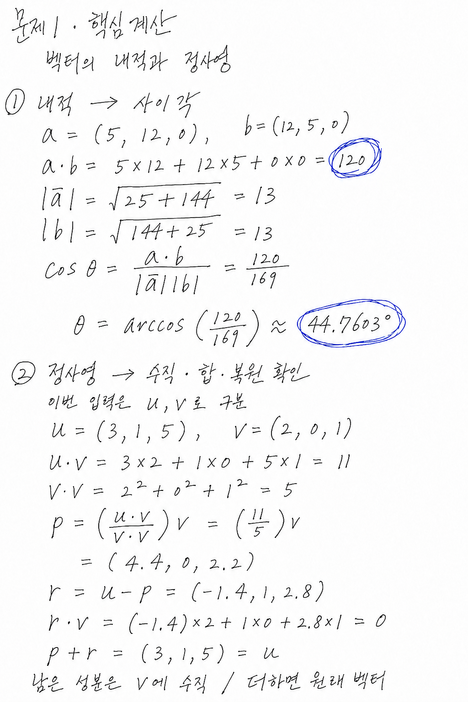
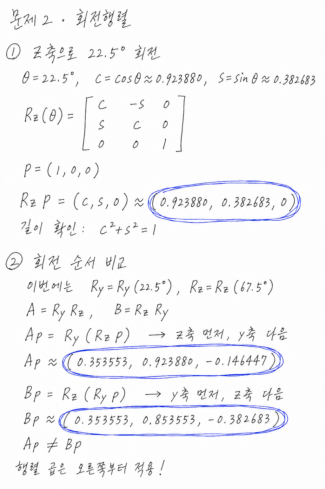
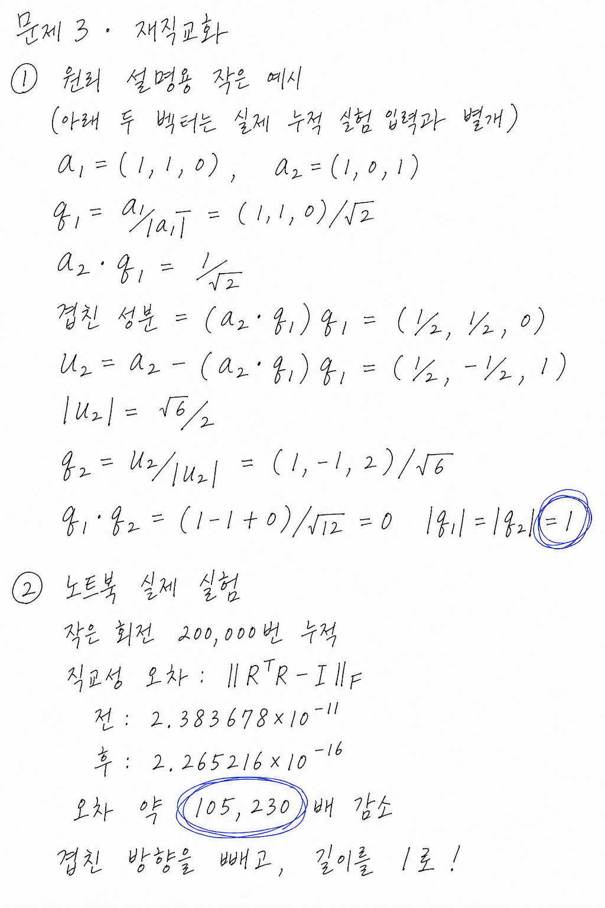
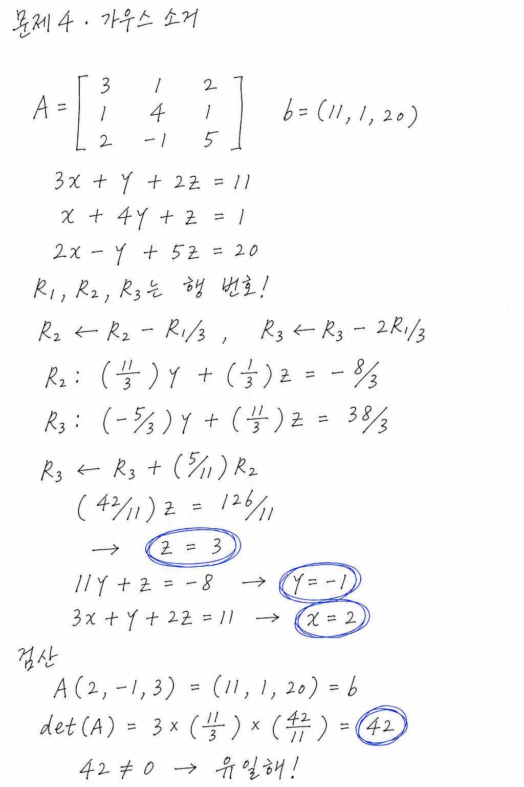
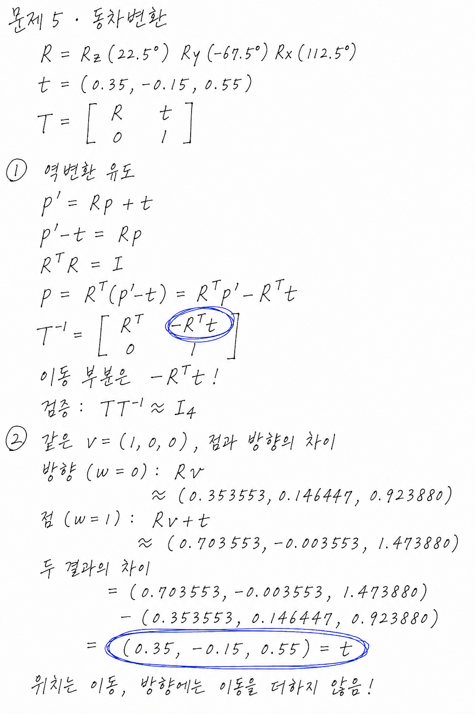
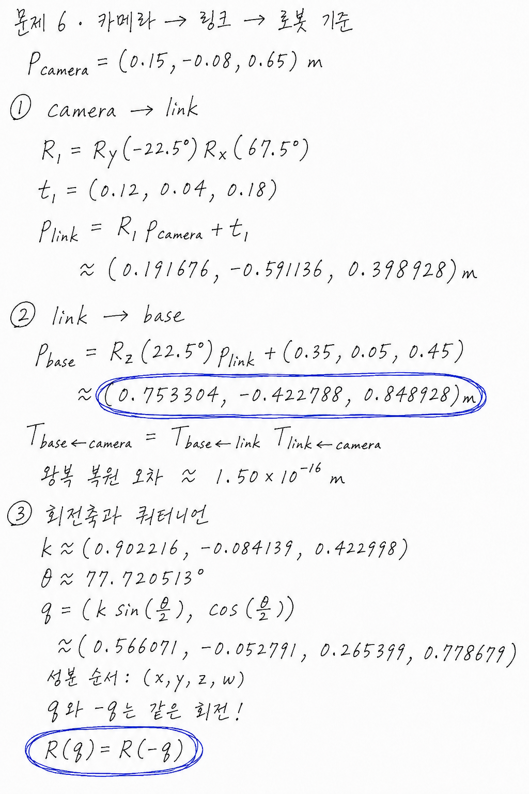

# 손글씨풍 핵심 계산 풀이

학습용 계산 설명 이미지 6장임. 각 노트북의 앞부분에도 같은 그림을 첨부함. 실행 결과 그래프 10장은 별도로 `../20260907/`에 있음.

## 01. 내적·사이각·정사영

내적의 입력 a,b와 정사영의 입력 u,v를 구분함. 그림의 0은 정확한 산술값이며, 코드 출력의 미세한 차이는 부동소수점 반올림 오차임.

[해당 노트북](../../notebooks/01_vectors.ipynb)

## 02. 회전행렬·회전 순서

첫 계산의 z축 각도는 22.5°, 순서 비교의 z축 각도는 67.5°임. 행렬 곱은 오른쪽부터 벡터에 적용함.

[해당 노트북](../../notebooks/02_rotation.ipynb)

## 03. Gram–Schmidt·누적 오차

앞부분의 두 벡터는 원리를 설명하기 위한 별도 예시임. 뒷부분의 20만 회 누적 오차는 아래 노트북에 저장된 실험값임.

[해당 노트북](../../notebooks/03_reorthogonalize.ipynb)

## 04. 가우스 소거·역대입

아래 실습과 같은 A,b를 사용함. R₁,R₂,R₃는 행 번호이며, 소거 후 z,y,x 순서로 역대입함.

[해당 노트북](../../notebooks/04_linear_system.ipynb)

## 05. 동차 역변환·점과 방향

역변환의 이동 부분은 −Rᵀt임. 동일한 좌표값을 점과 방향으로 해석했을 때 결과의 차이는 t임.

[해당 노트북](../../notebooks/05_transform.ipynb)

## 06. 좌표 체인·쿼터니언

camera → link → base 순서로 계산함. 중간 좌표는 같은 입력으로 계산한 풀이값이며, 표시한 근삿값은 소수 6자리로 반올림함. 쿼터니언 순서는 x,y,z,w임.

[해당 노트북](../../notebooks/06_chain.ipynb)
