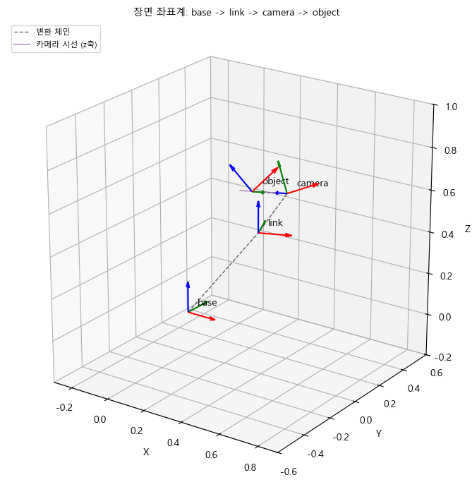
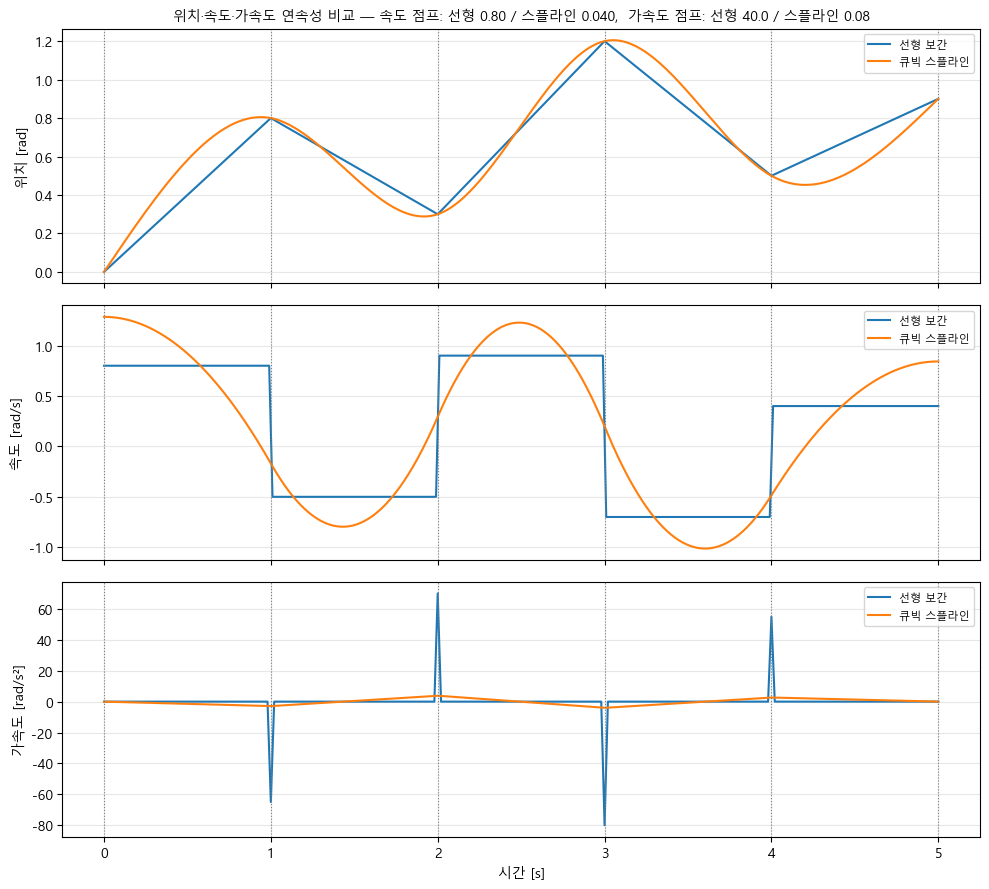
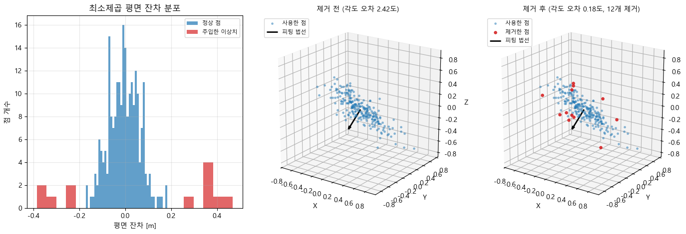

# 모듈 4 — 픽앤플레이스 자세 추정과 궤적 생성

카메라가 본 점들을 로봇 기준으로 옮기고, 물체의 방향을 추정한 뒤 그 위치와 방향까지 움직이는 경로를 만든다. **01 → 02 → 03 노트북 순서**로 따라 하면 된다.

- [완성 시연](demo.gif) · [발표 자료와 결과 해석](presentation.md)
- [공식 과제 지시문](https://github.com/SpartaPA/physicalai-lv1-assignments/blob/e1cb627e41a38af6ba5445aeefead12d2719ff77/과제4_픽앤플레이스_자세추정.md)
- 기준 배포본: 공식 저장소 `e1cb627e41a38af6ba5445aeefead12d2719ff77`의 `lv1_module4_student/`

## 1. 사용할 터미널 정하기

이 안내는 **Ubuntu 22.04 또는 Ubuntu 22.04 WSL + ROS 2 Humble + Python 3.10 가상환경**을 기준으로 한다. 모듈 4에서는 계산·시각화를 실행하므로 거북이 창을 띄우지 않는다. 터미널에는 Humble과 수학 패키지를 함께 불러온다.

이름은 다음처럼 구분한다. `jammy`가 표시돼도 다른 ROS 배포판을 사용한 것이 아니다. [ROS 공식 안내](https://www.ros.org/blog/getting-started/)에서도 Ubuntu 22.04 Jammy와 ROS 2 Humble 조합을 안내한다.

| 표시 | 뜻 | 이 실습의 값 |
|---|---|---|
| Ubuntu 코드명 | 운영체제 버전의 이름 | `jammy` = Ubuntu 22.04 |
| `ROS_DISTRO` | 현재 불러온 ROS 2 배포판 | `humble` |
| 터미널 앞의 괄호 | 활성화된 가상환경의 표시 이름 | `(venv)` |
| 가상환경 폴더 | 파이썬과 패키지가 저장된 위치 | 기존 `physicalai-lv1-math` 또는 새 `.venv` |
| 노트북 커널 | 노트북 코드를 실행할 파이썬 | `Python (pose_lab)` |

**터미널 1개**에서 JupyterLab을 켜고 이후 계산은 브라우저에서 실행한다. JupyterLab을 켜 둔 채 pytest 같은 명령을 실행하려면 **두 번째 터미널**을 사용한다.

Cursor 터미널이 Windows PowerShell이라면 먼저:

```powershell
wsl.exe -d Ubuntu-22.04
```

프롬프트가 `chsjh@PA12:...$`처럼 이미 Ubuntu라면 바로 2단계로 간다. 이후 `source` 명령은 Ubuntu 터미널에서 실행한다.

## 2. 과제 폴더와 가상환경 준비

아래 A와 B 중 자신의 상황에 맞는 **한쪽만** 실행한다.

### A. 이 PC의 기존 작업을 이어서 실행

```bash
cd '/mnt/c/Desktop/coding/physicalai-lv1-최성진/lv1_module4'
source scripts/use_env.sh
```

이 스크립트는 모듈 3에서 사용한 수학용 가상환경과 `/opt/ros/humble/setup.bash`를 불러오고 터미널 표시를 `(venv)`로 맞춘다. 기존 `physicalai-lv1-math` 폴더와 설치 패키지는 그대로 사용한다. 가상환경 폴더 이름이 `ros2-humble`이어야만 Humble을 쓸 수 있는 것은 아니다.

환경 선택 순서는 명시한 `MODULE4_VENV` → 이 모듈의 `.venv` → `$HOME/.venvs/physicalai-lv1-math`다. 다른 위치에 만든 환경을 사용하려면 먼저 `export MODULE4_VENV='/실제/가상환경/경로'`를 실행한다. 지정한 경로가 잘못됐을 때는 다른 환경으로 자동 대체하지 않는다.

### B. 다른 PC에서 처음 내려받아 실행

먼저 **Ubuntu 22.04에 ROS 2 Humble을 설치**한다. `/opt/ros/humble/setup.bash`가 없다면 [Humble 공식 설치 안내](https://docs.ros.org/en/humble/Installation/Ubuntu-Install-Debs.html)의 저장소 등록과 `ros-humble-desktop` 설치를 마친다. `requirements.txt`는 ROS 자체를 설치하지 않는다.

Git과 Python 3.10의 가상환경 도구, 한글 글꼴도 준비한다. 다음 명령은 Ubuntu 22.04 기준이다.

```bash
sudo apt update
sudo apt install -y git python3-venv fonts-nanum
python3 --version
test -f /opt/ros/humble/setup.bash && echo 'Humble 설치 확인'
```

Python 버전이 `3.10.x`이고 `Humble 설치 확인`이 출력되는지 확인한다. Ubuntu 24.04 터미널이나 다른 ROS 배포판을 불러온 터미널에서는 계속하지 않고 Ubuntu 22.04 터미널을 연다.

저장소를 저장할 상위 폴더로 이동한 뒤:

```bash
git clone https://github.com/SpartaPA/physicalai-lv1-choi-sungjin.git
cd physicalai-lv1-choi-sungjin/lv1_module4
python3 -m venv --prompt venv .venv
source .venv/bin/activate
python -m pip install -r requirements.txt
source scripts/use_env.sh
```

비공개 저장소이므로 접근 권한이 있는 GitHub 계정으로 인증해야 한다. 이미 클론한 저장소가 있다면 다시 클론하지 않고 그 안의 `lv1_module4`로 이동한다. 가상환경은 Git에 포함되지 않으므로 새 PC에서 별도로 만든다.

Windows PC에서도 이번 Humble 실행 순서는 **WSL의 Ubuntu 22.04 터미널**에서 따라 한다. PowerShell에 `source`를 입력하지 않는다.

## 3. Humble·가상환경 확인과 노트북 커널 연결

Ubuntu에서 A 또는 B를 마쳤다면 같은 터미널에서:

```bash
python -c "import sys; print(sys.executable); print(sys.prefix != sys.base_prefix)"
echo "$ROS_DISTRO"
python scripts/check_env.py
python -m ipykernel install --user --name physicalai-lv1-math --display-name "Python (pose_lab)"
python -m jupyter kernelspec list
```

확인할 결과:

- 첫 줄은 A라면 `/home/chsjh/.venvs/physicalai-lv1-math/bin/python`, B라면 방금 만든 `.venv/bin/python` 경로다.
- 둘째 줄이 `True`이면 가상환경이다.
- `echo "$ROS_DISTRO"`의 결과가 `humble`이다. `check_env.py`의 모든 항목이 `[PASS]`여야 한다.
- 터미널 앞은 `(venv)`다. 파이썬 경로에 `physicalai-lv1-math`가 남아 있어도 정상이다.
- 커널 목록에 `physicalai-lv1-math`가 있다. 브라우저 표시 이름은 `Python (pose_lab)`이다.

Kernel(커널)은 노트북의 코드를 실제로 실행하는 파이썬이다. 위 등록 명령은 현재 가상환경과 노트북을 연결한다. 같은 이름의 커널이 다른 가상환경에 연결돼 있었다면 이 명령으로 경로가 갱신된다.

`use_env.sh`는 `PIP_LOCAL=1`도 설정한다. 따라서 노트북의 `pip freeze`는 가상환경에 설치한 pip 패키지를 기록하고, apt로 설치한 ROS 패키지는 포함하지 않는다. ROS 2 Humble 설치는 2단계에서 별도로 준비한다.

## 4. JupyterLab 열기

2~3단계를 적용한 터미널 1에서:

```bash
python -m jupyter lab
```

**이전 안내로 이미 JupyterLab을 켰다면**, 열어 둔 노트북을 저장하고 기존 서버를 해당 터미널의 `Ctrl+C`로 종료한 뒤 `source scripts/use_env.sh`와 위 명령으로 다시 연다. 다른 터미널에서 환경을 적용해도 이미 실행 중인 서버에는 전달되지 않으며, 커널만 재시작해도 서버의 예전 환경을 물려받는다.

1. 실행 터미널에 나온 `http://localhost:.../lab` 또는 `http://127.0.0.1:.../lab` 주소를 연다. 기본 포트가 사용 중이면 다른 포트가 표시될 수 있으므로 실제 출력 주소를 사용한다.
2. 로그인 화면이 나오면 같은 터미널에 출력된 `?token=...`이 포함된 전체 주소로 연다.
3. 왼쪽 파일 목록에서 `notebooks` 폴더를 더블클릭한다.
4. `01_pipeline.ipynb`를 더블클릭한다.
5. 커널 선택창 또는 오른쪽 위 커널 표시에서 `Python (pose_lab)`을 고른다.

터미널 1은 JupyterLab 서버를 실행 중이므로 그대로 둔다. 노트북 셀은 클릭한 뒤 **Shift+Enter**로 실행한다. 결과가 나올 때까지 기다리고 다음 셀로 이동한다.

## 5. 첫 노트북 — 환경·좌표계·점군 변환

파일: [01_pipeline.ipynb](notebooks/01_pipeline.ipynb) · 문제 1~2

1. 첫 코드 셀을 실행하고 `인터프리터`와 `ROOT`를 확인한다. `ROOT`는 현재 `lv1_module4` 폴더여야 한다.
2. **1-1 검증 셀**을 실행한다. 가상환경과 패키지 항목이 `[PASS]`, 마지막이 `True`여야 한다.
3. **1-2 셀 실행 순서 실험**을 다음 표대로 직접 해 본다.

| 실행 순서 | 확인할 결과 |
|---|---|
| A → B → C | `최종 count = 1` |
| B → B → C를 추가 실행 | `최종 count = 3` |
| Kernel → Restart Kernel 후 C만 실행 | `NameError`: 아직 `count`가 만들어지지 않음 |

마지막 오류는 일부러 재현하는 실험이다. 실험을 마치면 **Kernel → Restart Kernel and Run All Cells**를 선택해 정상 순서로 다시 실행한다. 커널에 남아 있던 값의 영향을 없애는 과정이다. [이번 실행의 순서 실험 기록](evidence/cell_order_experiment.json)과 비교할 수 있다.

4. **1-3 장면**에서 base·link·camera·object의 이름과 빨강 x축·초록 y축·파랑 z축을 확인한다.
5. **2-1 점군 변환**에서 카메라 점을 base로 변환하고 다시 되돌린다. 왕복 최대 오차는 이번 실행에서 약 `2.22e-16`이었다.
6. **2-2 관절 각도**에서 −30°·0°·30°일 때 같은 카메라 관측이 base 좌표에서는 어디로 이동하는지 그림을 비교한다.
7. 마지막까지 실행한 뒤 **Ctrl+S**로 저장한다. 각 절의 `전체 통과`가 모두 `True`인지 확인한다.

관련 코드: [PosePipeline](src/pose_pipeline.py). 여러 점을 `(N, 3)` 배열로 받아 모듈 3의 변환 함수로 한 번에 계산한다.



## 6. 두 번째 노트북 — 회전과 이동 경로 보간

파일: [02_interpolation.ipynb](notebooks/02_interpolation.ipynb) · 문제 3~4

1. 노트북을 열고 커널을 선택한 뒤 첫 셀부터 실행한다.
2. **3-1**에서 회전행렬 → 쿼터니언 → 회전행렬의 왕복 오차를 확인한다.
3. **3-2·3-3**에서 직접 구현한 SLERP와 SciPy가 같은 결과를 내는지 확인하고, 중간 자세 7개의 축이 어떻게 회전하는지 본다.
4. **3-4**에서 단순 선형 보간은 쿼터니언 크기가 1 아래로 내려가는 것을 확인한다. **3-5**에서는 거의 같은 자세, 부호만 반대인 쿼터니언, 180° 회전을 비교한다.
5. **4-1·4-2**에서 선형 보간과 스플라인의 위치·속도·가속도 그래프를 비교한다. 직선 경로는 경유점에서 꺾이며 속도가 갑자기 바뀐다.
6. **4-3·4-4**에서 3D 경로와 5차 다항식을 확인한다. 5차 궤적은 시작·끝 속도와 가속도가 모두 0에 가까워야 한다.
7. 끝까지 실행한 뒤 **Restart Kernel and Run All Cells → Ctrl+S**로 저장한다.

관련 코드: [quaternion.py](src/quaternion.py), [trajectory.py](src/trajectory.py).



## 7. 세 번째 노트북 — 물체 방향 추정과 시연

파일: [03_pose_estimation.ipynb](notebooks/03_pose_estimation.ipynb) · 문제 5~6

1. 첫 셀부터 실행한다. **5-1**은 길쭉한 점군 240개의 긴 축·중간 축·짧은 축을 찾는다.
2. **5-2**에서 구형에 가까운 점군의 축이 더 크게 흔들리는지 확인한다. 고유값이 비슷하면 대표 방향을 정하기 어렵다.
3. **5-3**에서 알려진 회전을 역추정한다. 이번 실행의 Kabsch 회전 오차는 약 **0.258°**였다.
4. **5-4**에서 노이즈 0~0.25와 점 개수 30·90·270개를 비교한다. 점 개수가 많아질 때 평균 오차가 어떻게 달라지는지 읽는다.
5. **5-5**에서 이상치를 **24개(10%)** 넣고 제거 전후를 비교한다. 이번 결과는 **24개 제거, 정상점 손실 0개, 회전 오차 1.768° → 0.230°**였다.
6. **6-1·6-2**에서 물체 자세를 목표로 위치와 방향을 함께 보간한다. 애니메이션 셀은 시간이 걸릴 수 있다. 셀 실행 표시 `[*]`가 끝날 때까지 기다린다.
7. 애니메이션 아래 재생 버튼으로 이동을 확인한다. 이어지는 저장 셀이 `lv1_module4/demo.gif`를 만든다.
8. **6-3**까지 실행한 뒤 **Restart Kernel and Run All Cells → Ctrl+S**로 저장한다.

제공된 난수 시드 `np.random.default_rng(42)`를 유지한다. 오차 수치는 이 시드와 현재 실험 조건에서 얻은 결과이며 소수점 끝자리는 환경에 따라 달라질 수 있다.



관련 코드: [pose_estimation.py](src/pose_estimation.py) · 결과: [demo.gif](demo.gif), [presentation.md](presentation.md).

## 8. 전체 결과를 한 번에 재검증

JupyterLab을 켜 둔 경우 **터미널 2**를 열고 2단계의 `cd`와 가상환경 활성화를 다시 실행한다. 터미널 1에서 활성화한 환경은 새 터미널에 자동 적용되지 않는다.

이 PC의 예:

```bash
cd '/mnt/c/Desktop/coding/physicalai-lv1-최성진/lv1_module4'
source scripts/use_env.sh
python scripts/check_env.py
python scripts/verify_notebooks.py
```

다른 PC에서도 해당 `lv1_module4` 폴더에서 같은 `source scripts/use_env.sh`를 사용한다. 프로젝트 `.venv`가 있으면 자동 선택한다.

이 명령은 아래 작업을 차례대로 수행한다.

1. 실행기와 노트북 커널이 같은 가상환경인지 확인한다.
2. pytest로 함수 테스트를 실행한다.
3. 문제 1의 순서 변경 실험과 예상된 `NameError`를 재현한다.
4. 세 노트북을 각각 새 커널에서 처음부터 끝까지 실행하고 저장한다.
5. 노트북 출력, 그림 13장, GIF, 환경 파일, 실행 기록을 갱신한다.

실행 전에 브라우저에서 수정 중인 노트북을 **저장하고 닫는다**. 검증이 끝나면 다시 열어 새 출력을 확인한다. 실험 조건을 바꿨다면 [발표 자료](presentation.md)의 수치 설명도 새 결과와 대조해 갱신한다.

함수만 확인하려면:

```bash
python -m pytest -v
```

이 모듈의 [pytest.ini](pytest.ini)는 Humble의 ROS launch 테스트 확장 `launch_testing`·`launch_ros`만 자동 로딩에서 제외한다. 두 확장은 이 모듈에서 사용하지 않으며, 기존 확장이 pytest 9와 충돌하는 것을 막기 위한 설정이다. 수학 함수 테스트는 모두 실행한다.

현재 저장한 실행 결과는 **pytest 43개 통과**, 노트북 검증 **176개 통과 / 실패 0개**, GIF **60프레임**이다. 전체 검증 명령의 마지막에는 `노트북 3개 전체 실행 및 저장 결과 검사 통과`가 나온다.

## 9. 실행 기록과 파일 위치

| 파일·폴더 | 내용 |
|---|---|
| [notebooks/](notebooks/) | 실행 출력과 그래프가 저장된 노트북 3개 |
| [src/](src/) · [tests/](tests/) | 수학 함수와 테스트 |
| [images/](images/) | 노트북이 실제로 출력한 PNG 그림 13장 |
| [demo.gif](demo.gif) | 위치와 방향이 동시에 변하는 60프레임 시연 |
| [presentation.md](presentation.md) | 구조, 결과, 한계, 개선안 |
| [requirements.txt](requirements.txt) | 사용한 패키지 버전 |
| [use_env.sh](scripts/use_env.sh) · [check_env.py](scripts/check_env.py) | `(venv)`·Humble 적용과 실제 환경 검사 |
| [humble_environment.json](evidence/humble_environment.json) | Ubuntu·가상환경·Humble·ROS 노드 실행 확인 |
| [notebook_validation.json](evidence/notebook_validation.json) | 실행 시각·커널·노트북별 PASS/FAIL·오류·순차 실행 여부 |
| [cell_order_experiment.json](evidence/cell_order_experiment.json) | 셀 순서 실험 결과 |
| [pytest.txt](evidence/pytest.txt) | 함수 테스트 전체 출력 |
| [01_pipeline.txt](evidence/01_pipeline.txt) · [02_interpolation.txt](evidence/02_interpolation.txt) · [03_pose_estimation.txt](evidence/03_pose_estimation.txt) | 계산과 검증의 텍스트 출력 |

노트북의 제공 검증·그림·애니메이션 셀은 수정하지 않는다. `.venv/`, `__pycache__/`, `.pytest_cache/`, `.ipynb_checkpoints/`는 업로드 대상에서 제외한다.

## 10. 막혔을 때 확인할 것

| 증상 | 확인·해결 |
|---|---|
| `wsl: command not found` | 이미 Ubuntu인지 프롬프트를 확인한다. Windows 명령은 PowerShell에서 실행한다. |
| `(physicalai-lv1-math)`가 표시됨 | 정상적인 가상환경 이름이다. `(venv)` 표시와 Humble을 함께 적용하려면 `source scripts/use_env.sh`를 실행한다. |
| Ubuntu에 `jammy`가 표시됨 | Ubuntu 22.04의 정상 코드명이다. ROS 배포판은 `echo "$ROS_DISTRO"`로 따로 확인한다. |
| `ROS_DISTRO`가 비어 있거나 `rclpy`를 못 찾음 | `source scripts/use_env.sh`를 실행한다. JupyterLab이 이미 실행 중이었다면 저장 후 서버도 다시 연다. |
| 다른 ROS 배포판이 불러와져 있음 | 해당 배포판을 자동으로 불러오는 설정을 확인하고, Ubuntu 22.04의 새 터미널에서 Humble을 적용한다. |
| `ModuleNotFoundError` | 2단계 가상환경을 활성화하고 그 환경의 `python -m pip install -r requirements.txt`를 실행한다. |
| `No module named src` | `lv1_module4`에서 JupyterLab을 열었는지 확인하고 노트북 첫 셀부터 실행한다. |
| `Python (pose_lab)`이 없음 | 3단계 커널 등록을 실행하고 노트북을 다시 연다. |
| 실행기와 커널의 가상환경이 다름 | 사용할 가상환경을 활성화한 뒤 3단계 등록 명령으로 연결 경로를 맞춘다. |
| 일부 셀은 됐는데 다시 실행하면 오류 | 커널을 재시작하고 위에서 아래로 전체 실행한다. 문제 1-2의 C 단독 실행 오류는 의도된 실험이다. |
| 한글 제목이 □로 표시 | Ubuntu에서 `fonts-nanum` 설치 후 커널을 재시작한다. 기존 글꼴 캐시가 남았다면 아래 명령도 실행한다. |
| GitHub에서 노트북이 늦게 열리거나 애니메이션이 안 움직임 | 브라우저 미리보기 대신 내려받은 노트북을 JupyterLab에서 열거나 `demo.gif`를 확인한다. |

글꼴 캐시 갱신:

```bash
python -c "from matplotlib import font_manager; font_manager._load_fontmanager(try_read_cache=False)"
```

작업이 끝나면 노트북을 저장하고 터미널 1의 JupyterLab을 **Ctrl+C**로 종료한다. 종료 확인이 나오면 화면 안내에 따른다.

## 결과를 해석할 때

이 실습은 합성 점군과 오프라인 궤적을 사용한다. 실제 로봇의 충돌·관절 제한·센서 지연까지 검증한 것은 아니다. 기록된 본 실행은 Ubuntu 22.04 WSL에서 수행했다. 같은 WSL의 빈 가상환경에서도 `requirements.txt` 설치, 주요 패키지 가져오기, 함수 테스트 43개 통과와 `pip check`의 의존성 충돌 없음을 확인했다. 별도 물리 PC나 Windows Python에서의 실행과 구분한다.

노트북의 `t_frames`는 0~1 시간 비율이고, GIF는 10 fps로 6초 동안 재생한다. 재생 시간을 실제 로봇 제어 주기로 해석하지 않는다. 자세한 오차 수치와 한계는 발표 자료에 정리했다.

PCA(피시에이)는 점들이 가장 길게 퍼진 방향을 찾는다. Kabsch(카브시)는 대응하는 두 점 묶음을 가장 잘 겹치는 회전과 이동을 찾는다. SLERP(슬러프)는 두 방향 사이를 일정한 각도 간격으로 잇는다. Spline(스플라인)은 경유점을 부드러운 곡선으로 연결한다. venv(벤브)는 이번 실습의 파이썬 패키지를 따로 담아 두는 환경이다.
