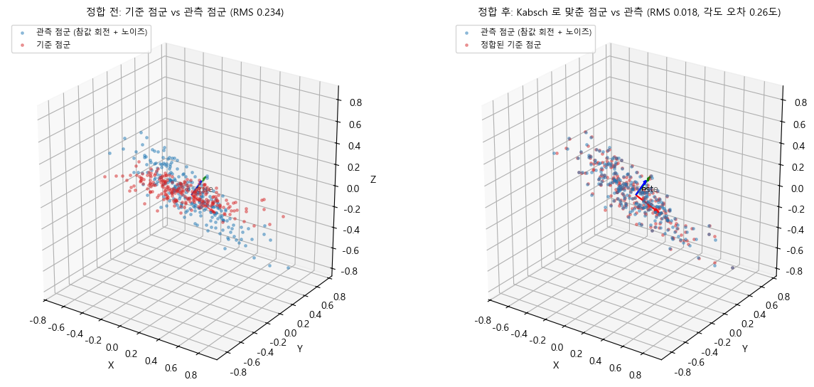
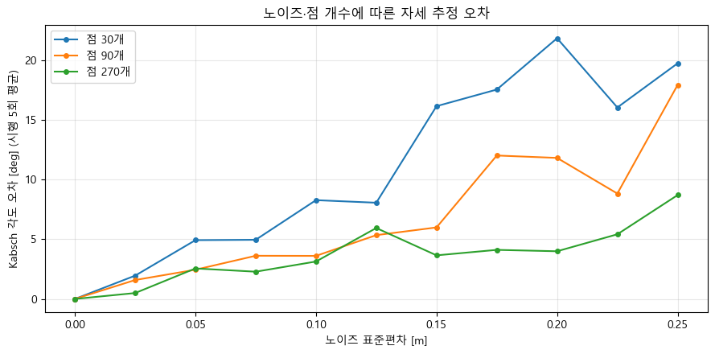
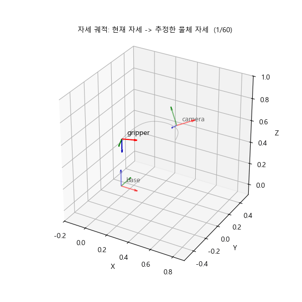
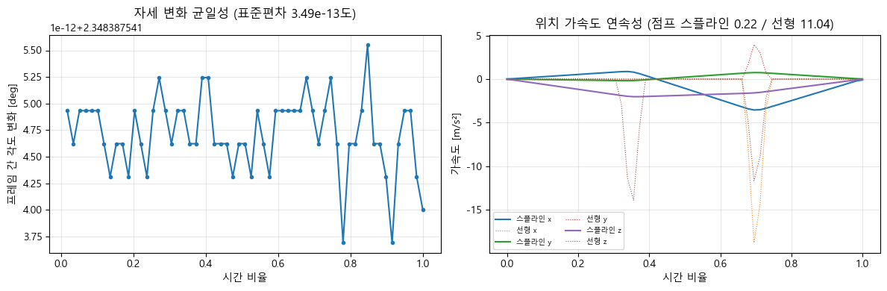

# 모듈 4 발표 — 픽앤플레이스 자세 추정과 궤적 생성

이름: 최성진 · 실행일: 2026-09-09

## 1. 파이프라인 전체 구조

카메라가 본 점의 위치를 로봇 기준으로 바꾸고, 점군에서 물체 방향을 추정한 뒤 그곳으로 이동하는 궤적을 만들었다. Pipeline(파이프라인)은 앞 단계의 결과를 다음 단계에 넘기는 계산 순서다.

```text
카메라 점군 → 이상치 정제 → PCA로 물체 축과 중심 추정
                                  ↓
모듈 3 좌표 변환 → PosePipeline → base 기준 목표 위치·방향
                                  ↓
              위치: 스플라인 / 방향: SLERP → 60프레임 시연
```

`01_pipeline.ipynb`에서 base·link·camera·object 네 좌표계를 정의하고, `PosePipeline`으로 카메라 점군을 한 번에 변환했다. 역변환 후 최대 차이는 2.220446e−16으로 부동소수점 오차 수준이었다. 관절 각도 −30°·0°·30°를 바꿔 같은 관측값의 base 좌표가 달라지는 것도 확인했다.


모듈 3의 `vectors.py`, `rotation.py`, `transform.py`, `coordinate_chain.py`를 재사용했다. 이번에 추가한 기능은 `PosePipeline`, 쿼터니언 변환·SLERP, 궤적 보간, PCA·Kabsch·평면 피팅이다. `02_interpolation.ipynb`에서 보간을 검증하고, `03_pose_estimation.ipynb`에서 정제한 카메라 점군의 PCA 자세를 `object_pose_in_base()`로 옮겨 목표로 사용했다.

SLERP(슬러프)는 시작 방향에서 목표 방향까지 일정한 각도 간격으로 회전하게 한다. Spline(스플라인)은 경유점을 부드럽게 잇는 곡선이다. 직접 구현한 SLERP는 SciPy 결과와 비교했으며, 단순 쿼터니언 선형 보간은 단위 길이를 유지하지 못하는 것을 확인했다.

## 2. 자세 추정 결과와 오차

PCA(피시에이)는 점군이 많이 퍼진 방향을 순서대로 찾는다. 길쭉한 점군 240개의 주축과 고유값은 다음과 같다. 축은 부호를 반대로 해도 같은 직선을 가리키므로, 부호만으로 물체의 앞뒤가 결정되지는 않는다.

| 축 | 단위 방향 벡터 | 고유값 |
|---|---|---:|
| 긴 축 | (−0.999269, 0.037327, 0.008226) | 0.099500 |
| 중간 축 | (0.037052, 0.998820, −0.031402) | 0.010287 |
| 짧은 축 | (−0.009388, −0.031074, −0.999473) | 0.002548 |

Kabsch(카브시)는 대응하는 점 두 묶음이 가장 잘 겹치도록 회전과 이동을 구한다. 알려진 40° 회전과 이동에 표준편차 0.01 m의 노이즈를 더한 실험에서 회전 오차는 **0.258171°**, 병진 오차는 **8.710980e−05 m**였다.



추가로 전체 점의 10%인 **24개**를 법선 방향으로 0.2~0.5 m 이동시켜 이상치를 만들었다. 초기 최소제곱 평면의 잔차를 MAD로 걸러내고, 남은 점으로 평면을 다시 피팅하는 과정을 반복했다. MAD(엠에이디)는 중앙값 주변에서 잔차가 얼마나 퍼져 있는지 재는 값이어서 큰 이상치의 영향을 덜 받는다. 실제 이상치 위치는 검출률 평가에만 사용했다.

| 비교 항목 | 실행 결과 |
|---|---:|
| Kabsch 회전 오차, 제거 전 | 1.768446° |
| Kabsch 회전 오차, 제거 후 | **0.230081°** |
| 제거한 이상치 | 24 / 24 |
| 잘못 제거한 정상점 | 0 / 216 |
| 정제 후 평면 법선과 참값의 각도 | 6.983653° |


위 잔차 히스토그램과 검은 법선 화살표는 제공 그림 코드의 초기 평면 기준이다. 오른쪽의 점 선택은 반복 정제의 최종 마스크를 반영한다. 표의 법선 오차는 정제한 점으로 다시 계산한 값이다.

## 3. 노이즈·점 개수가 정확도에 미친 영향

노이즈 표준편차 0~0.25를 11단계로 바꾸고, 점 개수 30·90·270개마다 5회씩 계산했다. 고노이즈 구간인 0.175~0.25의 평균 회전 오차는 다음과 같다.

| 점 개수 | 평균 회전 오차 |
|---|---:|
| 30개 | 18.782639° |
| 90개 | 12.642510° |
| 270개 | 5.554521° |

이 조건에서는 270개의 평균 오차가 30개의 약 1/3.38이었다. 많은 점을 쓰면 독립 노이즈가 평균화되는 경향이 있지만, 모든 개별 시행에서 오차가 반드시 줄어드는 것은 아니다.



첫 주축의 흔들림은 길쭉한 점군에서 2.481°, 구형에 가까운 점군에서 72.729°였다. 구형에서는 고유값 차이가 작아 여러 방향이 비슷한 분산을 설명한다. 작은 표본 변화로도 선택되는 축이 크게 달라지는 이유다.

## 4. 현재 구현의 한계

- Kabsch는 점 대응이 주어져야 한다. PCA만으로는 대칭 물체의 앞뒤나 일관된 축 부호를 정하기 어렵다.
- 반복 MAD 정제는 초기 평면이 충분히 가까운 경우에 도움이 된다. 이상치 비율이 크게 높아지는 모든 상황에서 정답을 보장하지 않는다.
- 장면은 단순한 관절 회전과 고정된 카메라 변환을 사용한다. 실제 카메라 보정 오차, 역기구학, 충돌, 관절 범위·속도·가속도 제한은 다루지 않았다.
- 자연 스플라인은 양끝 가속도 0을 만족하지만 끝점의 속도까지 0이 되는 것은 아니다. 문제 4에서 정지 출발·도착용 5차 다항식을 별도로 검증했다.
- 시연은 합성 점군의 오프라인 애니메이션이다. 실제 로봇의 픽업 성공률이나 제어 주기를 측정한 결과는 아니다.



시작 위치는 (0.20, −0.30, 0.65), 목표 위치는 (0.724058, −0.410415, 0.842041) m였다. 자세는 SLERP, 위치는 자연 스플라인으로 동시에 보간했다. 프레임 간 회전각의 평균은 **2.348388°**, 표준편차는 **3.488385e−13°**였다.



인접 표본의 가속도 차이 최댓값은 스플라인 0.224255, 선형 보간 11.042661이었다. 이것은 표본 간 변화량이며, 수학적인 불연속 크기와 구분해야 한다. 스플라인 계수로 직접 계산한 경유점 좌우 가속도 차이는 **4.996004e−15**로 0에 가까웠다.

도표의 `t_frames`는 0~1의 시간 비율이다. GIF는 10 fps, 60프레임으로 6초 동안 재생한다. 시간 비율을 실제 6초 이동으로 해석하려면 속도는 6으로, 가속도는 36으로 나눠 환산해야 한다. 재생 시간과 로봇 제어 시간을 같은 것으로 취급하지 않았다.

## 5. 개선한다면 무엇을 어떻게

- 점 대응이 없는 관측에는 특징점으로 초기 정렬한 뒤 ICP(아이씨피)로 가까운 점끼리 반복 정합한다. 대응을 몰라도 정렬하는 것이 목표다.
- 이상치가 더 많은 경우에는 RANSAC(랜색)으로 여러 평면 후보를 만들고, 지지하는 점이 많은 후보를 초기값으로 사용한다. 이상치 비율을 늘리면서 검출률과 정상점 손실을 비교한다.
- 실제 로봇 경로에는 충돌 검사와 관절 제한을 적용하고, 시간 배분으로 속도·가속도 제한을 맞춘다. 정지 동작에서는 5차 궤적 또는 적절한 끝점 조건을 사용한다.
- 센서 보정 오차와 지연을 넣어 회전·병진 오차, 최대 속도·가속도, 충돌 여부, 계산 시간을 함께 측정한다.

### 실행 정보

- Ubuntu 22.04 WSL, Python 3.10.12의 표준 venv 사용
- NumPy 2.2.6, SciPy 1.15.3, Matplotlib 3.10.9, JupyterLab 4.6.3
- 난수: `np.random.default_rng(42)`
- 노트북 3개: 새 커널에서 순서대로 실행, 검증 176개 통과, 실패 0개
- pytest: 43개 통과, 실패 0개
- 저장 결과: 그림 13개, 노트북 HTML 애니메이션 1개, GIF 60프레임
- [실행 기록](evidence/notebook_validation.json) · [함수 테스트](evidence/pytest.txt) · [실행 방법](README.md)
